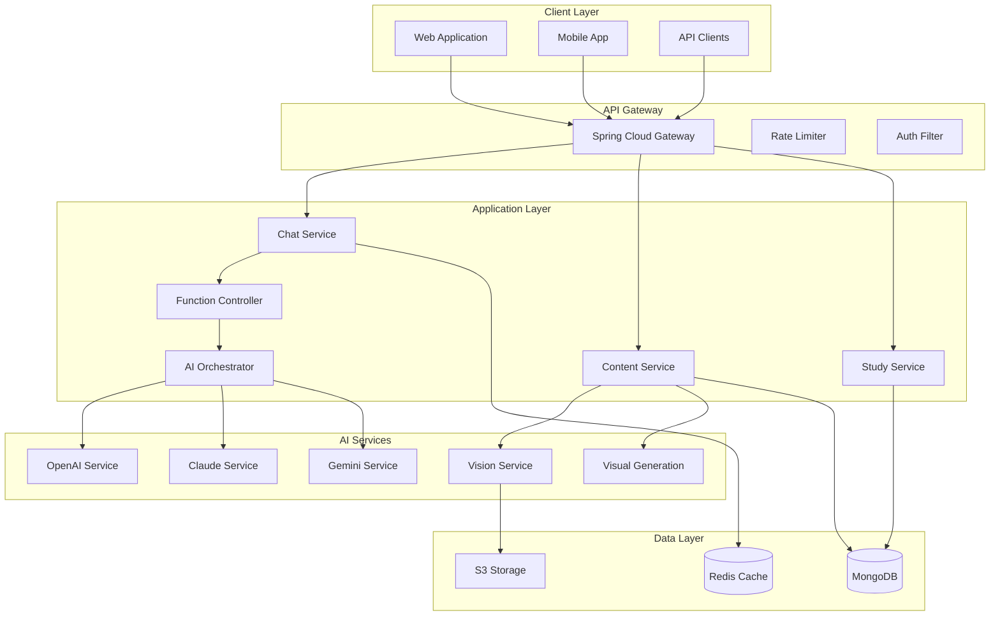

# AI-Powered Learning System: Complete Implementation Roadmap

## Executive Summary

This roadmap outlines the transformation of a basic flashcard application into a sophisticated AI-powered learning platform with:
- **Multi-modal AI capabilities** (text, image, voice)
- **Function calling architecture** for extensible AI features
- **Intelligent chat interface** with contextual understanding
- **Adaptive learning algorithms** for personalized study
- **Visual content generation** for enhanced learning materials

## System Architecture Overview



## Phase 1: Foundation & Infrastructure (Weeks 1-3)

### 1.1 Spring AI Integration

#### Objectives
- Set up Spring AI with multiple providers
- Implement function calling framework
- Create extensible AI service architecture

#### Technical Implementation

**Dependencies Addition:**
```xml
<dependencies>
    <!-- Spring AI Core -->
    <dependency>
        <groupId>org.springframework.ai</groupId>
        <artifactId>spring-ai-core</artifactId>
        <version>1.0.0</version>
    </dependency>

    <!-- Provider-specific -->
    <dependency>
        <groupId>org.springframework.ai</groupId>
        <artifactId>spring-ai-openai-spring-boot-starter</artifactId>
        <version>1.0.0</version>
    </dependency>

    <dependency>
        <groupId>org.springframework.ai</groupId>
        <artifactId>spring-ai-anthropic-spring-boot-starter</artifactId>
        <version>1.0.0</version>
    </dependency>

    <dependency>
        <groupId>org.springframework.ai</groupId>
        <artifactId>spring-ai-vertex-ai-gemini-spring-boot-starter</artifactId>
        <version>1.0.0</version>
    </dependency>

    <!-- Function Calling Support -->
    <dependency>
        <groupId>org.springframework.ai</groupId>
        <artifactId>spring-ai-function-calling</artifactId>
        <version>1.0.0</version>
    </dependency>
</dependencies>
```

**Core Service Architecture:**
```java
@Service
@Slf4j
public class AIOrchestrationService {

    @Autowired
    private FunctionRegistry functionRegistry;

    @Autowired
    private ModelSelectorService modelSelector;

    @Autowired
    private ConversationContextService contextService;

    public AIResponse processRequest(AIRequest request) {
        // 1. Select appropriate model
        ChatModel model = modelSelector.selectModel(request);

        // 2. Load context
        ConversationContext context = contextService.getContext(request.getSessionId());

        // 3. Build prompt with functions
        Prompt prompt = buildPromptWithFunctions(request, context);

        // 4. Execute with function calling
        ChatResponse response = model.call(prompt);

        // 5. Process function calls
        List<FunctionCallResult> results = processFunctionCalls(response);

        // 6. Update context
        contextService.updateContext(request.getSessionId(), response);

        return AIResponse.builder()
            .content(response.getContent())
            .functionResults(results)
            .metadata(extractMetadata(response))
            .build();
    }
}
```

### 1.2 Function Calling Framework

**Function Registry Implementation:**
```java
@Component
public class FunctionRegistry {

    private final Map<String, AIFunction> functions = new ConcurrentHashMap<>();

    @PostConstruct
    public void registerFunctions() {
        // Content Generation Functions
        register(new GenerateFlashcardsFunction());
        register(new GenerateSummaryFunction());
        register(new GenerateQuizFunction());

        // Analysis Functions
        register(new AnalyzeImageFunction());
        register(new AnalyzeDocumentFunction());
        register(new ExtractConceptsFunction());

        // Visual Functions
        register(new CreateDiagramFunction());
        register(new GenerateMindMapFunction());
        register(new CreateInfographicFunction());

        // Study Functions
        register(new StartStudySessionFunction());
        register(new AdaptDifficultyFunction());
        register(new GenerateExplanationFunction());
    }

    public List<FunctionDefinition> getAvailableFunctions(UserContext context) {
        return functions.values().stream()
            .filter(f -> f.isAvailableForUser(context))
            .map(AIFunction::getDefinition)
            .collect(Collectors.toList());
    }
}
```

### 1.3 Database Schema Updates

```javascript
// MongoDB Collections

// conversations collection
{
    _id: ObjectId,
    userId: String,
    sessionId: String,
    messages: [{
        role: String, // "user", "assistant", "system"
        content: String,
        timestamp: Date,
        functionCalls: [{
            name: String,
            parameters: Object,
            result: Object
        }]
    }],
    context: {
        currentTopic: String,
        studyGoals: [String],
        preferences: Object
    },
    createdAt: Date,
    updatedAt: Date
}

// ai_generation_history collection
{
    _id: ObjectId,
    userId: String,
    requestType: String,
    model: String,
    prompt: String,
    response: String,
    tokensUsed: Number,
    cost: Decimal,
    functionCalls: [Object],
    createdAt: Date
}

// visual_content collection
{
    _id: ObjectId,
    userId: String,
    type: String, // "diagram", "mindmap", "infographic"
    title: String,
    description: String,
    content: String, // Mermaid code or image URL
    metadata: Object,
    createdAt: Date
}
```

## Phase 2: Chat Interface & Conversational AI (Weeks 4-5)

### 2.1 Chat Session Management

```java
@Service
public class ChatSessionService {

    @Autowired
    private RedisTemplate<String, Object> redisTemplate;

    @Autowired
    private ConversationRepository conversationRepository;

    public ChatSession createSession(String userId) {
        ChatSession session = ChatSession.builder()
            .sessionId(UUID.randomUUID().toString())
            .userId(userId)
            .startTime(Instant.now())
            .build();

        // Store in Redis for fast access
        redisTemplate.opsForValue().set(
            "session:" + session.getSessionId(),
            session,
            Duration.ofHours(24)
        );

        return session;
    }

    public ChatResponse processMessage(ChatMessage message) {
        // 1. Retrieve session context
        ChatSession session = getSession(message.getSessionId());

        // 2. Analyze user intent
        UserIntent intent = analyzeIntent(message.getContent());

        // 3. Determine required functions
        List<String> requiredFunctions = determineFunctions(intent);

        // 4. Build contextualized prompt
        String prompt = buildContextualPrompt(session, message, requiredFunctions);

        // 5. Execute with AI
        AIResponse aiResponse = aiOrchestrationService.processRequest(
            AIRequest.builder()
                .sessionId(message.getSessionId())
                .content(prompt)
                .functions(requiredFunctions)
                .build()
        );

        // 6. Update session
        updateSession(session, message, aiResponse);

        return ChatResponse.builder()
            .sessionId(message.getSessionId())
            .content(aiResponse.getContent())
            .suggestions(generateSuggestions(session))
            .build();
    }
}
```

### 2.2 Context-Aware Prompting

```java
@Component
public class PromptBuilder {

    private static final String SYSTEM_PROMPT = """
        You are an intelligent learning assistant that helps users create and study flashcards.
        You have access to various functions to assist with learning tasks.

        Current capabilities:
        - Generate flashcards from text, images, or topics
        - Create visual learning aids (diagrams, mind maps)
        - Provide personalized study sessions
        - Answer questions about study materials
        - Track learning progress

        Always:
        1. Be helpful and encouraging
        2. Adapt to the user's learning style
        3. Provide clear explanations
        4. Use appropriate functions to enhance learning
        5. Remember context from previous messages
        """;

    public Prompt buildPrompt(ChatSession session, String userMessage, List<FunctionDefinition> functions) {
        List<Message> messages = new ArrayList<>();

        // System message
        messages.add(new SystemMessage(SYSTEM_PROMPT));

        // Context injection
        if (session.hasContext()) {
            messages.add(new SystemMessage(buildContextMessage(session)));
        }

        // Conversation history (last N messages)
        messages.addAll(session.getRecentMessages(10));

        // Current user message
        messages.add(new UserMessage(userMessage));

        // Create prompt with functions
        return new Prompt(
            messages,
            ChatOptions.builder()
                .functions(functions)
                .temperature(0.7)
                .maxTokens(2000)
                .build()
        );
    }
}
```

## Phase 3: Advanced AI Features (Weeks 6-7)

### 3.1 Multi-Modal Processing

```java
@Service
public class MultiModalService {

    @Autowired
    private VisionService visionService;

    @Autowired
    private AudioService audioService;

    @Autowired
    private DocumentService documentService;

    public MultiModalResponse processMultiModal(MultiModalRequest request) {
        MultiModalResponse.Builder responseBuilder = MultiModalResponse.builder();

        // Process images
        if (request.hasImages()) {
            List<ImageAnalysis> analyses = request.getImages().stream()
                .map(visionService::analyzeImage)
                .collect(Collectors.toList());
            responseBuilder.imageAnalyses(analyses);
        }

        // Process audio
        if (request.hasAudio()) {
            AudioTranscription transcription = audioService.transcribe(request.getAudio());
            responseBuilder.audioTranscription(transcription);
        }

        // Process documents
        if (request.hasDocuments()) {
            List<DocumentExtraction> extractions = request.getDocuments().stream()
                .map(documentService::extractContent)
                .collect(Collectors.toList());
            responseBuilder.documentExtractions(extractions);
        }

        // Combine all modalities for comprehensive analysis
        if (request.isCombinedAnalysis()) {
            CombinedAnalysis combined = combineModalities(responseBuilder.build());
            responseBuilder.combinedAnalysis(combined);
        }

        return responseBuilder.build();
    }
}
```

### 3.2 Visual Content Generation

```java
@Service
public class VisualGenerationService {

    @Autowired
    private MermaidService mermaidService;

    @Autowired
    private ImageGenerationService imageGenService;

    public VisualContent generateDiagram(DiagramRequest request) {
        switch (request.getType()) {
            case FLOWCHART:
                return generateFlowchart(request);
            case MIND_MAP:
                return generateMindMap(request);
            case SEQUENCE_DIAGRAM:
                return generateSequenceDiagram(request);
            case CLASS_DIAGRAM:
                return generateClassDiagram(request);
            default:
                throw new UnsupportedOperationException("Diagram type not supported");
        }
    }

    private VisualContent generateMindMap(DiagramRequest request) {
        // Generate Mermaid code for mind map
        String mermaidCode = mermaidService.generateMindMap(
            request.getTopic(),
            request.getConcepts(),
            request.getDepth()
        );

        return VisualContent.builder()
            .type(VisualType.MIND_MAP)
            .format(ContentFormat.MERMAID)
            .content(mermaidCode)
            .metadata(Map.of(
                "topic", request.getTopic(),
                "nodeCount", countNodes(mermaidCode)
            ))
            .build();
    }
}
```

## Phase 4: Adaptive Learning System (Weeks 8-9)

### 4.1 Learning Analytics Engine

```java
@Service
public class LearningAnalyticsService {

    @Autowired
    private StudySessionRepository sessionRepository;

    @Autowired
    private MLModelService mlService;

    public LearningProfile analyzeLearningPattern(String userId) {
        // Collect historical data
        List<StudySession> sessions = sessionRepository.findByUserId(userId);

        // Analyze patterns
        LearningMetrics metrics = calculateMetrics(sessions);

        // Identify strengths and weaknesses
        StrengthWeaknessAnalysis analysis = analyzePerformance(metrics);

        // Predict optimal study times
        StudyTimeRecommendation timeRec = mlService.predictOptimalStudyTime(userId, metrics);

        // Generate personalized recommendations
        List<StudyRecommendation> recommendations = generateRecommendations(analysis);

        return LearningProfile.builder()
            .userId(userId)
            .metrics(metrics)
            .analysis(analysis)
            .optimalStudyTimes(timeRec)
            .recommendations(recommendations)
            .build();
    }

    public AdaptiveContent generateAdaptiveContent(String userId, String topic) {
        LearningProfile profile = analyzeLearningPattern(userId);

        // Adjust difficulty based on performance
        DifficultyLevel difficulty = calculateAdaptiveDifficulty(profile, topic);

        // Select appropriate learning style
        LearningStyle style = profile.getPreferredLearningStyle();

        // Generate content tailored to user
        return AdaptiveContent.builder()
            .difficulty(difficulty)
            .style(style)
            .emphasizeWeakAreas(profile.getWeakAreas())
            .includeVisualAids(style == LearningStyle.VISUAL)
            .includeExamples(style == LearningStyle.PRACTICAL)
            .build();
    }
}
```

### 4.2 Spaced Repetition Algorithm

```java
@Component
public class SpacedRepetitionEngine {

    private static final double E_FACTOR_MIN = 1.3;
    private static final double E_FACTOR_MAX = 2.5;

    public ReviewSchedule calculateNextReview(FlashcardProgress progress) {
        double eFactor = progress.getEasinessFactor();
        int repetitions = progress.getRepetitions();
        int lastInterval = progress.getLastInterval();

        // SuperMemo 2 algorithm implementation
        if (progress.getLastScore() < 3) {
            // Reset if answer was incorrect
            repetitions = 0;
            lastInterval = 0;
        } else {
            // Calculate new E-Factor
            eFactor = Math.max(E_FACTOR_MIN,
                eFactor + (0.1 - (5 - progress.getLastScore()) *
                (0.08 + (5 - progress.getLastScore()) * 0.02)));

            // Calculate next interval
            int nextInterval;
            if (repetitions == 0) {
                nextInterval = 1;
            } else if (repetitions == 1) {
                nextInterval = 6;
            } else {
                nextInterval = (int) Math.ceil(lastInterval * eFactor);
            }

            return ReviewSchedule.builder()
                .flashcardId(progress.getFlashcardId())
                .nextReviewDate(LocalDate.now().plusDays(nextInterval))
                .easinessFactor(eFactor)
                .repetitions(repetitions + 1)
                .interval(nextInterval)
                .build();
        }
    }
}
```

## Phase 5: Integration & Scalability (Weeks 10-12)

### 5.1 Microservices Architecture

```yaml
# docker-compose.yml for microservices
version: '3.8'

services:
  api-gateway:
    build: ./api-gateway
    ports:
      - "8080:8080"
    environment:
      - EUREKA_SERVER=http://eureka-server:8761/eureka
    depends_on:
      - eureka-server

  ai-service:
    build: ./ai-service
    environment:
      - OPENAI_API_KEY=${OPENAI_API_KEY}
      - ANTHROPIC_API_KEY=${ANTHROPIC_API_KEY}
      - GOOGLE_CREDENTIALS_JSON=${GOOGLE_CREDENTIALS_JSON}
    depends_on:
      - mongodb
      - redis

  chat-service:
    build: ./chat-service
    depends_on:
      - ai-service
      - redis

  content-service:
    build: ./content-service
    depends_on:
      - mongodb
      - s3

  study-service:
    build: ./study-service
    depends_on:
      - mongodb
      - redis

  mongodb:
    image: mongo:6.0
    volumes:
      - mongo-data:/data/db

  redis:
    image: redis:7-alpine
    volumes:
      - redis-data:/data

  eureka-server:
    build: ./eureka-server
    ports:
      - "8761:8761"

volumes:
  mongo-data:
  redis-data:
```

### 5.2 Event-Driven Architecture

```java
@Configuration
@EnableKafka
public class KafkaConfig {

    @Bean
    public NewTopic flashcardGeneratedTopic() {
        return TopicBuilder.name("flashcard.generated")
            .partitions(3)
            .replicas(1)
            .build();
    }

    @Bean
    public NewTopic studySessionCompletedTopic() {
        return TopicBuilder.name("study.session.completed")
            .partitions(3)
            .replicas(1)
            .build();
    }
}

@Component
public class AIEventPublisher {

    @Autowired
    private KafkaTemplate<String, Object> kafkaTemplate;

    public void publishFlashcardGenerated(FlashcardGeneratedEvent event) {
        kafkaTemplate.send("flashcard.generated", event.getUserId(), event);
    }

    public void publishStudySessionCompleted(StudySessionCompletedEvent event) {
        kafkaTemplate.send("study.session.completed", event.getUserId(), event);
    }
}

@Component
public class AnalyticsEventListener {

    @KafkaListener(topics = "flashcard.generated")
    public void handleFlashcardGenerated(FlashcardGeneratedEvent event) {
        // Update analytics
        analyticsService.recordFlashcardGeneration(event);

        // Update user stats
        userStatsService.incrementFlashcardCount(event.getUserId(), event.getCount());
    }
}
```

## Phase 6: Production Readiness (Weeks 13-14)

### 6.1 Performance Optimization

```java
@Configuration
public class CacheConfig {

    @Bean
    public CacheManager cacheManager(RedisConnectionFactory connectionFactory) {
        RedisCacheConfiguration config = RedisCacheConfiguration.defaultCacheConfig()
            .entryTtl(Duration.ofMinutes(60))
            .serializeKeysWith(RedisSerializationContext.SerializationPair.fromSerializer(new StringRedisSerializer()))
            .serializeValuesWith(RedisSerializationContext.SerializationPair.fromSerializer(new GenericJackson2JsonRedisSerializer()));

        return RedisCacheManager.builder(connectionFactory)
            .cacheDefaults(config)
            .withCacheConfiguration("ai-responses",
                config.entryTtl(Duration.ofHours(24)))
            .withCacheConfiguration("user-profiles",
                config.entryTtl(Duration.ofHours(1)))
            .build();
    }
}

@Service
public class CachedAIService {

    @Cacheable(value = "ai-responses", key = "#request.getCacheKey()")
    public AIResponse generateCachedResponse(AIRequest request) {
        return aiService.generate(request);
    }

    @CacheEvict(value = "ai-responses", key = "#userId + ':*'")
    public void invalidateUserCache(String userId) {
        // Cache invalidation on user data change
    }
}
```

### 6.2 Monitoring & Observability

```java
@RestController
@RequestMapping("/metrics")
public class MetricsController {

    @Autowired
    private MeterRegistry meterRegistry;

    @GetMapping("/ai/usage")
    public AIUsageMetrics getAIUsage() {
        return AIUsageMetrics.builder()
            .totalRequests(meterRegistry.counter("ai.requests.total").count())
            .successRate(calculateSuccessRate())
            .averageResponseTime(meterRegistry.timer("ai.response.time").mean())
            .tokenUsage(meterRegistry.counter("ai.tokens.used").count())
            .costEstimate(calculateCostEstimate())
            .build();
    }
}

@Aspect
@Component
public class AIMetricsAspect {

    @Autowired
    private MeterRegistry meterRegistry;

    @Around("@annotation(TrackAIMetrics)")
    public Object trackMetrics(ProceedingJoinPoint joinPoint) throws Throwable {
        Timer.Sample sample = Timer.start(meterRegistry);

        try {
            Object result = joinPoint.proceed();
            meterRegistry.counter("ai.requests.success").increment();
            return result;
        } catch (Exception e) {
            meterRegistry.counter("ai.requests.error").increment();
            throw e;
        } finally {
            sample.stop(meterRegistry.timer("ai.response.time"));
        }
    }
}
```

## Deliverables & Success Metrics

### Technical Deliverables
1. **Multi-provider AI integration** with fallback mechanisms
2. **Function calling framework** with 15+ available functions
3. **Conversational chat interface** with context management
4. **Visual content generation** (diagrams, mind maps)
5. **Adaptive learning system** with personalization
6. **Comprehensive test coverage** (>80%)
7. **Production deployment** on Railway
8. **API documentation** with OpenAPI/Swagger
9. **Monitoring dashboard** with key metrics
10. **Developer documentation** and setup guides

### Success Metrics
- **Performance**: API response time < 200ms (non-AI), < 3s (AI)
- **Reliability**: 99.5% uptime
- **Scalability**: Support for 1000+ concurrent users
- **Quality**: Zero critical bugs in production
- **User Satisfaction**: >4.5/5 rating for AI features
- **Cost Efficiency**: < $100/month operational cost
- **Test Coverage**: >80% code coverage
- **Documentation**: 100% API endpoints documented

### Risk Mitigation
1. **AI Provider Failures**: Multi-provider fallback system
2. **Cost Overruns**: Request caching and rate limiting
3. **Performance Issues**: Redis caching and query optimization
4. **Security Vulnerabilities**: Regular security audits and updates
5. **Scalability Bottlenecks**: Microservices architecture ready

## Next Steps

### Immediate Actions (Week 1)
1. Add Spring AI dependencies to pom.xml
2. Create function calling framework
3. Implement basic chat interface
4. Set up Redis for session management
5. Deploy base application to Railway

### Short-term Goals (Month 1)
1. Complete multi-provider AI integration
2. Implement core AI functions
3. Build chat interface with context
4. Create visual generation service
5. Establish monitoring infrastructure

### Long-term Vision (3-6 Months)
1. Machine learning-based personalization
2. Voice interface integration
3. Mobile application development
4. Community features and sharing
5. Premium tier with advanced features

This comprehensive roadmap positions the flashcard application as a cutting-edge AI-powered learning platform, ready to scale and evolve with user needs.