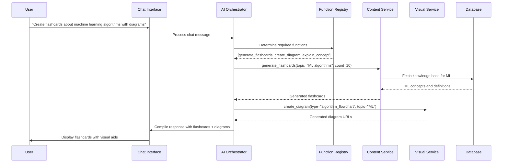
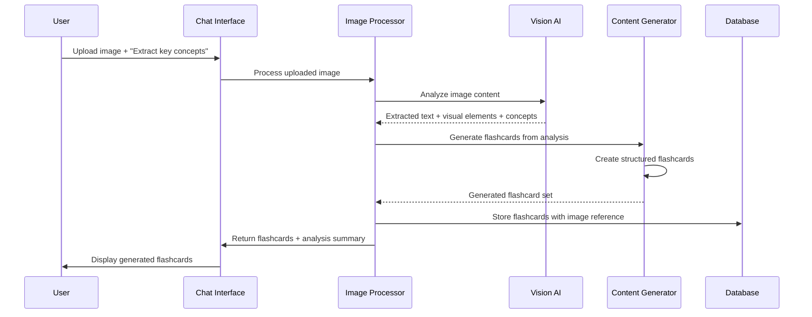
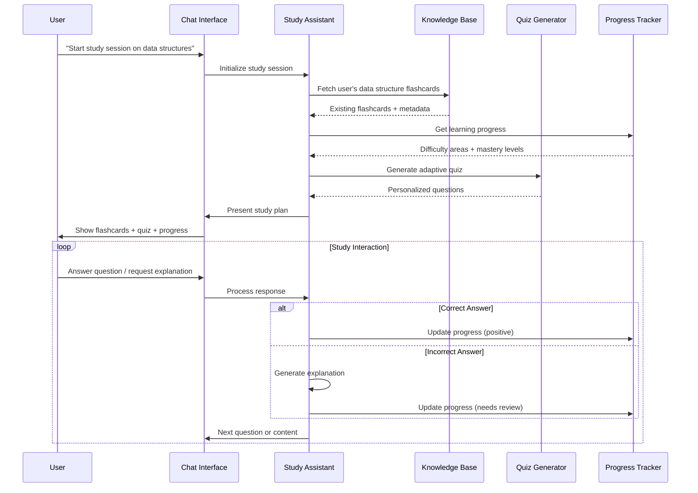
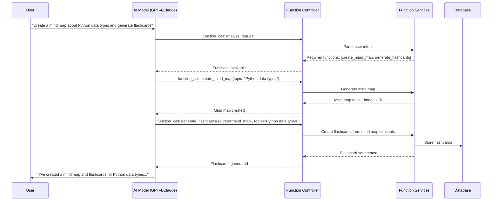

# AI-Powered Learning System: Workflow Design & Sequence Diagrams

## Overview

This document outlines a comprehensive AI-powered learning system that extends beyond simple text-to-flashcard generation to include:
- **Multi-modal input processing** (text, images, PDFs)
- **Interactive chat interface** with function calling
- **Visual content generation** (diagrams, mind maps)
- **Intelligent study assistance**
- **Topic-based flashcard generation** without source material

## System Architecture

### Core Components

1. **Chat Interface Service** - Handles conversational interactions
2. **Function Calling Orchestrator** - Routes AI requests to appropriate services
3. **Content Processing Service** - Handles text, image, and document analysis
4. **Visual Generation Service** - Creates diagrams and visual aids
5. **Study Assistant Service** - Provides personalized learning support
6. **Knowledge Base Service** - Manages topic-based content generation

## Sequence Diagrams

### 1. Interactive Chat with Function Calling



### 2. Image Analysis to Flashcards



### 3. Multi-Modal Study Session



### 4. Function Calling Workflow



## Available Functions for AI

### Content Generation Functions

```json
{
  "name": "generate_flashcards",
  "description": "Generate flashcards from text, topic, or other content",
  "parameters": {
    "source_type": "text|topic|image|url",
    "content": "Source material or topic description",
    "count": "Number of flashcards (1-50)",
    "difficulty": "beginner|intermediate|advanced",
    "format": "basic|cloze|multiple_choice"
  }
}

{
  "name": "analyze_image",
  "description": "Extract concepts and text from uploaded images",
  "parameters": {
    "image_url": "URL of uploaded image",
    "analysis_type": "text_extraction|concept_analysis|diagram_understanding",
    "generate_flashcards": "boolean"
  }
}

{
  "name": "create_visual_aid",
  "description": "Generate diagrams, mind maps, or visual representations",
  "parameters": {
    "type": "mind_map|flowchart|diagram|infographic",
    "topic": "Subject matter",
    "style": "simple|detailed|academic",
    "format": "mermaid|image|svg"
  }
}
```

### Study Assistant Functions

```json
{
  "name": "start_study_session",
  "description": "Begin an interactive study session",
  "parameters": {
    "deck_id": "Target flashcard deck",
    "session_type": "review|quiz|adaptive",
    "duration": "Session length in minutes"
  }
}

{
  "name": "generate_quiz",
  "description": "Create adaptive quizzes based on user progress",
  "parameters": {
    "topic": "Subject area",
    "question_count": "Number of questions",
    "difficulty": "Based on user performance",
    "question_types": "multiple_choice|fill_blank|essay"
  }
}

{
  "name": "explain_concept",
  "description": "Provide detailed explanations for difficult topics",
  "parameters": {
    "concept": "Topic to explain",
    "level": "User's current understanding level",
    "examples": "Include practical examples",
    "analogies": "Use analogies for clarity"
  }
}
```

### Knowledge Management Functions

```json
{
  "name": "search_knowledge_base",
  "description": "Find relevant information from stored content",
  "parameters": {
    "query": "Search terms",
    "scope": "user_content|public_knowledge|all",
    "content_types": "flashcards|notes|summaries"
  }
}

{
  "name": "create_summary",
  "description": "Generate summaries of study materials",
  "parameters": {
    "source": "Content to summarize",
    "length": "brief|detailed|comprehensive",
    "format": "bullet_points|prose|outline"
  }
}
```

## Implementation Architecture

### Backend Structure

```
src/main/java/com/learning/
├── ai/
│   ├── FunctionCallingService.java
│   ├── AIOrchestrator.java
│   └── functions/
│       ├── FlashcardFunction.java
│       ├── ImageAnalysisFunction.java
│       ├── VisualGenerationFunction.java
│       └── StudyAssistantFunction.java
├── chat/
│   ├── ChatSessionService.java
│   ├── ConversationManager.java
│   └── MessageProcessor.java
├── content/
│   ├── ContentAnalysisService.java
│   ├── ImageProcessingService.java
│   └── KnowledgeBaseService.java
└── study/
    ├── StudySessionService.java
    ├── ProgressTracker.java
    └── AdaptiveLearningService.java
```

### Frontend Chat Interface

```typescript
interface ChatMessage {
  id: string;
  role: 'user' | 'assistant';
  content: string;
  functions_used?: string[];
  attachments?: Attachment[];
  timestamp: Date;
}

interface FunctionCall {
  name: string;
  parameters: Record<string, any>;
  result?: any;
}

interface StudySession {
  id: string;
  topic: string;
  progress: number;
  current_flashcard?: Flashcard;
  quiz_questions?: Question[];
  performance_metrics: PerformanceData;
}
```

## Enhanced User Experience

### 1. Intelligent Conversation Flow
- Context-aware responses that remember previous interactions
- Proactive suggestions based on user behavior
- Multi-turn conversations that build on previous exchanges

### 2. Visual Learning Support
- Automatic diagram generation for complex topics
- Interactive visual elements in flashcards
- Progress visualization and learning analytics

### 3. Adaptive Learning
- Difficulty adjustment based on performance
- Personalized study recommendations
- Spaced repetition optimization using AI insights

### 4. Seamless Multi-Modal Input
- Drag-and-drop image processing
- PDF document analysis and extraction
- Voice-to-text input for flashcard creation

## Technical Implementation Notes

### Spring AI Integration
```java
@Service
public class AIOrchestrator {
    
    @Autowired
    private ChatClient chatClient;
    
    @Autowired
    private FunctionRegistry functionRegistry;
    
    public ChatResponse processMessage(String userMessage, String sessionId) {
        // Build prompt with available functions
        // Process AI response and extract function calls
        // Execute functions and gather results
        // Return comprehensive response
    }
}
```

### Function Registration
```java
@Component
public class FunctionRegistry {
    
    private Map<String, Function> functions = new HashMap<>();
    
    @PostConstruct
    public void registerFunctions() {
        functions.put("generate_flashcards", new FlashcardGenerationFunction());
        functions.put("analyze_image", new ImageAnalysisFunction());
        functions.put("create_visual_aid", new VisualGenerationFunction());
        // ... register all available functions
    }
}
```

This comprehensive system transforms your basic text-to-flashcard tool into a sophisticated AI-powered learning platform that can handle diverse learning scenarios and provide intelligent, adaptive study assistance.