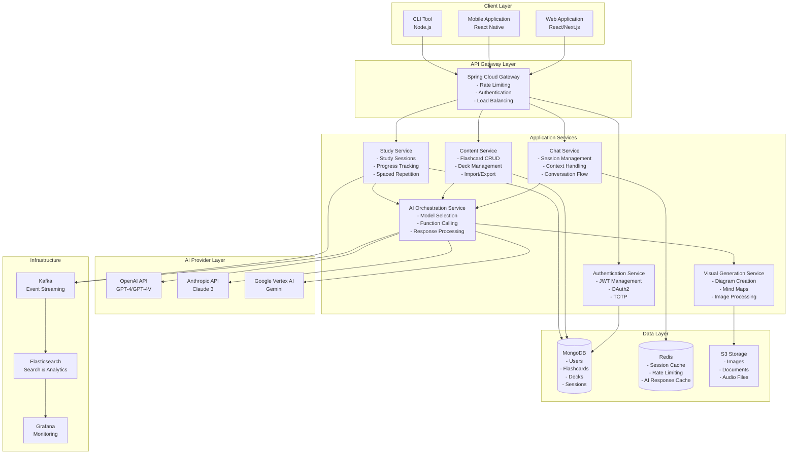
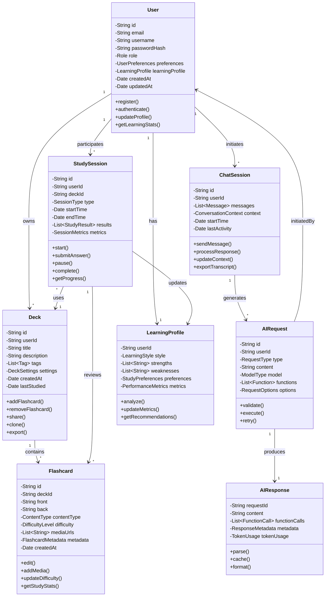
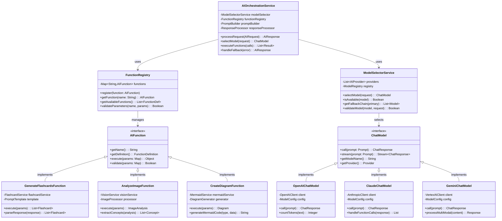
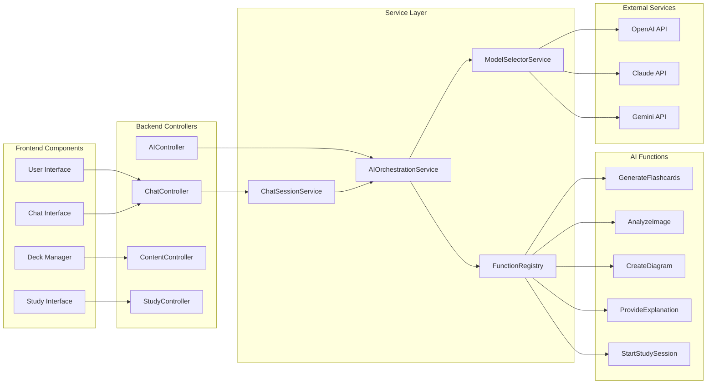
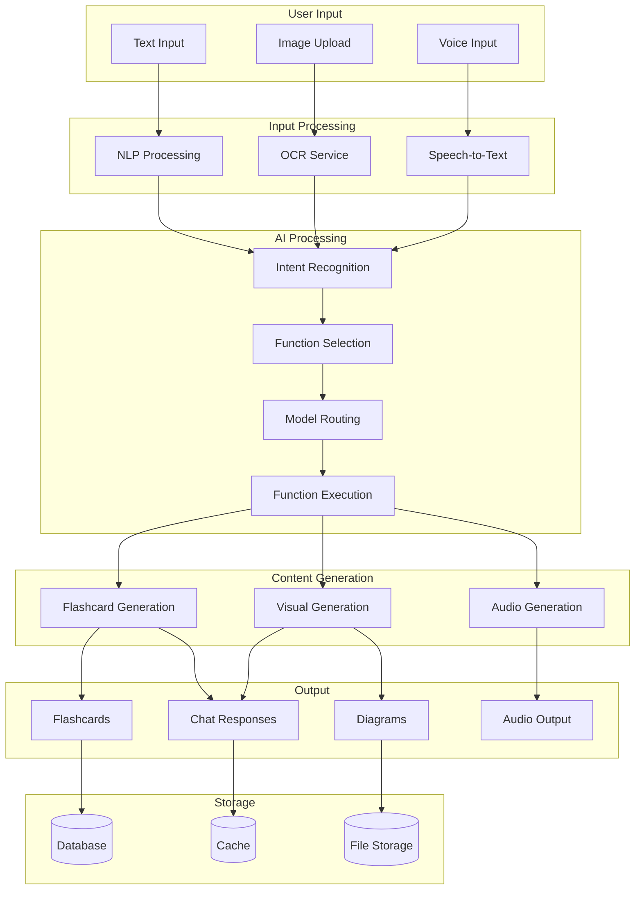
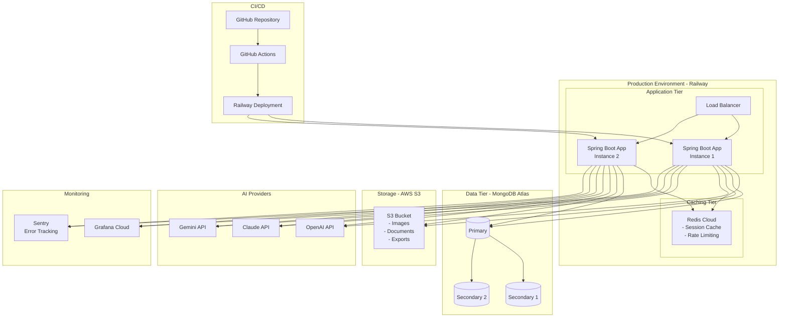
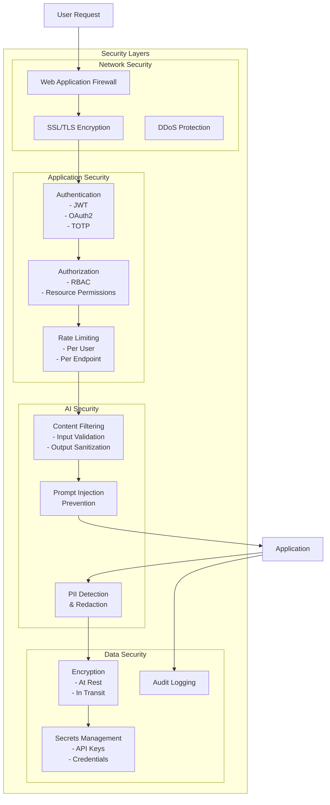
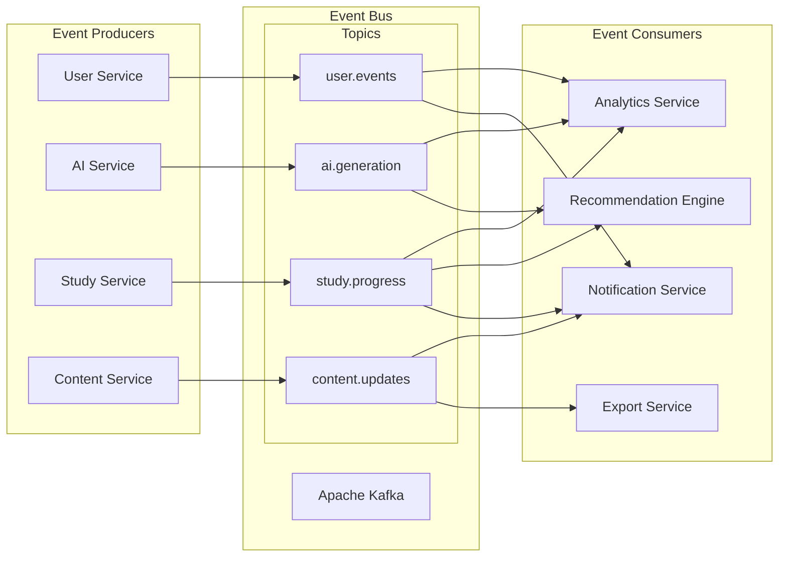
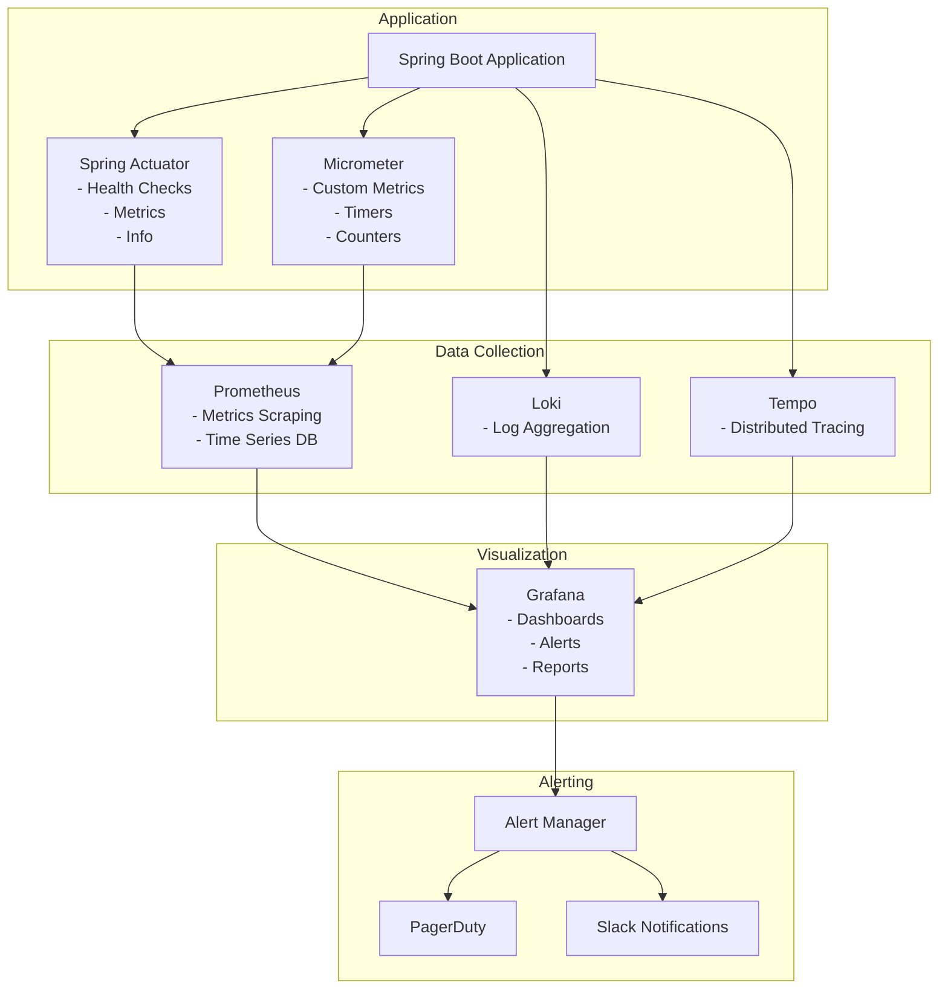
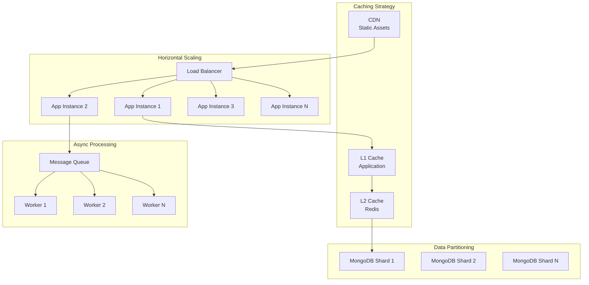

# System Architecture and Design Diagrams

## 1. High-Level System Architecture

## 2. UML Class Diagram - Core Domain Model

## 3. UML Class Diagram - AI Services Architecture

## 4. Component Interaction Diagram

## 5. Data Flow Diagram

## 6. Deployment Architecture

## 7. Security Architecture

## 8. Event-Driven Architecture

## 9. Monitoring and Observability Stack

## 10. Scalability Strategy

