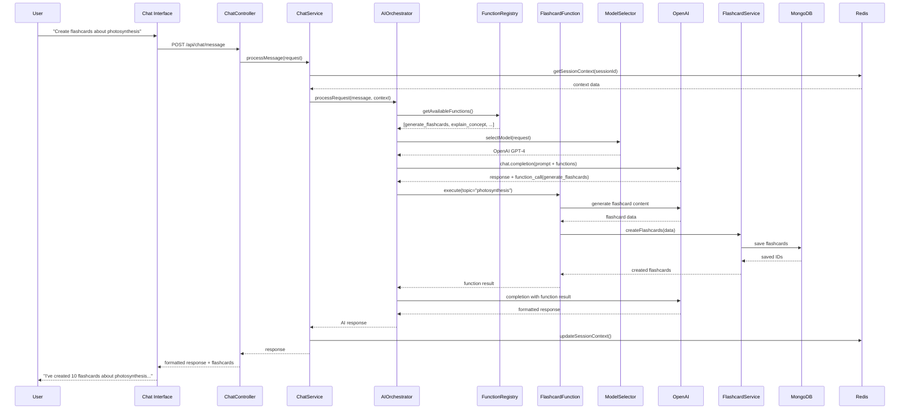
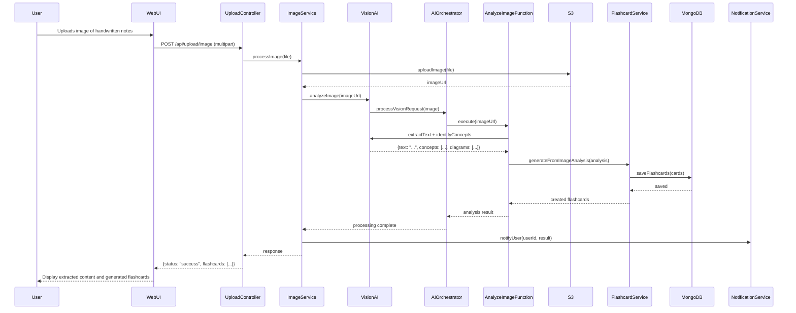
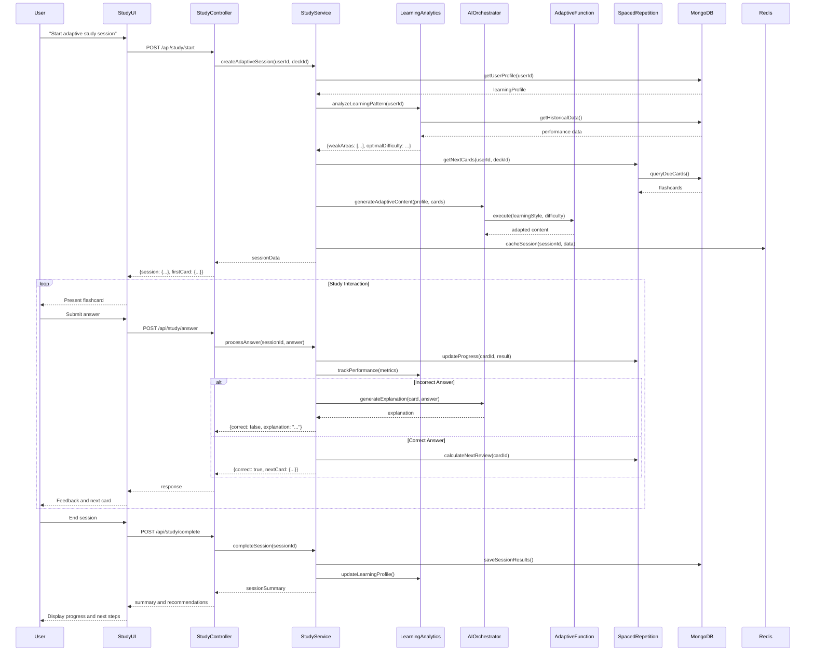
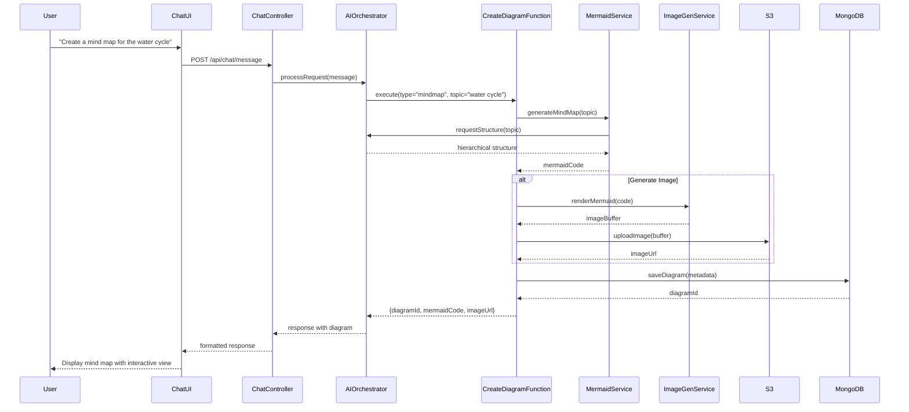
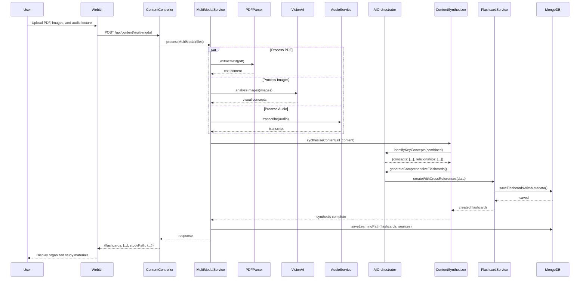
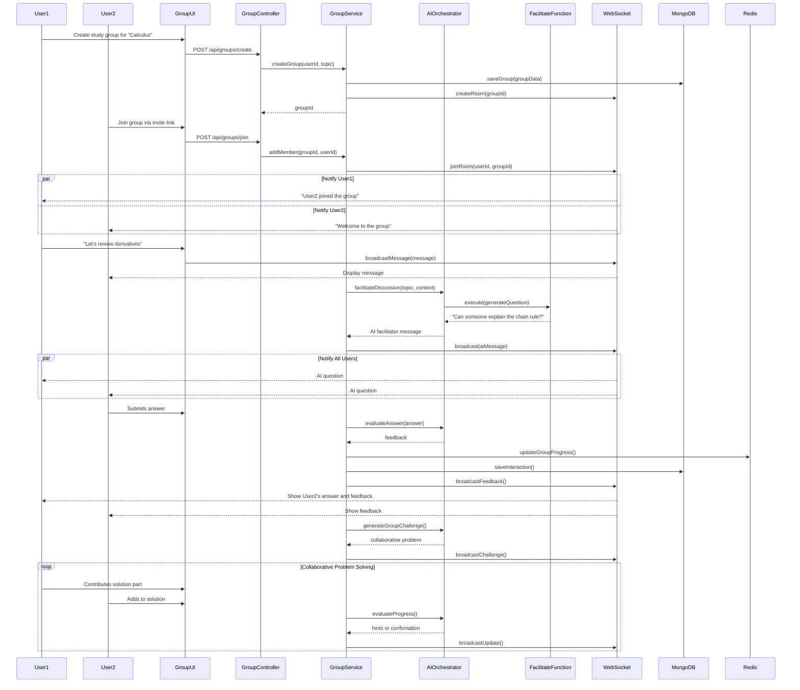
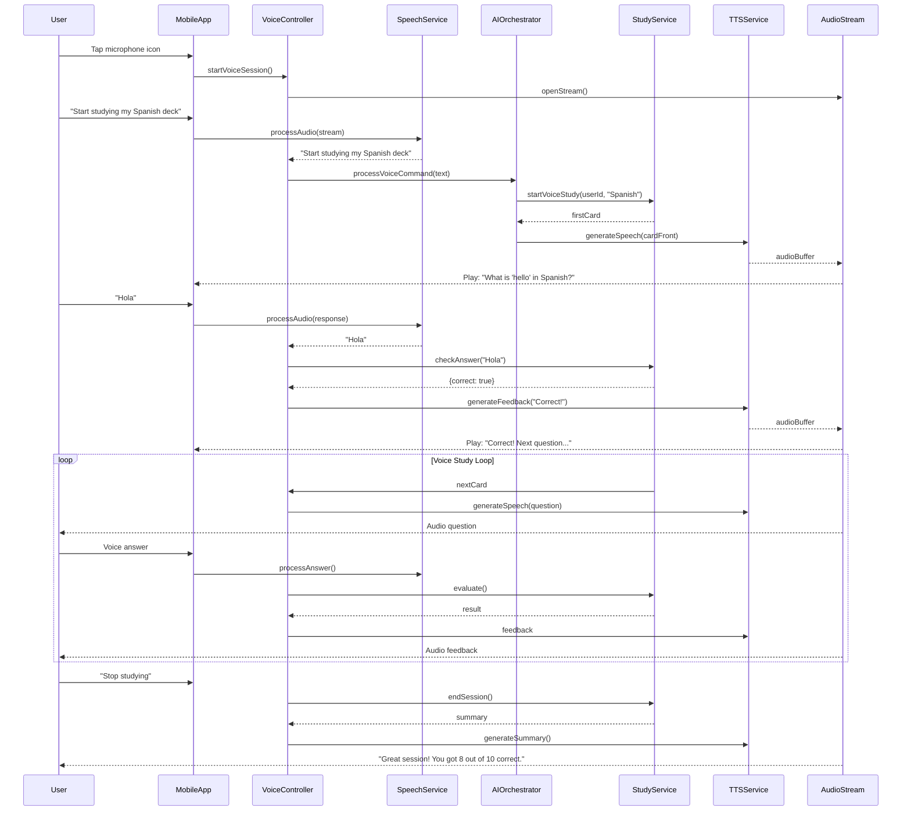
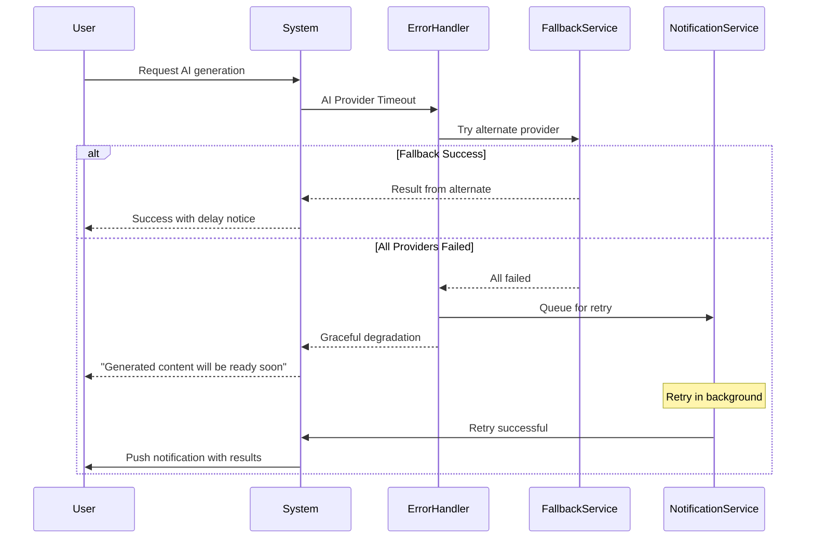

# User Journey Sequence Diagrams

## 1. Natural Language Flashcard Generation Journey



## 2. Image Analysis and Flashcard Generation Journey



## 3. Adaptive Study Session Journey



## 4. Visual Diagram Generation Journey



## 5. Multi-Modal Study Material Creation Journey



## 6. Collaborative Study Group Journey



## 7. Voice-Activated Study Journey



## 8. AI-Powered Content Recommendation Journey

```mermaid
sequenceDiagram
    participant User
    participant DashboardUI
    participant RecommendationController
    participant RecommendationEngine
    participant LearningAnalytics
    participant AIOrchestrator
    participant ContentService
    participant MongoDB

    User->>DashboardUI: Opens dashboard
    DashboardUI->>RecommendationController: GET /api/recommendations
    RecommendationController->>RecommendationEngine: generateRecommendations(userId)

    RecommendationEngine->>LearningAnalytics: getUserProfile(userId)
    LearningAnalytics->>MongoDB: queryUserData()
    MongoDB-->>LearningAnalytics: {studyHistory, performance, preferences}
    LearningAnalytics-->>RecommendationEngine: learningProfile

    RecommendationEngine->>AIOrchestrator: analyzeGaps(profile)
    AIOrchestrator-->>RecommendationEngine: {weakAreas: [...], suggestions: [...]}

    RecommendationEngine->>ContentService: findRelatedContent(suggestions)
    ContentService->>MongoDB: searchPublicDecks(criteria)
    MongoDB-->>ContentService: matchingDecks

    RecommendationEngine->>AIOrchestrator: personalizeRecommendations(decks, profile)
    AIOrchestrator-->>RecommendationEngine: rankedRecommendations

    RecommendationEngine-->>RecommendationController: recommendations
    RecommendationController-->>DashboardUI: {
        daily: [...],
        weekly: [...],
        topics: [...],
        challenges: [...]
    }

    DashboardUI-->>User: Display personalized recommendations

    User->>DashboardUI: Clicks on recommended deck
    DashboardUI->>ContentService: cloneDeck(deckId, userId)
    ContentService->>AIOrchestrator: adaptToUserLevel(deck, profile)
    AIOrchestrator-->>ContentService: adaptedDeck
    ContentService->>MongoDB: saveUserDeck()
    ContentService-->>DashboardUI: deckAdded
    DashboardUI-->>User: "Deck added and adapted to your level"
```

## 9. Exam Preparation Journey

```mermaid
sequenceDiagram
    participant User
    participant ExamUI
    participant ExamController
    participant ExamService
    participant AIOrchestrator
    participant QuizFunction
    participant TimerService
    participant GradingService
    participant MongoDB

    User->>ExamUI: "Prepare me for SAT Math"
    ExamUI->>ExamController: POST /api/exam/prepare
    ExamController->>ExamService: createExamPrep(userId, "SAT Math")

    ExamService->>AIOrchestrator: generateStudyPlan(exam, timeframe)
    AIOrchestrator-->>ExamService: {
        plan: [...],
        milestones: [...],
        practiceExams: [...]
    }

    ExamService->>MongoDB: saveStudyPlan()
    ExamService-->>ExamController: studyPlan
    ExamController-->>ExamUI: Display plan

    User->>ExamUI: "Start practice exam"
    ExamUI->>ExamController: POST /api/exam/start-practice
    ExamController->>ExamService: generatePracticeExam(userId, examType)

    ExamService->>AIOrchestrator: createExam(specifications)
    AIOrchestrator->>QuizFunction: generateQuestions(count=50, type="SAT")
    QuizFunction-->>AIOrchestrator: questions

    ExamService->>TimerService: startTimer(duration=180)
    ExamService->>MongoDB: saveExamSession()
    ExamService-->>ExamController: {exam: {...}, timeLimit: 180}

    loop Exam Taking
        ExamUI-->>User: Display question
        User->>ExamUI: Submit answer
        ExamUI->>ExamController: POST /api/exam/answer
        ExamController->>ExamService: recordAnswer(questionId, answer)
        ExamService->>MongoDB: saveAnswer()
        ExamService->>TimerService: checkTime()

        alt Time Warning
            TimerService-->>ExamService: 5 minutes remaining
            ExamService-->>ExamUI: timeWarning
            ExamUI-->>User: "5 minutes remaining"
        end
    end

    User->>ExamUI: Submit exam
    ExamUI->>ExamController: POST /api/exam/submit
    ExamController->>GradingService: gradeExam(examId)

    GradingService->>AIOrchestrator: evaluateAnswers(questions, answers)
    AIOrchestrator-->>GradingService: {
        score: 85,
        correct: [...],
        incorrect: [...],
        explanations: [...]
    }

    GradingService->>ExamService: generateReport(results)
    ExamService->>MongoDB: saveResults()
    ExamService-->>ExamController: examReport
    ExamController-->>ExamUI: Display results with explanations
    ExamUI-->>User: Score, analysis, and improvement areas
```

## 10. Learning Path Creation Journey

```mermaid
sequenceDiagram
    participant User
    participant PathUI
    participant PathController
    participant PathService
    participant AIOrchestrator
    participant CurriculumFunction
    participant ContentService
    participant ProgressTracker
    participant MongoDB

    User->>PathUI: "I want to learn machine learning from scratch"
    PathUI->>PathController: POST /api/path/create
    PathController->>PathService: generateLearningPath(userId, goal)

    PathService->>AIOrchestrator: analyzeLearningGoal(goal)
    AIOrchestrator->>CurriculumFunction: execute(topic="ML", level="beginner")

    CurriculumFunction->>AIOrchestrator: assessPrerequisites()
    AIOrchestrator-->>CurriculumFunction: [math, statistics, programming]

    CurriculumFunction->>ContentService: findOrCreateContent(prerequisites)
    ContentService-->>CurriculumFunction: prerequisiteDecks

    CurriculumFunction->>AIOrchestrator: generateCurriculum()
    AIOrchestrator-->>CurriculumFunction: {
        phases: [
            {name: "Foundations", duration: "2 weeks", topics: [...]},
            {name: "Core Concepts", duration: "4 weeks", topics: [...]},
            {name: "Advanced", duration: "4 weeks", topics: [...]}
        ]
    }

    PathService->>ContentService: createDecksForPath(curriculum)
    ContentService->>MongoDB: savePathDecks()

    PathService->>ProgressTracker: initializeTracking(userId, pathId)
    ProgressTracker->>MongoDB: createProgressRecord()

    PathService-->>PathController: learningPath
    PathController-->>PathUI: {
        path: {...},
        estimatedDuration: "10 weeks",
        milestones: [...],
        firstDeck: {...}
    }

    PathUI-->>User: Display interactive learning path

    loop Daily Learning
        User->>PathUI: Continue learning
        PathUI->>ProgressTracker: getCurrentPosition(userId, pathId)
        ProgressTracker-->>PathUI: currentDeck, progress

        User->>PathUI: Complete study session
        PathUI->>ProgressTracker: updateProgress()

        alt Milestone Reached
            ProgressTracker->>AIOrchestrator: generateMilestoneAssessment()
            AIOrchestrator-->>ProgressTracker: assessment
            ProgressTracker-->>PathUI: Show milestone quiz
        end
    end
```

## Journey Analytics and Metrics

### Key Performance Indicators per Journey

| Journey | Success Metrics | Tracking Points |
|---------|----------------|-----------------|
| Natural Language Generation | - Time to generate < 3s<br>- User satisfaction > 90%<br>- Flashcard quality score > 4/5 | - Request initiation<br>- AI processing<br>- Content delivery |
| Image Analysis | - OCR accuracy > 95%<br>- Concept extraction rate > 80%<br>- Processing time < 5s | - Upload start<br>- Analysis complete<br>- Flashcard generation |
| Adaptive Study | - Retention improvement > 30%<br>- Engagement rate > 70%<br>- Session completion > 80% | - Session start<br>- Each interaction<br>- Session end |
| Visual Generation | - Generation success rate > 95%<br>- User interaction rate > 60%<br>- Share rate > 20% | - Request<br>- Generation<br>- User interaction |
| Multi-Modal | - Content synthesis accuracy > 85%<br>- Time saved > 50%<br>- Cross-reference quality > 90% | - Upload<br>- Processing<br>- Synthesis complete |
| Collaborative | - Group engagement > 75%<br>- Peer learning effectiveness > 40%<br>- Return rate > 60% | - Group creation<br>- Member interactions<br>- Session completion |
| Voice Study | - Recognition accuracy > 95%<br>- Hands-free completion > 90%<br>- User preference > 70% | - Voice initiation<br>- Each Q&A<br>- Session end |
| Recommendations | - Click-through rate > 30%<br>- Adoption rate > 20%<br>- Relevance score > 4/5 | - Recommendation display<br>- User interaction<br>- Content adoption |
| Exam Prep | - Score improvement > 20%<br>- Practice completion > 85%<br>- Confidence increase > 40% | - Plan creation<br>- Practice sessions<br>- Actual exam results |
| Learning Path | - Path completion > 60%<br>- Milestone achievement > 70%<br>- Knowledge retention > 80% | - Path creation<br>- Daily progress<br>- Milestone completion |

## Error Handling and Recovery Flows

### Common Error Scenarios

