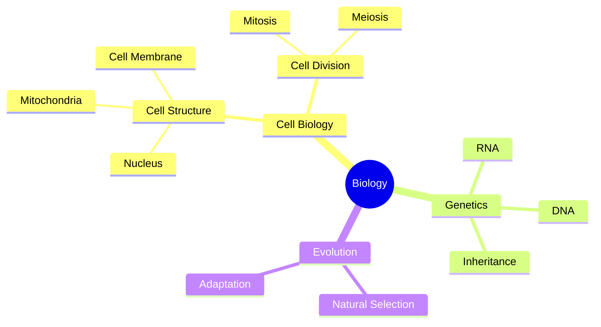

# User Stories: AI-Powered Learning Platform

## Epic 1: Conversational AI with Function Calling

### Story 1.1: Natural Language Flashcard Generation
**As a** student
**I want to** create flashcards by simply describing what I want to learn in natural language
**So that** I can quickly generate study materials without manual creation

**Acceptance Criteria:**
- User can type requests like "Create flashcards about photosynthesis for my biology exam"
- System understands context and generates appropriate flashcards
- AI suggests related topics for comprehensive coverage
- Generated flashcards include difficulty levels and tags
- User can refine results through conversation

**Technical Implementation:**
- Function: `generate_flashcards_from_topic`
- NLP intent recognition
- Context-aware prompt generation
- Multi-turn conversation support

**Example Interaction:**
```
User: "I need to study the French Revolution for tomorrow's test"
AI: "I'll create flashcards covering the French Revolution. What aspects would you like to focus on?"
User: "Main causes, key figures, and important dates"
AI: [Generates 15 flashcards organized by topic with varying difficulty]
```

---

### Story 1.2: Image-to-Flashcard Conversion
**As a** student
**I want to** upload photos of my notes or textbook pages and automatically generate flashcards
**So that** I can quickly digitize my study materials

**Acceptance Criteria:**
- Support for multiple image formats (JPG, PNG, PDF)
- OCR text extraction with 95%+ accuracy
- Intelligent concept identification from images
- Diagram and chart interpretation
- Batch processing for multiple images
- Progress indication for large uploads

**Technical Implementation:**
- Function: `analyze_image_content`
- Vision AI integration (GPT-4V, Claude Vision)
- Advanced OCR with error correction
- Concept extraction algorithms

---

### Story 1.3: Interactive Study Assistant
**As a** learner
**I want to** have conversations with an AI tutor about my flashcards
**So that** I can get explanations, ask questions, and deepen my understanding

**Acceptance Criteria:**
- Context-aware conversations about deck content
- Ability to ask "why" and "how" questions
- AI provides examples and analogies
- Tracks conversation history per study session
- Suggests related concepts to explore
- Can generate practice problems based on flashcards

**Technical Implementation:**
- Function: `provide_explanation`
- Function: `generate_practice_problems`
- Session management with Redis
- Context injection from user's decks

---

## Epic 2: Visual Learning Enhancement

### Story 2.1: Automatic Diagram Generation
**As a** visual learner
**I want to** automatically generate diagrams and mind maps from my study topics
**So that** I can better understand complex relationships and concepts

**Acceptance Criteria:**
- Generate mind maps from topic hierarchies
- Create flowcharts for processes
- Build concept maps showing relationships
- Export diagrams in multiple formats
- Interactive diagram editing
- Diagrams linked to relevant flashcards

**Technical Implementation:**
- Function: `create_mind_map`
- Function: `generate_flowchart`
- Mermaid.js integration
- D3.js for interactive visualizations

**Example Diagrams:**


---

### Story 2.2: Visual Memory Aids
**As a** student
**I want to** have AI generate memorable visual associations for difficult concepts
**So that** I can improve retention using visual memory techniques

**Acceptance Criteria:**
- Generate mnemonic images for abstract concepts
- Create visual stories for sequences
- Design memory palaces for lists
- Personalized visual styles based on preferences
- Track effectiveness of visual aids

**Technical Implementation:**
- Function: `generate_mnemonic_visual`
- Image generation AI integration
- Personalization engine
- Effectiveness tracking metrics

---

## Epic 3: Adaptive Learning System

### Story 3.1: Personalized Difficulty Adjustment
**As a** learner
**I want to** have the system automatically adjust question difficulty based on my performance
**So that** I'm always challenged at the right level

**Acceptance Criteria:**
- Real-time performance analysis
- Dynamic difficulty adjustment algorithm
- Gradual progression system
- Performance visualization
- Option to manually override difficulty
- Separate tracking for different topics

**Technical Implementation:**
- Function: `adjust_difficulty_level`
- ML model for performance prediction
- Adaptive algorithm implementation
- Performance analytics dashboard

---

### Story 3.2: Learning Style Detection
**As a** student
**I want to** have the AI detect and adapt to my learning style
**So that** content is presented in the way I learn best

**Acceptance Criteria:**
- Identify learning style (visual, auditory, kinesthetic, reading/writing)
- Adapt content presentation accordingly
- Provide style-specific study strategies
- Track effectiveness across styles
- Allow manual style selection
- Mixed-style content for reinforcement

**Technical Implementation:**
- Function: `detect_learning_style`
- Function: `adapt_content_to_style`
- Behavioral analysis algorithms
- A/B testing framework

---

### Story 3.3: Smart Study Scheduling
**As a** busy student
**I want to** have AI create an optimized study schedule based on my availability and goals
**So that** I can maximize learning efficiency with limited time

**Acceptance Criteria:**
- Calendar integration
- Spaced repetition scheduling
- Priority-based scheduling
- Break time recommendations
- Progress tracking against schedule
- Adjustment for unexpected changes
- Mobile notifications for study sessions

**Technical Implementation:**
- Function: `generate_study_schedule`
- Function: `optimize_review_timing`
- Calendar API integration
- Notification service

---

## Epic 4: Collaborative Learning Features

### Story 4.1: AI-Mediated Study Groups
**As a** student
**I want to** join AI-facilitated study groups
**So that** I can learn collaboratively with peers

**Acceptance Criteria:**
- AI moderates group discussions
- Generates group challenges
- Tracks individual contributions
- Provides group performance analytics
- Suggests discussion topics
- Resolves conflicts in answers

**Technical Implementation:**
- Function: `facilitate_group_discussion`
- Function: `generate_group_challenges`
- WebSocket for real-time collaboration
- Group session management

---

### Story 4.2: Peer Learning Recommendations
**As a** learner
**I want to** receive AI recommendations for study partners
**So that** I can find peers with complementary knowledge

**Acceptance Criteria:**
- Match users by topic and level
- Identify knowledge gaps that peers can fill
- Suggest collaboration opportunities
- Track successful partnerships
- Privacy-preserving matching

**Technical Implementation:**
- Function: `match_study_partners`
- Recommendation algorithm
- Privacy-first architecture

---

## Epic 5: Advanced Content Generation

### Story 5.1: Multi-Source Content Synthesis
**As a** researcher
**I want to** generate flashcards from multiple sources (PDFs, websites, videos)
**So that** I can create comprehensive study materials from diverse content

**Acceptance Criteria:**
- Support for PDF, web scraping, YouTube transcripts
- Intelligent deduplication
- Source attribution
- Cross-reference detection
- Batch processing UI
- Progress tracking for large jobs

**Technical Implementation:**
- Function: `synthesize_multiple_sources`
- PDF parsing service
- Web scraping service
- Video transcript extraction

---

### Story 5.2: Exam-Specific Preparation
**As a** student
**I want to** generate practice exams based on my flashcards
**So that** I can prepare for specific exam formats

**Acceptance Criteria:**
- Multiple question types (MCQ, essay, fill-in-blank)
- Timed practice exams
- Instant grading with explanations
- Performance analytics
- Weak area identification
- Exam history tracking

**Technical Implementation:**
- Function: `generate_practice_exam`
- Function: `grade_exam_responses`
- Question generation algorithms
- Grading rubric creation

---

## Epic 6: Voice and Audio Features

### Story 6.1: Voice-Activated Studying
**As a** commuter
**I want to** study using voice commands and audio responses
**So that** I can learn while driving or exercising

**Acceptance Criteria:**
- Voice command recognition
- Text-to-speech for flashcards
- Audio-only study mode
- Voice-based answers
- Hands-free navigation
- Background audio options

**Technical Implementation:**
- Function: `process_voice_command`
- Function: `generate_audio_response`
- Speech recognition integration
- TTS service integration

---

### Story 6.2: Podcast-Style Learning
**As a** auditory learner
**I want to** have AI generate podcast-style lessons from my flashcards
**So that** I can learn through listening

**Acceptance Criteria:**
- Generate narrative explanations
- Create conversational lessons
- Add background music
- Adjustable playback speed
- Chapter markers
- Offline download support

**Technical Implementation:**
- Function: `generate_audio_lesson`
- Audio synthesis service
- Content scripting engine

---

## Epic 7: Progress Analytics and Insights

### Story 7.1: Learning Analytics Dashboard
**As a** self-directed learner
**I want to** see detailed analytics about my learning progress
**So that** I can identify areas for improvement

**Acceptance Criteria:**
- Visual progress charts
- Retention rate tracking
- Study time analytics
- Performance trends
- Comparative analytics with peers
- Exportable reports
- Goal setting and tracking

**Technical Implementation:**
- Function: `generate_analytics_report`
- Data visualization library
- Analytics engine
- Report generation service

---

### Story 7.2: AI Learning Coach
**As a** student
**I want to** receive personalized coaching from AI based on my performance
**So that** I can improve my study habits

**Acceptance Criteria:**
- Weekly performance reviews
- Personalized study tips
- Motivation messages
- Goal recommendations
- Study habit analysis
- Improvement suggestions

**Technical Implementation:**
- Function: `provide_coaching_feedback`
- Function: `analyze_study_habits`
- Coaching algorithm
- Motivational content generation

---

## Epic 8: Integration and Automation

### Story 8.1: LMS Integration
**As a** student
**I want to** sync my flashcards with my school's learning management system
**So that** I can align my studying with course materials

**Acceptance Criteria:**
- Canvas/Blackboard/Moodle integration
- Automatic syllabus import
- Assignment-based flashcard generation
- Grade tracking integration
- Calendar sync
- Single sign-on support

**Technical Implementation:**
- LTI (Learning Tools Interoperability) support
- OAuth integration
- API connectors for major LMS platforms

---

### Story 8.2: Smart Note Integration
**As a** note-taker
**I want to** integrate with Notion, Obsidian, and Roam Research
**So that** I can generate flashcards from my existing notes

**Acceptance Criteria:**
- Two-way sync with note apps
- Automatic flashcard generation from tagged notes
- Preserve formatting and links
- Incremental updates
- Conflict resolution
- Backup functionality

**Technical Implementation:**
- Function: `sync_with_note_app`
- API integrations
- Webhook listeners
- Sync conflict resolution

---

## Priority Matrix

### Must Have (MVP)
1. Natural language flashcard generation
2. Basic chat interface
3. Image-to-flashcard conversion
4. Simple study sessions
5. Multi-provider AI support

### Should Have
1. Visual diagram generation
2. Adaptive difficulty
3. Voice commands
4. Advanced analytics
5. Study scheduling

### Could Have
1. Collaborative features
2. LMS integration
3. Podcast generation
4. AR flashcards
5. Gamification

### Won't Have (Future)
1. VR study environments
2. Brain-computer interface
3. Holographic displays
4. AI teaching assistant avatar
5. Quantum computing optimization

## Success Metrics

### User Engagement
- Daily active users: >60%
- Average session length: >15 minutes
- Flashcards created per user: >50/month
- AI interaction rate: >80%

### Learning Effectiveness
- Retention rate improvement: >30%
- Study time reduction: >20%
- Test score improvement: >15%
- User satisfaction: >4.5/5

### Technical Performance
- AI response time: <2 seconds
- Function call success rate: >95%
- System uptime: >99.9%
- Concurrent users supported: >1000

### Business Metrics
- User acquisition cost: <$5
- Monthly recurring revenue per user: >$10
- Churn rate: <5%
- Net promoter score: >50