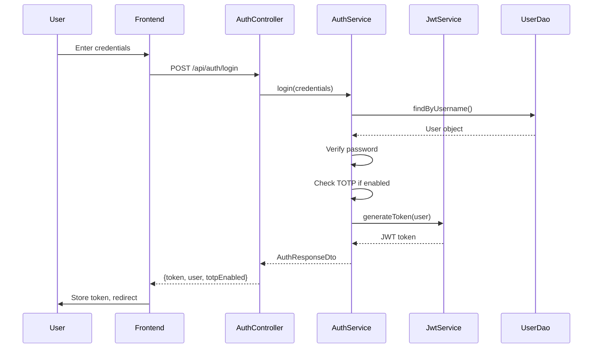
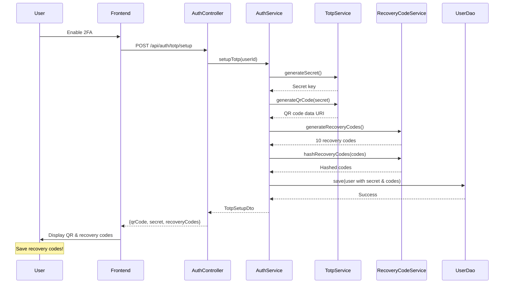
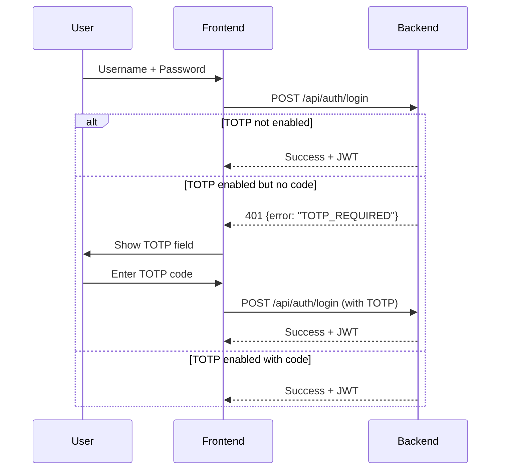
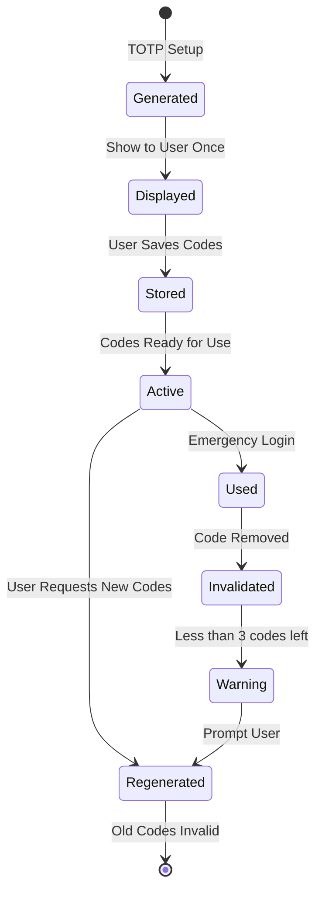
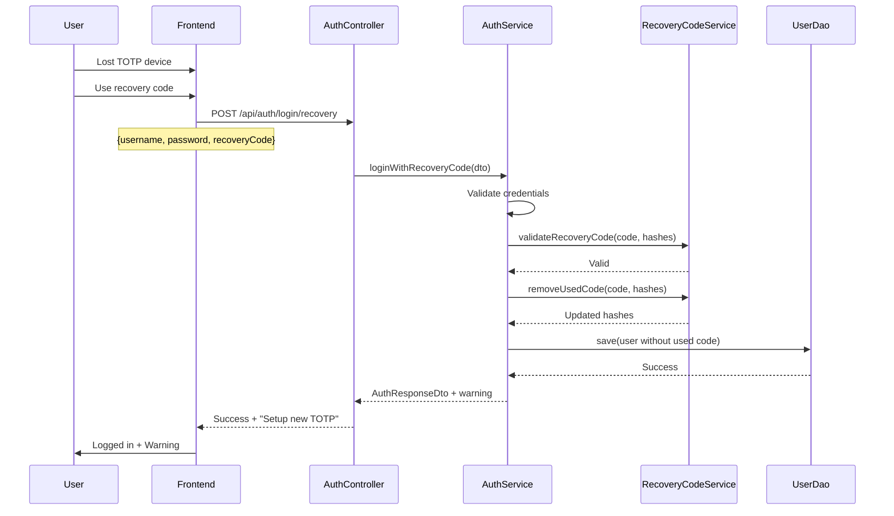
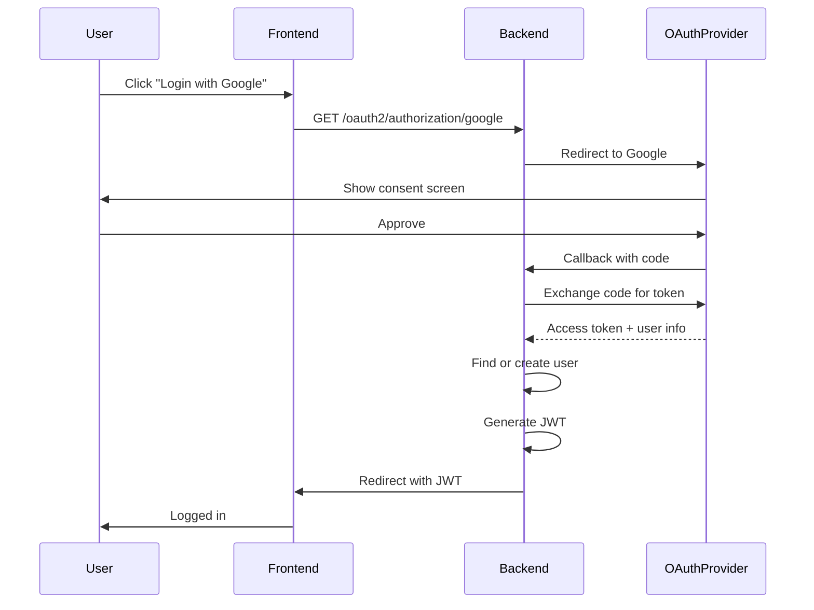

# Complete Authentication Implementation Guide

## Overview
This guide consolidates all authentication documentation including JWT, TOTP, Recovery Codes, and OAuth implementation for the Flashcards application.

## Table of Contents
1. [Current Implementation Status](#current-implementation-status)
2. [JWT Authentication](#jwt-authentication)
3. [TOTP Two-Factor Authentication](#totp-two-factor-authentication)
4. [Recovery Codes](#recovery-codes)
5. [OAuth Integration (Planned)](#oauth-integration-planned)
6. [Implementation Roadmap](#implementation-roadmap)

---

## Current Implementation Status

### ✅ Completed
- JWT token generation and validation
- User registration and login
- Password encryption with BCrypt
- TOTP setup and verification
- Security configuration with Spring Security
- JWT authentication filter and entry point

### 🚧 In Progress
- Recovery codes implementation
- OAuth provider integration

### 📋 Planned
- Rate limiting
- Session management
- Refresh tokens
- Account linking for OAuth

---

## JWT Authentication

### Token Structure
```json
{
  "header": {
    "alg": "HS256",
    "typ": "JWT"
  },
  "payload": {
    "sub": "userId",
    "username": "casquinn",
    "email": "user@example.com",
    "authorities": ["ROLE_USER"],
    "totpEnabled": true,
    "iss": "flashcards-app",
    "iat": 1234567890,
    "exp": 1234567890
  },
  "signature": "HMACSHA256(base64UrlEncode(header) + '.' + base64UrlEncode(payload), secret)"
}
```

### Authentication Flow



### Token Validation
Every request with JWT goes through:
1. `JwtAuthenticationFilter` extracts token from Authorization header
2. Validates token signature and expiration
3. Loads user details from token claims
4. Sets authentication in SecurityContext

---

## TOTP Two-Factor Authentication

### Setup Flow



### Login with TOTP



### UI Pattern: Smart Error Messages
We use the "Smart Error Messages" pattern where:
1. First login attempt without TOTP returns specific error
2. Frontend dynamically shows TOTP field
3. User retries with TOTP code

---

## Recovery Codes

### Industry Standards
Following GitHub, Google, and Microsoft patterns:
- **10 codes** generated during TOTP setup
- **8 characters** alphanumeric (XXXX-XXXX format)
- **One-time use** - code invalidated after use
- **BCrypt hashed** storage (same as passwords)
- **Regeneration** available (invalidates old codes)

### Recovery Code Lifecycle



### Login with Recovery Code



### Recovery Code Management

#### Generation Algorithm
```java
// Cryptographically secure generation
SecureRandom random = new SecureRandom();
String charset = "ABCDEFGHIJKLMNOPQRSTUVWXYZ0123456789";
StringBuilder code = new StringBuilder(8);
for (int i = 0; i < 8; i++) {
    code.append(charset.charAt(random.nextInt(36)));
}
// Format: XXXX-XXXX for readability
```

#### Storage Strategy
- Hash with BCrypt (strength 12)
- Store as Set<String> in User document
- Track generation timestamp
- Count usage for metrics

---

## OAuth Integration (Planned)

### Supported Providers
1. **Google** - Most common, easy setup
2. **GitHub** - Developer community
3. **Discord** - Gaming/tech community

### OAuth Flow



### Account Linking Strategy
- Link by email if exists
- Prompt to merge accounts
- Store provider and provider ID
- Allow multiple OAuth providers per account

---

## Implementation Roadmap

### Phase 1: Recovery Codes (Current)
**Priority: HIGH** - Security requirement
1. ✅ Update User model with recovery code fields
2. ✅ Add constants to AuthConstants
3. ⏳ Create RecoveryCodeService
4. ⏳ Update AuthService for code generation during TOTP setup
5. ⏳ Add login with recovery code endpoint
6. ⏳ Add regenerate codes endpoint
7. ⏳ Update DTOs and documentation

### Phase 2: OAuth Integration
**Priority: HIGH** - User convenience
1. Add Spring Security OAuth2 dependencies
2. Configure OAuth2 clients (Google, GitHub)
3. Create OAuth2SuccessHandler
4. Implement account linking logic
5. Update User model for OAuth fields
6. Test with each provider

### Phase 3: Rate Limiting
**Priority: MEDIUM** - Security enhancement
1. Add Redis and Bucket4j dependencies
2. Create RateLimitingFilter
3. Configure limits per endpoint
4. Add monitoring and metrics

### Phase 4: Enhanced Security
**Priority: LOW** - Nice to have
1. Refresh tokens
2. Session management
3. Device tracking
4. Login history

---

## API Endpoints Summary

### Authentication
- `POST /api/auth/register` - User registration
- `POST /api/auth/login` - User login
- `POST /api/auth/logout` - User logout (client-side)
- `POST /api/auth/refresh` - Refresh token (planned)

### TOTP Management
- `POST /api/auth/totp/setup` - Initialize TOTP (returns QR + recovery codes)
- `POST /api/auth/totp/enable` - Confirm TOTP setup
- `POST /api/auth/totp/disable` - Remove TOTP
- `POST /api/auth/totp/verify` - Verify TOTP code

### Recovery Codes
- `POST /api/auth/login/recovery` - Login with recovery code
- `POST /api/auth/totp/recovery-codes/regenerate` - Generate new codes
- `GET /api/auth/totp/recovery-codes/status` - Check remaining codes

### OAuth (Planned)
- `GET /oauth2/authorization/{provider}` - Initiate OAuth flow
- `GET /oauth2/callback/{provider}` - OAuth callback
- `POST /api/auth/link/{provider}` - Link OAuth account

---

## Security Considerations

### Password Security
- BCrypt with strength 12
- Minimum 8 characters
- Maximum 100 characters

### Token Security
- JWT with HMAC-SHA256
- 24-hour expiration
- Secure random secret key
- No sensitive data in payload

### TOTP Security
- 30-second time window
- 6-digit codes
- SHA1 algorithm (industry standard)
- Secure secret generation

### Recovery Code Security
- BCrypt hashing (same as passwords)
- One-time use enforcement
- Secure random generation
- Audit logging for usage

---

## Testing Strategy

### Unit Tests
- JWT generation and validation
- TOTP code generation and verification
- Recovery code generation and validation
- Password hashing and verification

### Integration Tests
- Complete authentication flows
- TOTP setup and login
- Recovery code usage
- OAuth provider mocking

### Security Tests
- Brute force protection
- Token expiration handling
- Invalid token rejection
- Recovery code reuse prevention

---

## Monitoring and Metrics

### Key Metrics
- Login success/failure rates
- TOTP adoption rate
- Recovery code usage frequency
- OAuth provider preferences
- Token expiration events

### Audit Logging
- All authentication attempts
- TOTP enable/disable events
- Recovery code generation/usage
- OAuth account linking
- Failed authentication reasons

---

## Error Codes and Messages

### Authentication Errors
- `AUTH_INVALID_CREDENTIALS` - Invalid username or password
- `AUTH_TOTP_REQUIRED` - TOTP code required
- `AUTH_TOTP_INVALID` - Invalid TOTP code
- `AUTH_USER_DISABLED` - Account disabled
- `AUTH_TOKEN_EXPIRED` - JWT token expired

### Recovery Code Errors
- `RECOVERY_CODE_INVALID` - Invalid recovery code
- `RECOVERY_CODES_EXHAUSTED` - No codes remaining
- `RECOVERY_CODE_ALREADY_USED` - Code already used

---

## Frontend Integration Guidelines

### Token Storage
- Store JWT in httpOnly cookie (preferred)
- Or localStorage with XSS protection
- Include in Authorization header: `Bearer {token}`

### TOTP Field Display
```javascript
// Smart error handling
if (error.code === 'AUTH_TOTP_REQUIRED') {
    showTotpField();
    showMessage('Please enter your 2FA code');
}
```

### Recovery Code UI
```javascript
// During TOTP setup
function displayRecoveryCodes(codes) {
    showModal({
        title: 'Save Your Recovery Codes',
        message: 'These codes will only be shown once!',
        codes: codes.map(formatCode),
        actions: ['Download', 'Copy', 'I have saved them']
    });
}
```

---

## Troubleshooting Guide

### Common Issues

#### TOTP Code Invalid
- Check device time synchronization
- Verify secret is correctly stored
- Confirm QR code was scanned properly

#### Recovery Code Not Working
- Ensure code hasn't been used
- Check for typos (codes are case-sensitive)
- Verify user has TOTP enabled

#### JWT Token Issues
- Check token expiration
- Verify secret key configuration
- Ensure proper header format

---

## References
- [RFC 6238 - TOTP](https://tools.ietf.org/html/rfc6238)
- [RFC 7519 - JWT](https://tools.ietf.org/html/rfc7519)
- [OWASP Authentication Cheat Sheet](https://cheatsheetseries.owasp.org/cheatsheets/Authentication_Cheat_Sheet.html)
- [Spring Security OAuth2 Guide](https://spring.io/guides/tutorials/spring-boot-oauth2/)