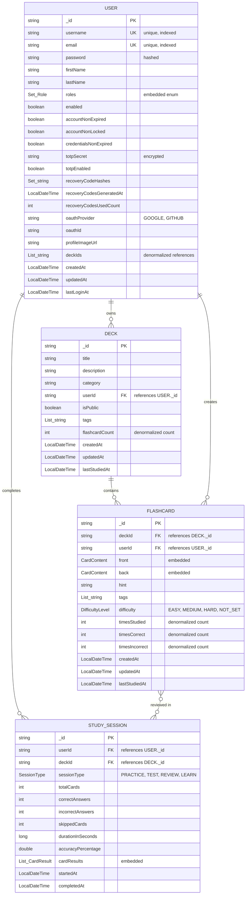
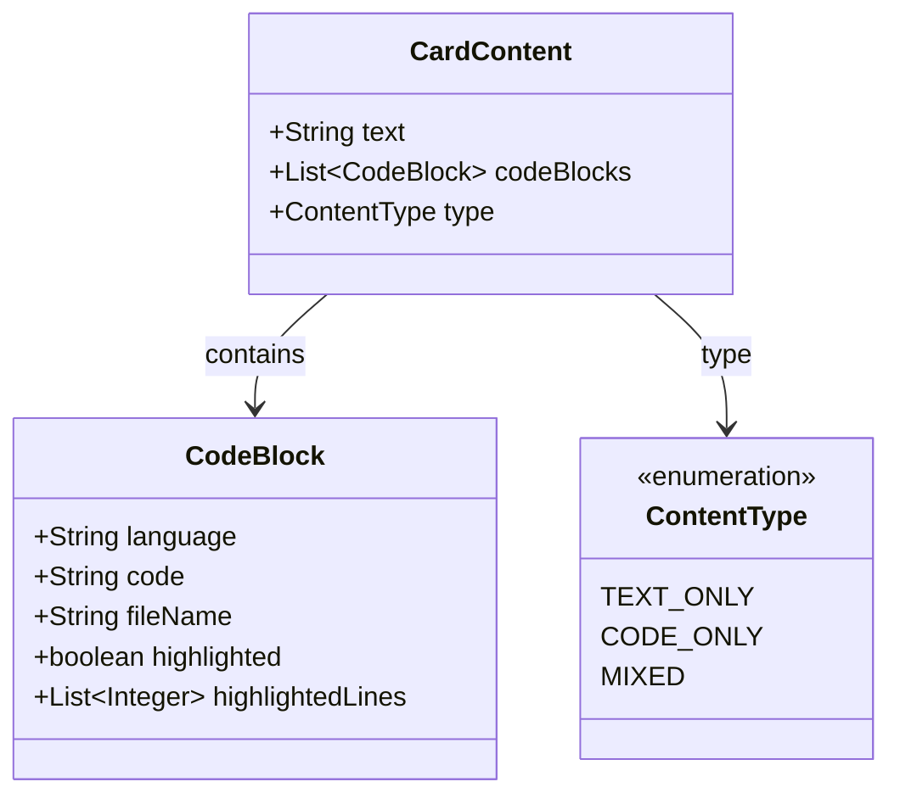
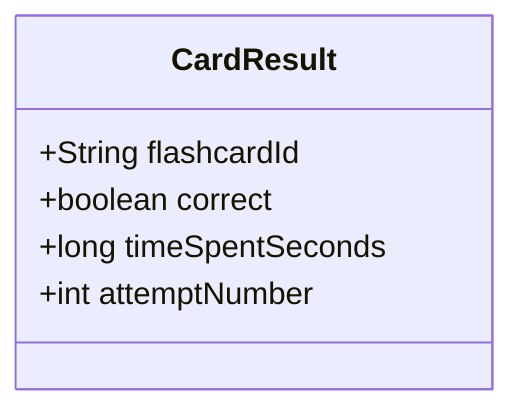

# Database Entity-Relationship Diagram (ERD)

This document provides a comprehensive view of the MongoDB database schema including all collections, relationships, embedded documents, and indexes.

## Overview

**Database:** `flashcards` (MongoDB)
**Collections:** 5 (users, decks, flashcards, study_sessions, roles)
**Relationships:** 1:N (User-Decks, User-Sessions, Deck-Flashcards), N:N (Flashcards-Sessions via embedded CardResult)

## Entity-Relationship Diagram



## Embedded Document Structures

### CardContent (Embedded in Flashcard)



**Usage:**
- `front` and `back` fields of Flashcard are CardContent objects
- Supports text-only, code-only, or mixed content
- Code blocks include syntax highlighting metadata

### CardResult (Embedded in StudySession)



**Usage:**
- Embedded array in StudySession to track individual card performance
- Creates implicit N:N relationship between Flashcards and StudySessions

## Collection Details

### 1. users Collection

| Field | Type | Constraints | Description |
|-------|------|-------------|-------------|
| `_id` | String | PK, Auto-generated | Unique user identifier |
| `username` | String | Unique, Indexed | User's unique username |
| `email` | String | Unique, Indexed | User's email address |
| `password` | String | - | Hashed password (BCrypt) |
| `firstName` | String | - | User's first name |
| `lastName` | String | - | User's last name |
| `roles` | Set<Role> | - | User roles (USER, ADMIN, MODERATOR) |
| `enabled` | boolean | Default: true | Account enabled status |
| `accountNonExpired` | boolean | Default: true | Account expiration status |
| `accountNonLocked` | boolean | Default: true | Account lock status |
| `credentialsNonExpired` | boolean | Default: true | Credentials expiration status |
| `totpSecret` | String | Encrypted | TOTP secret for 2FA |
| `totpEnabled` | boolean | Default: false | 2FA enabled status |
| `recoveryCodeHashes` | Set<String> | - | Hashed backup recovery codes |
| `recoveryCodesGeneratedAt` | LocalDateTime | - | Timestamp of code generation |
| `recoveryCodesUsedCount` | int | - | Count of used recovery codes |
| `oauthProvider` | String | - | OAuth provider (GOOGLE, GITHUB) |
| `oauthId` | String | - | OAuth provider user ID |
| `profileImageUrl` | String | - | URL to profile picture |
| `deckIds` | List<String> | - | Denormalized list of owned deck IDs |
| `createdAt` | LocalDateTime | Auto | Account creation timestamp |
| `updatedAt` | LocalDateTime | Auto | Last update timestamp |
| `lastLoginAt` | LocalDateTime | - | Last successful login |

**Indexes:**
- `username` (unique)
- `email` (unique)
- ⚠️ **Missing:** `oauthProvider` + `oauthId` compound index

**Sample Document:**
```json
{
  "_id": "user-12345",
  "username": "john_doe",
  "email": "john@example.com",
  "password": "$2a$10$...",
  "firstName": "John",
  "lastName": "Doe",
  "roles": ["USER"],
  "enabled": true,
  "accountNonExpired": true,
  "accountNonLocked": true,
  "credentialsNonExpired": true,
  "totpSecret": "ENCRYPTED_SECRET",
  "totpEnabled": true,
  "recoveryCodeHashes": ["$2a$10$...", "$2a$10$..."],
  "recoveryCodesGeneratedAt": "2024-01-01T00:00:00Z",
  "recoveryCodesUsedCount": 0,
  "oauthProvider": "GOOGLE",
  "oauthId": "google-oauth-id-123",
  "profileImageUrl": "https://example.com/profile.jpg",
  "deckIds": ["deck-1", "deck-2"],
  "createdAt": "2024-01-01T00:00:00Z",
  "updatedAt": "2024-01-15T10:30:00Z",
  "lastLoginAt": "2024-01-15T10:00:00Z"
}
```

### 2. decks Collection

| Field | Type | Constraints | Description |
|-------|------|-------------|-------------|
| `_id` | String | PK | Unique deck identifier |
| `title` | String | Required | Deck title |
| `description` | String | - | Deck description |
| `category` | String | - | Deck category/subject |
| `userId` | String | FK to users._id | Owner user ID |
| `isPublic` | boolean | Default: false | Public visibility |
| `tags` | List<String> | - | Searchable tags |
| `flashcardCount` | int | Denormalized | Count of flashcards in deck |
| `createdAt` | LocalDateTime | Auto | Deck creation timestamp |
| `updatedAt` | LocalDateTime | Auto | Last update timestamp |
| `lastStudiedAt` | LocalDateTime | - | Last study session timestamp |

**Indexes:**
- ⚠️ **Missing:** `userId` (for user's decks query)
- ⚠️ **Missing:** `isPublic` + `category` compound index (for browse)
- ⚠️ **Missing:** Text index on `title` + `description` (for search)

**Sample Document:**
```json
{
  "_id": "deck-12345",
  "title": "Java Spring Boot Basics",
  "description": "Core concepts of Spring Boot framework",
  "category": "Programming",
  "userId": "user-12345",
  "isPublic": true,
  "tags": ["java", "spring", "backend"],
  "flashcardCount": 50,
  "createdAt": "2024-01-05T00:00:00Z",
  "updatedAt": "2024-01-15T12:00:00Z",
  "lastStudiedAt": "2024-01-15T10:30:00Z"
}
```

### 3. flashcards Collection

| Field | Type | Constraints | Description |
|-------|------|-------------|-------------|
| `_id` | String | PK | Unique flashcard identifier |
| `deckId` | String | FK to decks._id | Parent deck ID |
| `userId` | String | FK to users._id | Creator user ID |
| `front` | CardContent | Required | Front side content |
| `back` | CardContent | Required | Back side content |
| `hint` | String | - | Optional hint text |
| `tags` | List<String> | - | Searchable tags |
| `difficulty` | DifficultyLevel | Default: NOT_SET | Difficulty level |
| `timesStudied` | int | Default: 0 | Total review count |
| `timesCorrect` | int | Default: 0 | Correct answer count |
| `timesIncorrect` | int | Default: 0 | Incorrect answer count |
| `createdAt` | LocalDateTime | Auto | Creation timestamp |
| `updatedAt` | LocalDateTime | Auto | Last update timestamp |
| `lastStudiedAt` | LocalDateTime | - | Last review timestamp |

**Indexes:**
- ⚠️ **Missing:** `deckId` (critical for deck queries)
- ⚠️ **Missing:** `userId` (for user's flashcards)
- ⚠️ **Missing:** Text index on `front.text` + `back.text` + `tags`

**Sample Document:**
```json
{
  "_id": "flashcard-12345",
  "deckId": "deck-12345",
  "userId": "user-12345",
  "front": {
    "text": "What is dependency injection?",
    "codeBlocks": null,
    "type": "TEXT_ONLY"
  },
  "back": {
    "text": "Dependency injection is a design pattern...",
    "codeBlocks": [
      {
        "language": "java",
        "code": "@Autowired\nprivate MyService service;",
        "fileName": "Example.java",
        "highlighted": true,
        "highlightedLines": [1, 2]
      }
    ],
    "type": "MIXED"
  },
  "hint": "Think about Spring framework",
  "tags": ["spring", "design-patterns"],
  "difficulty": "MEDIUM",
  "timesStudied": 5,
  "timesCorrect": 4,
  "timesIncorrect": 1,
  "createdAt": "2024-01-05T12:00:00Z",
  "updatedAt": "2024-01-15T10:30:00Z",
  "lastStudiedAt": "2024-01-15T10:30:00Z"
}
```

### 4. study_sessions Collection

| Field | Type | Constraints | Description |
|-------|------|-------------|-------------|
| `_id` | String | PK | Unique session identifier |
| `userId` | String | FK to users._id | Session user ID |
| `deckId` | String | FK to decks._id | Studied deck ID |
| `sessionType` | SessionType | Required | Session type enum |
| `totalCards` | int | Default: 0 | Total cards in session |
| `correctAnswers` | int | Default: 0 | Correct answer count |
| `incorrectAnswers` | int | Default: 0 | Incorrect answer count |
| `skippedCards` | int | Default: 0 | Skipped card count |
| `durationInSeconds` | long | Default: 0 | Session duration |
| `accuracyPercentage` | double | Calculated | Accuracy percentage |
| `cardResults` | List<CardResult> | - | Individual card results |
| `startedAt` | LocalDateTime | Auto | Session start time |
| `completedAt` | LocalDateTime | - | Session completion time |

**Indexes:**
- ⚠️ **Missing:** `userId` + `startedAt` compound index (for user history)
- ⚠️ **Missing:** `deckId` (for deck analytics)

**SessionType Enum:**
- `PRACTICE` - Casual practice mode
- `TEST` - Formal test mode
- `REVIEW` - Spaced repetition review
- `LEARN` - Learning new cards

**Sample Document:**
```json
{
  "_id": "session-12345",
  "userId": "user-12345",
  "deckId": "deck-12345",
  "sessionType": "REVIEW",
  "totalCards": 20,
  "correctAnswers": 15,
  "incorrectAnswers": 5,
  "skippedCards": 0,
  "durationInSeconds": 900,
  "accuracyPercentage": 0.75,
  "cardResults": [
    {
      "flashcardId": "flashcard-1",
      "correct": true,
      "timeSpentSeconds": 45,
      "attemptNumber": 1
    },
    {
      "flashcardId": "flashcard-2",
      "correct": false,
      "timeSpentSeconds": 60,
      "attemptNumber": 2
    }
  ],
  "startedAt": "2024-01-15T10:00:00Z",
  "completedAt": "2024-01-15T10:15:00Z"
}
```

### 5. roles (Enum, Not a Collection)

**Values:**
- `USER` ("ROLE_USER") - Standard user role
- `ADMIN` ("ROLE_ADMIN") - Administrator role
- `MODERATOR` ("ROLE_MODERATOR") - Content moderator role

**Storage:** Embedded in User documents as `Set<Role>`

## Relationships

### One-to-Many (1:N)

1. **User → Decks**
   - Field: `Deck.userId` references `User._id`
   - Denormalized: `User.deckIds` (list of deck IDs for quick access)
   - Cascade: Delete user → Delete all user's decks (not implemented)

2. **User → Flashcards**
   - Field: `Flashcard.userId` references `User._id`
   - Creator relationship
   - Cascade: Delete user → Delete all user's flashcards (not implemented)

3. **User → StudySessions**
   - Field: `StudySession.userId` references `User._id`
   - Cascade: Delete user → Delete all user's sessions (not implemented)

4. **Deck → Flashcards**
   - Field: `Flashcard.deckId` references `Deck._id`
   - Denormalized: `Deck.flashcardCount` (count cache)
   - Cascade: Delete deck → Delete all deck's flashcards (implemented)

### Many-to-Many (N:N)

1. **Flashcards ↔ StudySessions**
   - Relationship: Flashcards are reviewed in multiple sessions, sessions review multiple flashcards
   - Implementation: Embedded `CardResult` array in `StudySession`
   - Field: `StudySession.cardResults[].flashcardId` references `Flashcard._id`
   - No join collection needed (MongoDB embedded pattern)

## Planned Schema Changes for MVP

### 1. Spaced Repetition Learning Data (Flashcard)

**New embedded document in Flashcard:**
```java
public class LearningData {
    private double easinessFactor;        // SM-2 algorithm (1.3 to 2.5+)
    private int interval;                 // Days until next review
    private int repetitionLevel;          // Number of successful reviews
    private LocalDateTime lastReviewed;   // Last review timestamp
    private LocalDateTime nextReviewDate; // Next scheduled review
    private int totalReviews;             // Total review count
    private int successfulReviews;        // Successful review count
    private long averageResponseTimeMs;   // Average response time
    private MasteryLevel masteryLevel;    // NEW, LEARNING, YOUNG, MATURE, MASTERED
}
```

**Index needed:** `nextReviewDate` (for daily review queries)

### 2. Study Session Status (StudySession)

**New fields:**
```java
private SessionStatus status;  // IN_PROGRESS, COMPLETED, ABANDONED
private int currentCardIndex;  // For resuming interrupted sessions
```

**Index needed:** `userId` + `status` compound (for active session lookup)

### 3. User Analytics (New Collection)

**New collection:** `user_analytics`
```java
@Document(collection = "user_analytics")
public class UserAnalytics {
    @Id
    private String userId;  // One document per user

    private long totalStudyTimeMs;
    private int totalCardsReviewed;
    private int totalSessionsCompleted;
    private int currentStreak;  // Days
    private int longestStreak;
    private LocalDate lastStudyDate;
    private double averageAccuracy;

    private int cardsMastered;
    private int cardsLearning;
    private int cardsNew;

    private List<DeckStats> deckStats;
    private List<DailyActivity> dailyActivity;

    private LocalDateTime createdAt;
    private LocalDateTime updatedAt;
}
```

**Indexes:** `userId` (PK), `lastStudyDate`

### 4. Notifications (New Collection)

**New collection:** `notifications`
```java
@Document(collection = "notifications")
public class Notification {
    @Id
    private String id;

    private String userId;
    private NotificationType type;  // REVIEW_REMINDER, ACHIEVEMENT, SYSTEM
    private String title;
    private String message;
    private boolean read;
    private String actionUrl;

    private LocalDateTime createdAt;
    private LocalDateTime readAt;
}
```

**Indexes:** `userId` + `read` + `createdAt` compound (for unread notifications)

## Index Strategy

### Critical Missing Indexes (Immediate Priority)

1. **flashcards collection:**
   ```javascript
   db.flashcards.createIndex({ "deckId": 1 })
   db.flashcards.createIndex({ "userId": 1 })
   db.flashcards.createIndex({ "deckId": 1, "createdAt": -1 })
   ```

2. **decks collection:**
   ```javascript
   db.decks.createIndex({ "userId": 1 })
   db.decks.createIndex({ "isPublic": 1, "category": 1 })
   db.decks.createIndex({ "title": "text", "description": "text" })
   ```

3. **study_sessions collection:**
   ```javascript
   db.study_sessions.createIndex({ "userId": 1, "startedAt": -1 })
   db.study_sessions.createIndex({ "deckId": 1 })
   ```

4. **users collection:**
   ```javascript
   db.users.createIndex({ "oauthProvider": 1, "oauthId": 1 }, { unique: true, sparse: true })
   ```

### Indexes for Spaced Repetition (MVP Required)

```javascript
db.flashcards.createIndex({ "learningData.nextReviewDate": 1 })
db.flashcards.createIndex({ "userId": 1, "learningData.nextReviewDate": 1 })
db.study_sessions.createIndex({ "userId": 1, "status": 1 })
```

## Data Integrity Considerations

### Current Issues:

1. **No Referential Integrity**
   - MongoDB doesn't enforce foreign keys
   - Orphaned records possible (e.g., flashcards without decks)
   - **Solution:** Implement cascade delete in DAO layer

2. **Denormalized Data Sync**
   - `Deck.flashcardCount` can become stale
   - `User.deckIds` can become out of sync
   - **Solution:** Update denormalized fields in same transaction

3. **No Database Transactions**
   - Multi-document operations not atomic
   - **Solution:** Use MongoDB transactions for critical operations

### Recommendations:

1. **Add Cascade Delete Logic:**
   ```java
   // In DeckDao
   public void deleteWithCascade(String deckId) {
       // Delete all flashcards in deck
       flashcardRepository.deleteByDeckId(deckId);
       // Delete all sessions for deck
       studySessionRepository.deleteByDeckId(deckId);
       // Delete deck
       deckRepository.deleteById(deckId);
       // Update user's deckIds
       userRepository.removeDeckId(userId, deckId);
   }
   ```

2. **Add Validation Service:**
   ```java
   @Service
   public class DataIntegrityService {
       public void validateFlashcard(Flashcard flashcard) {
           if (!deckRepository.existsById(flashcard.getDeckId())) {
               throw new ServiceException("Referenced deck does not exist");
           }
       }
   }
   ```

3. **Add Scheduled Cleanup Job:**
   ```java
   @Scheduled(cron = "0 0 2 * * *") // Daily at 2 AM
   public void cleanupOrphanedRecords() {
       // Find flashcards with non-existent deckId
       // Find sessions with non-existent userId/deckId
       // Log and optionally delete
   }
   ```

## MongoDB-Specific Considerations

### Document Size Limits

1. **Maximum document size:** 16 MB
   - **Risk:** StudySession with many card results
   - **Current:** ~200 bytes per CardResult
   - **Limit:** ~80,000 cards per session (not realistic)
   - **Verdict:** ✅ Safe

2. **Embedded arrays:**
   - `User.deckIds` - Could grow large for power users
   - **Recommendation:** If user has >1000 decks, paginate queries instead

### Query Performance

1. **Aggregation pipelines needed:**
   - User statistics (total cards, accuracy, etc.)
   - Deck analytics (average session performance)
   - Leaderboards (top users, highest accuracy)

2. **Projection optimization:**
   - Don't fetch full Flashcard documents for list views
   - Project only needed fields (e.g., `{front.text: 1, difficulty: 1}`)

## Migration Scripts Needed

### 1. Add Learning Data to Existing Flashcards

```javascript
db.flashcards.updateMany(
  { learningData: { $exists: false } },
  {
    $set: {
      learningData: {
        easinessFactor: 2.5,
        interval: 0,
        repetitionLevel: 0,
        lastReviewed: null,
        nextReviewDate: new Date(),
        totalReviews: 0,
        successfulReviews: 0,
        averageResponseTimeMs: 0,
        masteryLevel: "NEW"
      }
    }
  }
)
```

### 2. Create User Analytics from Study Sessions

```javascript
// Aggregate existing session data to create analytics documents
db.study_sessions.aggregate([
  { $group: {
      _id: "$userId",
      totalSessions: { $sum: 1 },
      totalCards: { $sum: "$totalCards" },
      totalCorrect: { $sum: "$correctAnswers" },
      totalTime: { $sum: "$durationInSeconds" }
  }},
  { $project: {
      userId: "$_id",
      totalSessionsCompleted: "$totalSessions",
      totalCardsReviewed: "$totalCards",
      averageAccuracy: { $divide: ["$totalCorrect", "$totalCards"] },
      totalStudyTimeMs: { $multiply: ["$totalTime", 1000] },
      createdAt: new Date(),
      updatedAt: new Date()
  }},
  { $out: "user_analytics" }
])
```

## Related Documentation

- [MVP Readiness Assessment](./MVP-Readiness-Assessment.md) - 60% feature completion, critical gaps identified
- [Sequence Diagrams - Study Sessions](./Sequence-Diagrams-Study-Sessions.md) - Study session flows (not yet implemented)
- [Sequence Diagrams - AI Operations](./Sequence-Diagrams-AI-Operations.md) - AI flashcard generation flows
- [Testing Strategy](./Testing-Strategy.md) (to be created) - Database integration testing plan