# JWT Authentication Flow

This document explains how JWT (JSON Web Token) authentication works in the application, from token generation to validation.

## 1. JWT Token Structure


## 2. JWT Token Generation Flow


## 3. JWT Token Validation Flow (Every Request)


## 4. JWT Token Refresh Pattern (Not Implemented Yet)

```mermaid
sequenceDiagram
    participant U as User
    participant API as API
    participant JWT as JwtService
    participant DB as Database

    Note over U,DB: Token Near Expiration

    U->>API: POST /api/auth/refresh
    Note right of U: Authorization: Bearer <current-token>

    API->>JWT: validateToken(currentToken)

    alt Token Valid but Expiring Soon
        JWT->>JWT: extractUserId(currentToken)
        JWT->>DB: findUser(userId)
        DB-->>JWT: User (with latest state)
        JWT->>JWT: generateToken(user)
        Note right of JWT: New token with:<br/>- Updated totpEnabled<br/>- Fresh expiration<br/>- Current authorities
        JWT-->>API: New JWT token
        API-->>U: {accessToken: newToken, expiresIn: 3600}

    else Token Expired or Invalid
        JWT-->>API: Invalid token error
        API-->>U: 401 - Please login again
    end
```



## 5. JWT Security Filter Chain


## 6. Token State Changes with TOTP


## 7. JWT Claims Extraction


## JWT Implementation Details

### Token Generation (JwtService.java)
```java
public String generateToken(User user) {
    Map<String, Object> claims = new HashMap<>();
    claims.put("username", user.getUsername());
    claims.put("email", user.getEmail());
    claims.put("authorities", user.getAuthorities());
    claims.put("totpEnabled", user.isTotpEnabled());

    return Jwts.builder()
        .setClaims(claims)
        .setSubject(user.getId())
        .setIssuedAt(new Date())
        .setExpiration(new Date(System.currentTimeMillis() + expirationMs))
        .setIssuer("flashcards-app")
        .signWith(getSigningKey(), SignatureAlgorithm.HS256)
        .compact();
}
```

### Token Validation (JwtService.java)
```java
public boolean isTokenValid(String token) {
    try {
        Claims claims = extractAllClaims(token);
        return !isTokenExpired(claims) &&
               "flashcards-app".equals(claims.getIssuer());
    } catch (JwtException e) {
        return false;
    }
}
```

### Filter Authentication (JwtAuthenticationFilter.java)
```java
protected void doFilterInternal(request, response, filterChain) {
    String authHeader = request.getHeader("Authorization");

    if (authHeader != null && authHeader.startsWith("Bearer ")) {
        String token = authHeader.substring(7);

        if (jwtService.isTokenValid(token)) {
            String userId = jwtService.extractUserId(token);

            UsernamePasswordAuthenticationToken authToken =
                new UsernamePasswordAuthenticationToken(
                    userId, null, new ArrayList<>()
                );

            SecurityContextHolder.getContext()
                .setAuthentication(authToken);
        }
    }

    filterChain.doFilter(request, response);
}
```

## Security Best Practices

### 1. **Token Storage (Frontend)**
- Store in memory or sessionStorage (not localStorage)
- Never store in cookies without httpOnly flag
- Clear on logout/session end

### 2. **Token Transmission**
- Always use HTTPS in production
- Send only in Authorization header
- Never in URL parameters

### 3. **Token Expiration**
- Short expiration time (1 hour)
- Implement refresh token pattern for UX
- Force re-authentication for sensitive operations

### 4. **Secret Key Management**
- Use strong, random secret key
- Store in environment variables
- Rotate keys periodically
- Never commit to version control

### 5. **Claims Management**
- Minimal sensitive data in claims
- No passwords or secrets
- Include version/type for future changes

## Common JWT Security Issues

### Issue 1: Token Hijacking
**Problem**: Token stolen via XSS/network sniffing
**Solution**: HTTPS only, Content Security Policy, short expiration

### Issue 2: Token Replay
**Problem**: Old token reused after state change
**Solution**: Issue new tokens on security state changes (TOTP enable/disable)

### Issue 3: Algorithm Confusion
**Problem**: Attacker changes algorithm to 'none'
**Solution**: Always validate algorithm, use specific algorithm (HS256)

### Issue 4: Weak Secret
**Problem**: Guessable or short secret key
**Solution**: Use 256-bit+ random key from secure generator

## Token Lifecycle Summary


## Testing JWT Flow

### 1. Generate Token
```bash
curl -X POST http://localhost:8080/api/auth/login \
  -H "Content-Type: application/json" \
  -d '{"usernameOrEmail": "user", "password": "pass"}'
# Returns: {accessToken: "eyJ..."}
```

### 2. Use Token
```bash
curl -X GET http://localhost:8080/api/protected \
  -H "Authorization: Bearer eyJ..."
```

### 3. Decode Token (for debugging)
```bash
# Using jwt.io or command line
echo "eyJ..." | base64 -d
# Shows: {"sub":"userId","username":"user",...}
```

### 4. Test Expiration
```bash
# Wait 1 hour, then try using token
curl -X GET http://localhost:8080/api/protected \
  -H "Authorization: Bearer eyJ..."
# Returns: 401 Unauthorized
```