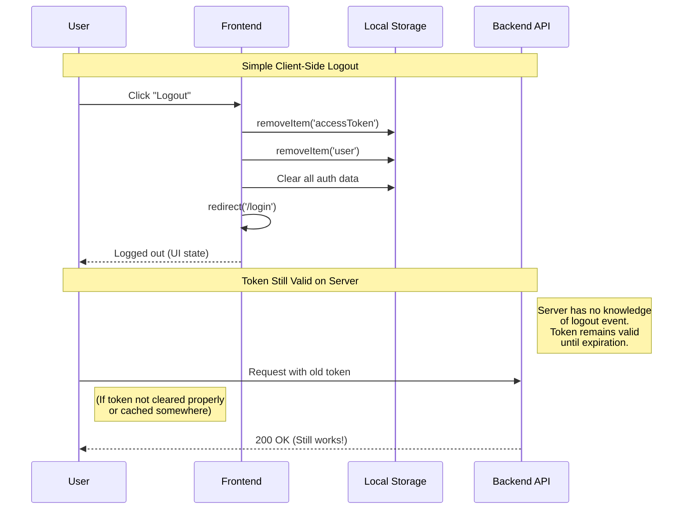
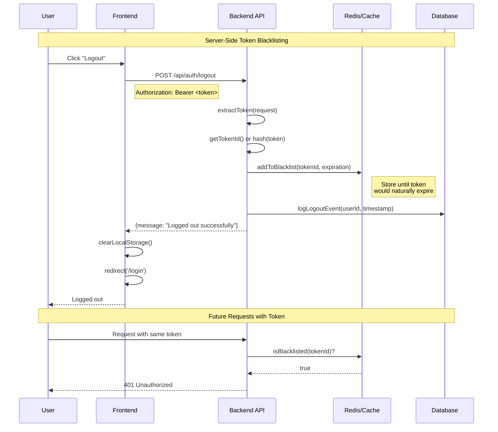
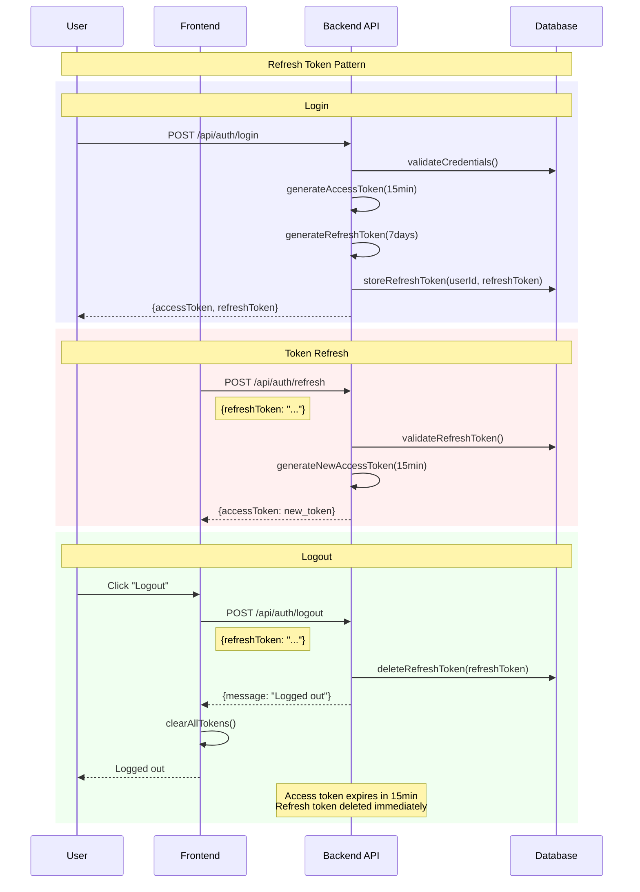
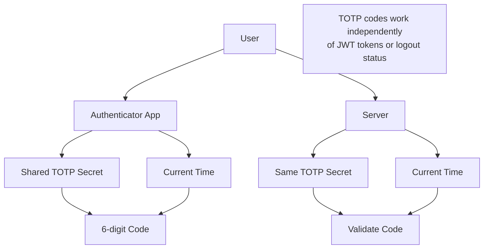

# JWT Logout Strategies

Since JWT tokens are stateless, logout is primarily a **client-side operation**. However, there are several strategies with different security implications.

## 1. Client-Side Only Logout (Current Implementation)



### Pros:
- ✅ Simple implementation
- ✅ No server-side state required
- ✅ Works with distributed systems

### Cons:
- ❌ Token remains valid until expiration
- ❌ If token is compromised/cached, still usable
- ❌ No audit trail of logout events

## 2. Token Blacklisting (Server-Side Tracking)



### Implementation:
```java
@PostMapping("/logout")
public ResponseEntity<Map<String, String>> logout(HttpServletRequest request) {
    String token = jwtService.extractTokenFromRequest(request);

    if (token != null) {
        // Add to blacklist with TTL = token expiration
        tokenBlacklistService.blacklistToken(token);

        // Optional: Log logout event
        String userId = jwtService.extractUserId(token);
        auditService.logLogout(userId);
    }

    return ResponseEntity.ok(Map.of("message", "Logged out successfully"));
}
```

### Pros:
- ✅ Immediately invalidates token
- ✅ Audit trail of logout events
- ✅ Better security

### Cons:
- ❌ Requires server-side state (Redis/cache)
- ❌ More complex implementation
- ❌ Performance overhead on every request

## 3. Short-Lived Tokens + Refresh Tokens



### Implementation:
```java
@PostMapping("/logout")
public ResponseEntity<Map<String, String>> logout(@RequestBody LogoutRequest request) {
    // Invalidate refresh token immediately
    refreshTokenService.deleteRefreshToken(request.getRefreshToken());

    // Access token will expire naturally (15min)
    return ResponseEntity.ok(Map.of("message", "Logged out successfully"));
}
```

### Pros:
- ✅ Short access token lifetime (15min)
- ✅ Immediate invalidation via refresh token
- ✅ Good security/UX balance

### Cons:
- ❌ More complex token management
- ❌ Additional refresh endpoints
- ❌ Refresh token storage required

## 4. Frontend Implementation Examples

### React/Angular/Vue Pattern:
```javascript
// Auth Context/Service
class AuthService {
    async logout() {
        const token = localStorage.getItem('accessToken');

        try {
            // Optional: Call server logout endpoint
            await fetch('/api/auth/logout', {
                method: 'POST',
                headers: {
                    'Authorization': `Bearer ${token}`,
                    'Content-Type': 'application/json'
                }
            });
        } catch (error) {
            console.warn('Logout API call failed, proceeding with client logout');
        }

        // Always clear client-side data
        localStorage.removeItem('accessToken');
        localStorage.removeItem('refreshToken');
        localStorage.removeItem('user');
        sessionStorage.clear();

        // Clear any in-memory state
        this.currentUser = null;
        this.isAuthenticated = false;

        // Redirect to login
        window.location.href = '/login';
    }

    // Call on app startup to check auth state
    checkAuthState() {
        const token = localStorage.getItem('accessToken');
        if (token && this.isTokenExpired(token)) {
            this.logout(); // Auto-logout expired tokens
        }
    }
}
```

### Multiple Tab Synchronization:
```javascript
// Listen for logout events across tabs
window.addEventListener('storage', (e) => {
    if (e.key === 'accessToken' && e.newValue === null) {
        // Another tab logged out, sync this tab
        this.handleLogoutFromOtherTab();
    }
});

// Broadcast logout to other tabs
function broadcastLogout() {
    localStorage.removeItem('accessToken'); // Triggers storage event
    window.postMessage({ type: 'LOGOUT' }, '*');
}
```

## 5. TOTP Implications

### Q: Does logout invalidate TOTP codes?

**No** - TOTP codes are **time-based** and generated by the authenticator app independently:



**TOTP codes:**
- ✅ Generated every 30 seconds
- ✅ Work regardless of logout status
- ✅ Based on shared secret + time
- ✅ Valid for ~30-60 seconds

**Logout only affects:**
- ❌ JWT tokens (session)
- ❌ Browser storage
- ❌ Application state

## 6. Recommended Approach for Your App

For your flashcard application, I recommend **hybrid approach**:

### Phase 1: Client-Side Logout (Current)
```java
// No server endpoint needed initially
// Frontend handles everything
```

### Phase 2: Add Logout Endpoint (Future)
```java
@PostMapping("/logout")
public ResponseEntity<Map<String, String>> logout(
    HttpServletRequest request,
    Authentication authentication
) {
    String userId = authentication.getName();

    // Log the logout event
    auditService.logEvent(userId, "LOGOUT", LocalDateTime.now());

    // Optional: Notify other services
    eventPublisher.publishEvent(new UserLoggedOutEvent(userId));

    return ResponseEntity.ok(Map.of(
        "message", "Logged out successfully",
        "timestamp", LocalDateTime.now().toString()
    ));
}
```

### Frontend Implementation:
```javascript
async function logout() {
    try {
        // Call server for audit/logging
        await fetch('/api/auth/logout', {
            method: 'POST',
            headers: { 'Authorization': `Bearer ${token}` }
        });
    } catch (e) {
        // Continue with logout even if server call fails
    }

    // Always clear client state
    localStorage.clear();
    window.location.href = '/login';
}
```

## 7. Security Best Practices

### 1. **Token Expiration**
- Keep JWT tokens short-lived (15-60 minutes)
- Longer tokens = longer exposure after logout

### 2. **Secure Storage**
- Never store tokens in localStorage for sensitive apps
- Use httpOnly cookies or sessionStorage
- Clear all storage on logout

### 3. **Multiple Sessions**
- Consider "logout all devices" functionality
- Track active sessions in database
- Force re-authentication for sensitive operations

### 4. **Audit Logging**
- Log all logout events
- Track unusual logout patterns
- Monitor for security incidents

## Summary

**For JWT logout:**
1. **Primary**: Client-side token removal
2. **Optional**: Server-side audit logging
3. **Advanced**: Token blacklisting or refresh tokens
4. **TOTP**: Unaffected by logout - codes still work

**TOTP codes remain valid regardless of logout status** because they're time-based and generated independently by the authenticator app.