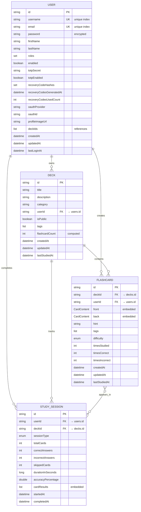

# Flashcards Application - MVP Readiness Assessment

**Date:** 2025-01-08
**Version:** 1.0
**Status:** 60% Complete - NOT MVP READY

## Executive Summary

The flashcards application is a Spring Boot backend with MongoDB that provides comprehensive user authentication, flashcard management, and AI-powered content generation. While substantial progress has been made on core features and AI integration, the application is **NOT YET MVP-READY** due to missing critical features, incomplete testing infrastructure, and lack of deployment automation.

**Current Completion Estimate: ~60% of Core MVP Features**

**Critical MVP Blockers:**
1. ❌ Study Session System not implemented
2. ❌ Spaced Repetition Algorithm missing
3. ❌ Test Coverage <5% (target: 80%)
4. ❌ MongoDB Indexes not configured
5. ❌ CI/CD Pipeline not set up
6. ❌ Production Monitoring not configured

**Estimated Time to MVP: 4-6 weeks**

---

## Table of Contents

1. [Feature Implementation Status](#1-feature-implementation-status)
2. [Database Schema & ERD](#2-database-schema--entity-relationship-diagram)
3. [Missing Core Features](#3-missing-core-features-for-mvp)
4. [Code Quality Issues](#4-code-quality-issues)
5. [Testing Gaps](#5-testing-gaps)
6. [Deployment & Infrastructure](#6-deployment--infrastructure-status)
7. [Documentation Status](#7-documentation-status)
8. [Prioritized Recommendations](#8-prioritized-recommendations)
9. [MVP Readiness Checklist](#9-mvp-readiness-checklist)
10. [Risk Assessment](#10-risk-assessment)
11. [Timeline to MVP](#11-estimated-timeline-to-mvp)

---

## 1. Feature Implementation Status

### 1.1 Authentication & User Management ✅ COMPLETE (100%)

**Implemented Features:**
- JWT-based authentication with secure token management
- User registration and login with email/password
- OAuth2 integration (Google, GitHub)
- TOTP two-factor authentication with QR code generation
- Recovery code system (8 codes, single-use)
- Password encryption using Jasypt
- Role-based access control (USER, ADMIN, MODERATOR)

**API Endpoints:**
- `POST /api/auth/register` - User registration
- `POST /api/auth/login` - Login with optional TOTP
- `POST /api/auth/totp/setup` - TOTP configuration
- `POST /api/auth/totp/enable` - Enable 2FA
- `POST /api/auth/totp/disable` - Disable 2FA
- `POST /api/auth/login/recovery` - Recovery code login
- `POST /api/auth/recovery-codes/regenerate` - New recovery codes
- `GET /api/auth/recovery-codes/status` - Check recovery code status
- `GET /api/auth/oauth2/providers` - List OAuth providers

**Security Features:**
- JWT expiration: 15 minutes (access token)
- Refresh token support
- Account locking after failed attempts
- Secure password hashing
- OAuth2 state validation

---

### 1.2 User Management ✅ COMPLETE (100%)

**User Model Fields:**
```java
- id: String (MongoDB ObjectId)
- username: String (unique, indexed)
- email: String (unique, indexed)
- password: String (encrypted)
- firstName, lastName: String
- roles: Set<Role>
- enabled: boolean
- account status flags (expired, locked, credentials expired)
- totpSecret, totpEnabled: TOTP configuration
- recoveryCodeHashes: Set<String>
- recoveryCodesGeneratedAt: LocalDateTime
- recoveryCodesUsedCount: int
- oauthProvider, oauthId: OAuth integration
- profileImageUrl: String
- deckIds: List<String> (references)
- createdAt, updatedAt, lastLoginAt: LocalDateTime
```

**Operations:**
- Full CRUD with proper DAO/Service/Controller layers
- Query by username, email, OAuth ID
- Update user profile
- Delete user (with cascade considerations)

---

### 1.3 Deck Management ✅ COMPLETE (100%)

**Deck Model Fields:**
```java
- id: String
- title: String
- description: String
- category: String
- userId: String (owner)
- isPublic: boolean
- tags: List<String>
- flashcardCount: int (computed)
- createdAt, updatedAt, lastStudiedAt: LocalDateTime
```

**Implemented Features:**
- Complete CRUD operations
- Query by user, category, tags, visibility
- Public deck discovery
- Tag-based organization
- Automatic flashcard count tracking
- User validation before creation

**Missing Features:**
- ❌ Deck sharing mechanism (share with specific users)
- ❌ Import/Export (JSON, CSV)
- ❌ Deck cloning
- ❌ Statistics aggregation service

---

### 1.4 Flashcard Management ✅ COMPLETE (85%)

**Flashcard Model Features:**
```java
- id, deckId, userId: String
- front, back: CardContent
  - text: String
  - codeBlocks: List<CodeBlock>
    - language, code, fileName
    - highlighted: boolean
    - highlightedLines: List<Integer>
  - type: ContentType (TEXT_ONLY, CODE_ONLY, MIXED)
- hint: String
- tags: List<String>
- difficulty: DifficultyLevel (EASY, MEDIUM, HARD, NOT_SET)
- timesStudied, timesCorrect, timesIncorrect: int
- createdAt, updatedAt, lastStudiedAt: LocalDateTime
```

**Operations:**
- Full CRUD with validation
- Bulk creation (AI-generated batches)
- Bulk deletion by deck
- Query by deck, user, difficulty, tags
- Study statistics updates
- Code syntax highlighting support

**Missing:**
- ⚠️ Image attachment storage (model supports, implementation pending)
- ⚠️ Card versioning system
- ⚠️ Advanced bulk edit operations

---

### 1.5 AI-Powered Features ✅ ADVANCED (90%)

**Multi-Model Support:**
- **OpenAI:** GPT-4, GPT-4o, GPT-4o-mini, GPT-3.5-turbo
- **Anthropic:** Claude Sonnet 4, Claude 3.5 Sonnet/Haiku
- **Google:** Gemini 2.0 Flash, Gemini 2.5 Flash, Gemini 1.5 Pro/Flash

**AI Strategies Implemented:**
1. **TextToFlashcardsStrategy** - Generate from text content
2. **ImageToFlashcardsStrategy** - Extract from images (GPT-4o, Gemini vision)
3. **PromptToFlashcardsStrategy** - Generate from custom prompts
4. **ContentToSummaryStrategy** - Summarize decks/text
5. **TextToImageStrategy** - DALL-E educational diagrams
6. **TextToSpeechStrategy** - Audio generation (6 voices, adjustable speed)
7. **SpeechToTextStrategy** - Whisper transcription with actions

**AI Endpoints:**
```
POST /api/ai/flashcards/generate-text
POST /api/ai/flashcards/generate-image (multipart)
POST /api/ai/flashcards/generate-prompt
POST /api/ai/images/generate
POST /api/ai/summary/generate

POST /api/audio/text-to-speech (JSON → base64 audio)
POST /api/audio/text-to-speech/stream (JSON → binary MP3)
POST /api/audio/speech-to-text (multipart → transcription + optional summary/flashcards)
```

**AI Infrastructure:**
- `AIExecutionService` - Centralized execution with fallback
- `ModelSelectorService` - Provider routing
- `AIImageGenerationService` - DALL-E integration
- `AIAudioService` - TTS/STT orchestration
- Fallback chain configuration (primary → fallback1 → fallback2)

**Configuration:**
```yaml
ai:
  max-flashcards-per-request: 20
  max-text-length: 10000
  rate-limit-per-minute: 10
  cache:
    enabled: true
    ttl: 3600
    max-size: 1000
  fallback:
    enabled: true
    models: GPT_4O_MINI,CLAUDE_3_5_HAIKU,GEMINI_2_0_FLASH
```

**Missing:**
- ❌ Chat assistant (conversational AI with memory)
- ⚠️ AI response caching (configured but needs Redis)
- ⚠️ Model comparison mode
- ❌ Per-user/model cost tracking
- ❌ AI usage analytics dashboard

---

### 1.6 Study Session Tracking ❌ NOT IMPLEMENTED (10%)

**Critical MVP Blocker**

**What Exists:**
- StudySession model defined with comprehensive fields
- StudySessionRepository with basic queries
- StudySessionMapper and DTOs

**Missing (All Critical):**
- ❌ StudySessionService - No business logic
- ❌ StudySessionDao - No data access layer
- ❌ StudySessionController - No API endpoints
- ❌ Spaced repetition algorithm
- ❌ Progress calculation logic
- ❌ Study streak tracking
- ❌ Performance analytics
- ❌ Statistics aggregation

**Impact:** This is the **#1 MVP blocker**. Without study sessions, users cannot track their learning progress, which is core functionality for a flashcard app.

**Estimated Effort:** 2-3 days for basic implementation

---

### 1.7 Search & Filter System ❌ NOT IMPLEMENTED (0%)

**Status:** Not started

**Current Workaround:**
- Basic queries exist: findByTag, findByCategory, findByDifficulty
- No unified search interface

**Missing:**
- ❌ Full-text search across cards/decks
- ❌ MongoDB text indexes
- ❌ SearchService with query builder
- ❌ Advanced filtering (boolean operators)
- ❌ Search history
- ❌ Autocomplete

**Impact:** Medium priority - basic queries work but UX suffers

**Estimated Effort:** 3-5 days

---

## 2. Database Schema & Entity-Relationship Diagram

### 2.1 Collections Overview

```
flashcards (database)
├── users
├── decks
├── flashcards
└── study_sessions
```

### 2.2 Entity-Relationship Diagram



### 2.3 Embedded Documents

**CardContent:**
```java
{
  text: String,
  codeBlocks: [
    {
      language: String,
      code: String,
      fileName: String,
      highlighted: boolean,
      highlightedLines: [int]
    }
  ],
  type: ContentType enum
}
```

**CardResult (in StudySession):**
```java
{
  flashcardId: String,
  correct: boolean,
  timeSpentSeconds: long,
  attemptNumber: int
}
```

### 2.4 Index Status

**Existing Indexes:**
- ✅ `users.username` - Unique
- ✅ `users.email` - Unique

**Missing Critical Indexes:**
- ❌ `decks.userId` - Standard (query performance)
- ❌ `decks.category` - Standard
- ❌ `decks.tags` - Multikey (array index)
- ❌ `flashcards.deckId` - Standard (critical for queries)
- ❌ `flashcards.userId` - Standard
- ❌ `flashcards.tags` - Multikey
- ❌ `flashcards.difficulty` - Standard
- ❌ `study_sessions.userId` - Standard
- ❌ `study_sessions.deckId` - Standard
- ❌ Text search indexes for full-text search

**Impact:** Queries will be slow without indexes, especially with larger datasets.

**Estimated Effort:** 4-6 hours to configure `MongoIndexConfig`

---

## 3. Missing Core Features for MVP

### 3.1 Priority P0 (Critical Blockers)

#### 3.1.1 Study Session Implementation

**Status:** ❌ Not Started
**Effort:** 2-3 days
**Dependencies:** None (repository exists)

**Files Needed:**
```
src/main/java/com/flashcards/backend/flashcards/
├── service/StudySessionService.java
├── dao/StudySessionDao.java
├── dao/impl/StudySessionDaoImpl.java
└── controller/StudySessionController.java
```

**Required Endpoints:**
```
POST   /api/study-sessions          - Start new session
GET    /api/study-sessions/{id}     - Get session details
PUT    /api/study-sessions/{id}     - Update session (record answer)
POST   /api/study-sessions/{id}/complete - Finish session
GET    /api/study-sessions/user/{userId} - User's sessions
GET    /api/study-sessions/deck/{deckId} - Deck sessions
GET    /api/study-sessions/stats/{userId} - User statistics
```

**Business Logic Required:**
- Create session with deck snapshot
- Record per-card results (correct/incorrect/skipped)
- Calculate accuracy percentage
- Track time spent per card
- Update flashcard study statistics
- Calculate session metrics (duration, performance)

---

#### 3.1.2 Spaced Repetition Algorithm

**Status:** ❌ Not Started
**Effort:** 2-3 days
**Dependencies:** StudySessionService

**Files Needed:**
```
src/main/java/com/flashcards/backend/flashcards/
├── service/SpacedRepetitionService.java
├── util/SpacedRepetitionCalculator.java
└── model/RepetitionSchedule.java (new)
```

**Algorithm Options:**
1. **SM-2 (SuperMemo 2)** - Classic, well-tested
2. **Leitner System** - Simple, effective
3. **Custom hybrid** - Tailored to app needs

**Features Required:**
- Calculate next review date based on performance
- Track ease factor per card
- Implement interval calculation
- Due card query optimization
- Review queue generation

**New Flashcard Fields Needed:**
```java
// Add to Flashcard model:
private Double easeFactor = 2.5;         // SM-2 ease factor
private Integer repetitionCount = 0;     // Number of successful reviews
private LocalDateTime nextReviewDate;    // When card is due
private Integer intervalDays = 0;        // Current review interval
```

---

#### 3.1.3 MongoDB Index Configuration

**Status:** ❌ Not Started
**Effort:** 4-6 hours
**Dependencies:** None

**File Needed:**
```java
src/main/java/com/flashcards/backend/flashcards/
└── config/MongoIndexConfig.java
```

**Implementation:**
```java
@Configuration
public class MongoIndexConfig {

    @Bean
    public MongoCustomConversions mongoCustomConversions() {
        return new MongoCustomConversions(Collections.emptyList());
    }

    @PostConstruct
    public void initIndexes() {
        // Deck indexes
        mongoTemplate.indexOps(Deck.class)
            .ensureIndex(new Index().on("userId", Sort.Direction.ASC));
        mongoTemplate.indexOps(Deck.class)
            .ensureIndex(new Index().on("category", Sort.Direction.ASC));
        mongoTemplate.indexOps(Deck.class)
            .ensureIndex(new Index().on("tags", Sort.Direction.ASC));

        // Flashcard indexes
        mongoTemplate.indexOps(Flashcard.class)
            .ensureIndex(new Index().on("deckId", Sort.Direction.ASC));
        mongoTemplate.indexOps(Flashcard.class)
            .ensureIndex(new Index().on("userId", Sort.Direction.ASC));
        mongoTemplate.indexOps(Flashcard.class)
            .ensureIndex(new Index().on("nextReviewDate", Sort.Direction.ASC));

        // StudySession indexes
        mongoTemplate.indexOps(StudySession.class)
            .ensureIndex(new Index().on("userId", Sort.Direction.ASC));
        mongoTemplate.indexOps(StudySession.class)
            .ensureIndex(new Index().on("deckId", Sort.Direction.ASC));

        // Text search indexes
        mongoTemplate.indexOps(Flashcard.class)
            .ensureIndex(new TextIndexDefinition.TextIndexDefinitionBuilder()
                .onField("front.text")
                .onField("back.text")
                .onField("tags")
                .build());
    }
}
```

---

#### 3.1.4 Testing Infrastructure

**Status:** ❌ Minimal (<5% coverage)
**Effort:** 2-3 weeks
**Dependencies:** None

**Current State:**
- 1 test file: `FlashcardsApplicationTests.java` (basic context load)
- No service, DAO, or controller tests
- No test data factories
- No embedded MongoDB setup

**Required Setup:**
```xml
<!-- pom.xml additions -->
<dependency>
    <groupId>de.flapdoodle.embed</groupId>
    <artifactId>de.flapdoodle.embed.mongo</artifactId>
    <scope>test</scope>
</dependency>
<dependency>
    <groupId>org.mockito</groupId>
    <artifactId>mockito-inline</artifactId>
    <scope>test</scope>
</dependency>
<dependency>
    <groupId>io.cucumber</groupId>
    <artifactId>cucumber-java</artifactId>
    <version>7.14.0</version>
    <scope>test</scope>
</dependency>
<dependency>
    <groupId>io.cucumber</groupId>
    <artifactId>cucumber-spring</artifactId>
    <version>7.14.0</version>
    <scope>test</scope>
</dependency>
<dependency>
    <groupId>org.jacoco</groupId>
    <artifactId>jacoco-maven-plugin</artifactId>
    <version>0.8.11</version>
</dependency>
```

**Test Files Needed (minimum 27 files):**

**Service Layer (10 files):**
- UserServiceTest
- DeckServiceTest
- FlashcardServiceTest
- StudySessionServiceTest
- SpacedRepetitionServiceTest
- AuthServiceTest
- AIExecutionServiceTest
- ModelSelectorServiceTest
- TotpServiceTest
- JwtServiceTest

**DAO Layer (4 files):**
- UserDaoTest
- DeckDaoTest
- FlashcardDaoTest
- StudySessionDaoTest

**Controller Layer (8 files):**
- AuthControllerTest
- UserControllerTest
- DeckControllerTest
- FlashcardControllerTest
- StudySessionControllerTest
- AIControllerTest
- AIAudioControllerTest
- OperationsControllerTest

**Repository Layer (4 files):**
- UserRepositoryTest
- DeckRepositoryTest
- FlashcardRepositoryTest
- StudySessionRepositoryTest

**Cucumber (1+ files):**
- RunCucumberTest.java
- Feature files: ai-generation.feature, study-session.feature, etc.

---

### 3.2 Priority P1 (High Priority)

#### 3.2.1 CI/CD Pipeline

**Status:** ❌ Not Started
**Effort:** 2 days

**Files Needed:**
```
.github/workflows/
├── ci.yml        # Test on PR
├── deploy.yml    # Deploy on merge to main
└── security.yml  # Dependency scanning
```

**Required Actions:**
- Run tests on every PR
- Build verification
- Code coverage reporting (JaCoCo → Codecov)
- Automatic Railway deployment on merge
- Security scanning (Dependabot, Snyk)

---

#### 3.2.2 Production Monitoring

**Status:** ❌ Not Configured
**Effort:** 2 days

**Required:**
- Spring Boot Actuator endpoints
- Custom metrics for AI usage
- Error tracking (Sentry or similar)
- Uptime monitoring (UptimeRobot)
- Performance dashboards
- Alert rules for critical issues

---

#### 3.2.3 Search Functionality

**Status:** ❌ Not Started
**Effort:** 3-5 days

**Files Needed:**
```
src/main/java/com/flashcards/backend/flashcards/
├── service/SearchService.java
├── controller/SearchController.java
└── dto/SearchRequestDto.java, SearchResponseDto.java
```

**Features:**
- Full-text search across flashcards and decks
- Filter combinations (tags AND difficulty AND date range)
- Pagination and sorting
- Search result highlighting
- Recent searches

---

### 3.3 Priority P2 (Medium Priority)

#### 3.3.1 Redis Integration

**Status:** ⚠️ Configured but not implemented
**Effort:** 2-3 days

**Required:**
- Redis Cloud setup
- Spring Cache configuration
- Rate limiting with Redis
- Session storage (optional)
- Cache eviction policies

---

#### 3.3.2 Rate Limiting

**Status:** ⚠️ Configured but not enforced
**Effort:** 2-3 days

**Files Needed:**
```
src/main/java/com/flashcards/backend/flashcards/
├── filter/RateLimitFilter.java
├── service/RateLimitService.java
└── exception/RateLimitExceededException.java
```

**Features:**
- Per-user rate limits
- Endpoint-specific limits
- Rate limit headers in responses
- Configurable limits per user tier

---

#### 3.3.3 Deck Import/Export

**Status:** ❌ Not Started
**Effort:** 2-3 days

**Formats:**
- JSON (full fidelity)
- CSV (simplified)
- Anki format (compatibility)

---

## 4. Code Quality Issues

### 4.1 Strengths ✅

1. **Architecture Excellence**
   - Strict 4-layer pattern (Controller → Service → DAO → Repository)
   - Consistent exception handling with ErrorCode enums
   - Functional programming with Supplier pattern

2. **Code Standards**
   - Proper Lombok usage (@Data, @Builder, @RequiredArgsConstructor)
   - Apache Commons utilities (StringUtils, BooleanUtils, Objects)
   - Static imports for specific constants (no wildcards)
   - String.formatted() over String.format()

3. **Documentation**
   - Custom annotation classes (@AIApiDocumentation, @AuthApiDocumentation)
   - Separates business logic from documentation
   - Comprehensive Swagger/OpenAPI coverage

4. **Security**
   - JWT with proper expiration
   - TOTP 2FA with recovery codes
   - OAuth2 integration
   - Password encryption (Jasypt)
   - Role-based access control

### 4.2 Issues to Address

#### 4.2.1 Missing JavaDoc ⚠️

**Current State:**
- No JavaDoc on public methods
- Only inline comments
- No package-info.java files

**Impact:** Reduces maintainability

**Recommendation:** Add JavaDoc to all public APIs, especially:
- Service layer methods
- DTO classes
- Utility classes

---

#### 4.2.2 Inconsistent Validation ⚠️

**Issues:**
- Mix of Jakarta validation (@NotBlank, @Size) and manual validation
- Some DTOs lack validation
- Service layer has extensive manual checks

**Example:**
```java
// FlashcardService.java lines 216-270
// Lots of manual validation that could use Jakarta annotations
```

**Recommendation:** Standardize on Jakarta validation at DTO level + business rules in service

---

#### 4.2.3 Transaction Handling ⚠️

**Issue:**
- `@Transactional` used but MongoDB needs replica set for transactions
- May fail in standalone MongoDB

**Recommendation:** Document MongoDB replica set requirement or handle without transactions

---

#### 4.2.4 Magic Numbers ⚠️

**Example:**
```yaml
# application.yml
spring:
  servlet:
    multipart:
      max-file-size: 10MB    # Should be constant
      max-request-size: 10MB
```

**Recommendation:** Extract to configuration class

---

## 5. Testing Gaps

### 5.1 Current Coverage

**Test Files:** 1
**Estimated Coverage:** <5%
**Target:** 80%

### 5.2 Required Test Categories

#### Unit Tests (Target: 80% coverage)

**Service Layer:**
- [ ] UserServiceTest
- [ ] DeckServiceTest
- [ ] FlashcardServiceTest
- [ ] StudySessionServiceTest
- [ ] SpacedRepetitionServiceTest
- [ ] AuthServiceTest
- [ ] AIExecutionServiceTest
- [ ] ModelSelectorServiceTest
- [ ] TotpServiceTest
- [ ] RecoveryCodeServiceTest
- [ ] JwtServiceTest

**DAO Layer:**
- [ ] UserDaoTest
- [ ] DeckDaoTest
- [ ] FlashcardDaoTest
- [ ] StudySessionDaoTest

#### Integration Tests (MockMvc)

**Controllers:**
- [ ] AuthControllerTest
- [ ] UserControllerTest
- [ ] DeckControllerTest
- [ ] FlashcardControllerTest
- [ ] StudySessionControllerTest
- [ ] AIControllerTest
- [ ] AIAudioControllerTest
- [ ] OperationsControllerTest

**Coverage:**
- Request/response validation
- Authentication/authorization
- Error handling
- Content negotiation

#### Repository Tests (@DataMongoTest)

**Repositories:**
- [ ] UserRepositoryTest
- [ ] DeckRepositoryTest
- [ ] FlashcardRepositoryTest
- [ ] StudySessionRepositoryTest

**Focus:**
- Custom query methods
- Index usage verification
- Data integrity
- Concurrent access

#### Cucumber BDD Tests

**Feature Files:**
```gherkin
Feature: AI Flashcard Generation
Feature: User Authentication
Feature: Study Session Management
Feature: Spaced Repetition Learning
Feature: Deck Management
```

**Requirements:**
- Cucumber dependencies
- Step definitions
- Test data management
- Scenario execution

### 5.3 Testing Infrastructure Setup

**Required:**
```java
// application-test.yml
spring:
  data:
    mongodb:
      embedded: true
  cache:
    type: none
  ai:
    enabled: false  # Mock AI services

// Test configuration classes
@TestConfiguration
public class TestConfig {
    @Bean
    public ChatModel mockChatModel() {
        return mock(ChatModel.class);
    }
}

// Base test classes
@SpringBootTest
@AutoConfigureMockMvc
public abstract class ControllerTestBase {
    @Autowired
    protected MockMvc mockMvc;
    // Common setup
}

@DataMongoTest
public abstract class RepositoryTestBase {
    @Autowired
    protected MongoTemplate mongoTemplate;
    // Common setup
}
```

---

## 6. Deployment & Infrastructure Status

### 6.1 Current Deployment

**Platform:** Railway
**URL:** https://backend-study-app-production.up.railway.app
**Status:** ✅ Production-ready configuration

**What Works:**
- Spring Boot deployment
- MongoDB Atlas connection
- Environment variables
- OAuth redirect URIs
- Production profile

### 6.2 Missing Infrastructure

#### 6.2.1 CI/CD Pipeline ❌

**Impact:** High - Manual deployments are error-prone

**Needed:**
```yaml
# .github/workflows/ci.yml
name: CI/CD
on:
  push:
    branches: [main, develop]
  pull_request:
    branches: [main]

jobs:
  test:
    runs-on: ubuntu-latest
    services:
      mongodb:
        image: mongo:6.0
        ports: [27017:27017]
    steps:
      - uses: actions/checkout@v3
      - uses: actions/setup-java@v3
        with:
          java-version: '21'
          distribution: 'temurin'
      - name: Test
        run: mvn clean test
      - name: Coverage
        run: mvn jacoco:report
      - name: Upload to Codecov
        uses: codecov/codecov-action@v3

  deploy:
    needs: test
    if: github.ref == 'refs/heads/main'
    runs-on: ubuntu-latest
    steps:
      - uses: actions/checkout@v3
      - name: Deploy to Railway
        uses: railwayapp/railway-action@v1
        env:
          RAILWAY_TOKEN: ${{ secrets.RAILWAY_TOKEN }}
```

#### 6.2.2 Monitoring ❌

**Required:**
- Spring Boot Actuator
- Custom metrics (AI usage, costs)
- Error tracking (Sentry)
- Uptime monitoring
- Performance dashboards

**Endpoints Needed:**
```
/actuator/health        - Health check
/actuator/metrics       - System metrics
/actuator/prometheus    - Prometheus export
/actuator/info          - Build info
```

#### 6.2.3 Redis Cloud ❌

**Purpose:**
- Caching (AI responses, frequent queries)
- Rate limiting storage
- Session management (optional)

**Provider:** Redis Cloud (free tier)

**Configuration:**
```yaml
spring:
  cache:
    type: redis
  redis:
    host: ${REDIS_HOST}
    port: ${REDIS_PORT}
    password: ${REDIS_PASSWORD}
    ssl: true
    timeout: 2000ms
    jedis:
      pool:
        max-active: 8
        max-idle: 8
        min-idle: 2
```

#### 6.2.4 Security Hardening ⚠️

**Implemented:**
- ✅ JWT authentication
- ✅ Password encryption
- ✅ OAuth2
- ✅ TOTP 2FA

**Missing:**
- ❌ Security headers (HSTS, CSP, X-Frame-Options)
- ❌ Rate limiting enforcement
- ❌ CORS for frontend
- ❌ Dependency scanning
- ❌ API key rotation

**Required Headers:**
```java
@Configuration
public class SecurityHeadersConfig {
    @Bean
    public SecurityFilterChain securityHeaders(HttpSecurity http) {
        return http
            .headers(headers -> headers
                .contentSecurityPolicy("default-src 'self'")
                .frameOptions().deny()
                .httpStrictTransportSecurity()
                    .includeSubDomains(true)
                    .maxAgeInSeconds(31536000)
            )
            .build();
    }
}
```

#### 6.2.5 Database Migrations ❌

**Current:** MongoDB auto-indexing (risky)

**Recommended:** Mongock for versioned migrations

**Setup:**
```xml
<dependency>
    <groupId>io.mongock</groupId>
    <artifactId>mongock-springboot</artifactId>
    <version>5.2.4</version>
</dependency>
```

---

## 7. Documentation Status

### 7.1 Existing Documentation ✅

**Quality Documentation:**
- ✅ `CLAUDE.md` - Comprehensive coding standards
- ✅ `docs/User-Stories-AI-MVP.md` - Complete user stories
- ✅ `docs/Authentication-Complete-Guide.md`
- ✅ Swagger/OpenAPI annotations (all endpoints)

**Minimal Documentation:**
- ⚠️ `README.md` - Only contains "Backend Study App" (1 line)

### 7.2 Missing Documentation ❌

**Critical:**
- ❌ Complete README.md
- ❌ Setup guide (env variables, dependencies)
- ❌ API usage guide
- ❌ Deployment guide

**High Priority:**
- ❌ CONTRIBUTING.md
- ❌ Troubleshooting guide
- ❌ Database migration guide
- ❌ Testing guide

**Medium Priority:**
- ❌ Architecture Decision Records (ADRs)
- ❌ Performance optimization guide
- ❌ Security best practices

### 7.3 README Template

```markdown
# Flashcard Study Application - Backend

Spring Boot REST API for an AI-powered flashcard study platform with multi-model support (OpenAI, Anthropic, Google).

## Features

- 🔐 JWT Authentication + OAuth2 (Google, GitHub)
- 🤖 Multi-Model AI (GPT-4, Claude, Gemini)
- 📚 Flashcard CRUD with code syntax highlighting
- 🎤 Audio features (TTS, STT)
- 📊 Study session tracking with spaced repetition
- 🔍 Full-text search
- 🚀 Production-ready deployment on Railway

## Tech Stack

- Java 21 + Spring Boot 3.2.x
- MongoDB (Atlas)
- Spring AI 1.0.2
- Redis (caching, rate limiting)
- JWT + OAuth2 + TOTP 2FA
- Swagger/OpenAPI documentation

## Quick Start

### Prerequisites
- Java 21+
- Maven 3.9+
- Docker (for local MongoDB)

### Environment Variables
(See detailed list)

### Run Locally
```bash
./mvnw spring-boot:run
```

### API Documentation
http://localhost:8080/swagger-ui.html

(Continue with more sections...)
```

---

## 8. Prioritized Recommendations

### Phase 1: Critical MVP Blockers (2-3 weeks)

**Week 1: Core Features**

**Day 1-3: Study Session System**
- Create StudySessionService, DAO, Controller
- Implement CRUD operations
- Add study statistics calculation
- Write unit tests

**Day 4-5: Spaced Repetition**
- Research SM-2 algorithm
- Implement SpacedRepetitionService
- Add nextReviewDate to Flashcard
- Integration with StudySession

**Day 6: Database Indexes**
- Create MongoIndexConfig
- Add all critical indexes
- Test query performance

**Day 7: Testing Infrastructure**
- Set up embedded MongoDB
- Create test data factories
- Configure test profiles
- Write first set of tests

**Week 2-3: Comprehensive Testing**

**Days 8-12: Service Layer Tests**
- UserServiceTest, DeckServiceTest, FlashcardServiceTest
- StudySessionServiceTest, SpacedRepetitionServiceTest
- AuthServiceTest, TotpServiceTest, JwtServiceTest
- AIExecutionServiceTest, ModelSelectorServiceTest
- Target: 80% service coverage

**Days 13-17: Controller & DAO Tests**
- Controller integration tests with MockMvc
- DAO layer tests
- Repository tests with @DataMongoTest
- Mock AI service responses

**Days 18-21: Cucumber BDD**
- Set up Cucumber
- Write feature files (AI generation, auth, study)
- Implement step definitions
- Run end-to-end scenarios

---

### Phase 2: Infrastructure & Deployment (1-2 weeks)

**Week 4: CI/CD & Monitoring**

**Days 22-23: CI/CD Pipeline**
- GitHub Actions workflows (ci.yml, deploy.yml)
- Automated testing on PR
- Code coverage reporting (JaCoCo → Codecov)
- Automated Railway deployment

**Days 24-25: Monitoring & Observability**
- Configure Spring Boot Actuator
- Custom metrics for AI usage
- Error tracking (Sentry)
- Uptime monitoring (UptimeRobot)
- Alert rules

**Days 26-27: Documentation**
- Complete README.md
- API usage guide
- Deployment guide
- Troubleshooting guide

**Day 28: Security Hardening**
- Security headers configuration
- CORS for frontend
- Dependency scanning (Dependabot)
- Rate limiting setup

---

### Phase 3: Performance & Polish (1 week)

**Week 5: Optimization**

**Days 29-30: Redis Integration**
- Redis Cloud setup
- Spring Cache configuration
- Cache eviction policies
- Rate limiting implementation

**Days 31-33: Search Functionality**
- SearchService implementation
- MongoDB text indexes
- SearchController endpoints
- Search result highlighting

**Days 34-35: Additional Features**
- Deck import/export (JSON, CSV)
- Enhanced error messages
- JavaDoc comments
- Code cleanup

---

## 9. MVP Readiness Checklist

### Must-Have for MVP ✅/❌

**Core Features:**
- [x] User authentication & authorization
- [x] User management (CRUD)
- [x] Deck management (CRUD)
- [x] Flashcard management (CRUD)
- [x] AI flashcard generation (text, image, prompt)
- [ ] Study session tracking ❌ **BLOCKER**
- [ ] Spaced repetition algorithm ❌ **BLOCKER**
- [ ] Search and filter (basic) ⚠️

**Infrastructure:**
- [x] MongoDB Atlas connection
- [x] Production deployment (Railway)
- [ ] MongoDB indexes ❌ **BLOCKER**
- [ ] CI/CD pipeline ❌ **BLOCKER**
- [ ] Monitoring & logging ❌ **BLOCKER**
- [ ] Security hardening ⚠️

**Testing:**
- [ ] 80% code coverage ❌ **BLOCKER** (currently <5%)
- [ ] Service layer unit tests ❌ **BLOCKER**
- [ ] Controller integration tests ❌ **BLOCKER**
- [ ] Repository tests ⚠️
- [ ] Critical path E2E tests ⚠️

**Documentation:**
- [x] API documentation (Swagger)
- [ ] Complete README ❌ **BLOCKER**
- [ ] Setup guide ❌ **BLOCKER**
- [ ] API usage guide ⚠️
- [x] Coding standards (CLAUDE.md)

### MVP Readiness Score: 6/10

**Breakdown:**
- Authentication & Security: 10/10 ✅
- Core CRUD Operations: 9/10 ✅
- AI Features: 9/10 ✅
- Study Tracking: 1/10 ❌
- Testing: 1/10 ❌
- Infrastructure: 5/10 ⚠️
- Documentation: 4/10 ⚠️
- Performance: 4/10 ⚠️

---

## 10. Risk Assessment

### Critical Risks (P0)

**1. No Study Session Implementation**
- **Risk:** Core functionality missing
- **Impact:** Cannot track user progress (dealbreaker for flashcard app)
- **Probability:** 100% (it doesn't exist)
- **Mitigation:** Implement in Week 1 (Phase 1)

**2. Inadequate Test Coverage**
- **Risk:** Production bugs, regressions, data loss
- **Impact:** User-facing issues, trust loss
- **Probability:** High (complex AI integrations untested)
- **Mitigation:** Comprehensive testing in Weeks 2-3

**3. No MongoDB Indexes**
- **Risk:** Severe performance degradation at scale
- **Impact:** Slow queries, timeouts, poor UX
- **Probability:** High (will happen with >1000 flashcards)
- **Mitigation:** Configure indexes immediately

**4. No CI/CD Pipeline**
- **Risk:** Manual deployment errors, downtime
- **Impact:** Service disruptions, data inconsistency
- **Probability:** Medium (human error)
- **Mitigation:** Implement in Week 4

**5. No Production Monitoring**
- **Risk:** Can't detect or debug production issues
- **Impact:** Extended outages, poor UX, data loss
- **Probability:** High (issues will occur)
- **Mitigation:** Set up Actuator + Sentry immediately

### High Risks (P1)

**6. AI Cost Overruns**
- **Risk:** No rate limiting or usage tracking
- **Impact:** Budget issues, API key suspension
- **Probability:** Medium
- **Mitigation:** Implement rate limiting + monitoring

**7. Missing Redis Caching**
- **Risk:** Higher AI costs, slower responses
- **Impact:** Poor performance, increased costs
- **Probability:** Medium
- **Mitigation:** Redis Cloud integration in Phase 3

**8. Security Vulnerabilities**
- **Risk:** Missing security headers, CORS issues
- **Impact:** XSS, CSRF, clickjacking attacks
- **Probability:** Low-Medium
- **Mitigation:** Security hardening in Week 4

### Medium Risks (P2)

**9. No Database Migrations**
- **Risk:** Schema changes cause data issues
- **Impact:** Data inconsistency, corruption
- **Probability:** Low (MongoDB is schemaless)
- **Mitigation:** Add Mongock when time permits

**10. Documentation Gaps**
- **Risk:** Hard for frontend devs to integrate
- **Impact:** Development delays
- **Probability:** High
- **Mitigation:** Complete README + guides in Week 4

---

## 11. Estimated Timeline to MVP

**Current State:** 60% complete
**Remaining Work:** 40%

### Detailed Timeline

| Phase | Duration | Completion | Key Deliverables |
|-------|----------|------------|------------------|
| **Phase 1: Critical Features** | 2-3 weeks | 75% → 85% | Study sessions, Spaced repetition, Indexes, Testing infrastructure |
| **Phase 2: Infrastructure** | 1-2 weeks | 85% → 95% | CI/CD, Monitoring, Documentation, Security |
| **Phase 3: Polish** | 1 week | 95% → 100% | Redis, Search, Import/Export, Final testing |
| **Total to MVP** | **4-6 weeks** | **100%** | Production-ready MVP |

### Milestone Breakdown

**Milestone 1 (End of Week 1):**
- ✅ Study Session system operational
- ✅ Spaced repetition algorithm working
- ✅ MongoDB indexes configured
- ✅ Basic test infrastructure ready

**Milestone 2 (End of Week 3):**
- ✅ 80% code coverage achieved
- ✅ All critical paths tested
- ✅ Cucumber scenarios passing
- ✅ Regression test suite ready

**Milestone 3 (End of Week 4):**
- ✅ CI/CD pipeline operational
- ✅ Monitoring and alerting configured
- ✅ Complete documentation published
- ✅ Security hardening complete

**Milestone 4 (End of Week 5-6):**
- ✅ Redis caching implemented
- ✅ Search functionality working
- ✅ All MVP features tested
- ✅ Production deployment verified

### Confidence Level

**Overall Confidence:** High (80%)

**Assumptions:**
- Dedicated development time (full-time or equivalent)
- No major scope changes
- External dependencies available (Railway, MongoDB Atlas, Redis Cloud)
- No critical bugs discovered

**Risks to Timeline:**
- Spaced repetition algorithm complexity (+2-3 days)
- Cucumber setup learning curve (+1-2 days)
- MongoDB index performance tuning (+1 day)
- Integration testing challenges (+2-3 days)

**Buffer:** Built-in 2-week range (4-6 weeks) accounts for unknowns

---

## 12. Next Steps

### Immediate Actions (This Week)

1. **Start Study Session Implementation** (Priority P0)
   - Create service, DAO, controller skeleton
   - Define API endpoints
   - Begin unit tests

2. **Configure MongoDB Indexes** (Priority P0)
   - Create `MongoIndexConfig.java`
   - Add critical indexes
   - Test query performance

3. **Set Up Testing Infrastructure** (Priority P0)
   - Add embedded MongoDB dependency
   - Create test data factories
   - Configure `application-test.yml`

4. **Write First Test Suite** (Priority P0)
   - Start with UserServiceTest
   - Add DeckServiceTest
   - Establish testing patterns

### This Month (Weeks 1-4)

5. **Complete Phase 1** (Critical MVP Blockers)
   - Finish all P0 tasks
   - Achieve 80% test coverage
   - Resolve all blockers

6. **Begin Phase 2** (Infrastructure)
   - Set up CI/CD
   - Configure monitoring
   - Write documentation

### Next Month (Weeks 5-6)

7. **Complete Phase 2 & 3** (Polish)
   - Redis integration
   - Search functionality
   - Final testing

8. **MVP Launch Preparation**
   - Security audit
   - Performance testing
   - Documentation review

---

## Conclusion

The flashcards application has a **solid foundation** with excellent architecture, comprehensive authentication, and advanced AI features. However, it is **not yet MVP-ready** due to critical gaps in study tracking, testing, and infrastructure.

**Key Strengths:**
- ✅ Clean architecture with strict layering
- ✅ Advanced AI integration (multi-model)
- ✅ Comprehensive authentication (JWT, OAuth2, TOTP)
- ✅ Excellent code standards
- ✅ Production-ready deployment

**Critical Gaps:**
- ❌ Missing study session system (core functionality)
- ❌ No spaced repetition algorithm
- ❌ Inadequate test coverage (<5% vs 80% target)
- ❌ Missing database indexes
- ❌ No CI/CD pipeline
- ❌ Insufficient monitoring

**Recommendation:**
Focus on **Phase 1 (Critical MVP Blockers)** immediately. The study session system and testing infrastructure are essential for a functional MVP. With **4-6 weeks of dedicated work** following the prioritized roadmap, this application can become a **production-ready, portfolio-quality project**.

**Success Criteria for MVP:**
- [x] All core CRUD operations working
- [x] AI integration functional
- [ ] Study tracking with spaced repetition
- [ ] 80% test coverage
- [ ] CI/CD pipeline operational
- [ ] Production monitoring configured
- [ ] Complete documentation

**Estimated Effort:** 4-6 weeks full-time (or 8-12 weeks part-time)

**Confidence:** High - Clear path forward with manageable tasks

---

## Appendix: Quick Reference

### File Locations

**Models:** `/src/main/java/.../model/`
- User.java, Deck.java, Flashcard.java, StudySession.java

**Controllers:** `/src/main/java/.../controller/`
- 8 controllers (Auth, User, Deck, Flashcard, AI, AIAudio, Operations, GlobalExceptionHandler)

**Services:** `/src/main/java/.../service/`
- Core: UserService, DeckService, FlashcardService, AuthService
- AI: AIExecutionService, AIAudioService, AIImageGenerationService, ModelSelectorService
- Security: JwtService, TotpService, RecoveryCodeService

**Configuration:** `/src/main/resources/`
- application.yml (comprehensive)
- application-prod.yml (pending)

**Documentation:** `/docs/`
- CLAUDE.md
- User-Stories-AI-MVP.md
- Authentication-Complete-Guide.md
- MVP-Readiness-Assessment.md (this document)

### Key Metrics

- **Total Java Files:** 123
- **Controllers:** 8
- **Services:** 15+
- **Models:** 5
- **Test Files:** 1 (needs 27+)
- **Code Coverage:** <5% (target: 80%)
- **API Endpoints:** 40+
- **AI Strategies:** 7

### Contact & Support

**Project Repository:** github.com/caseythecoder90/backend-study-app
**Deployment:** Railway (https://backend-study-app-production.up.railway.app)
**Documentation:** Swagger UI at `/swagger-ui.html`

---

*This assessment was generated on 2025-01-08. Revisit quarterly or after major changes.*