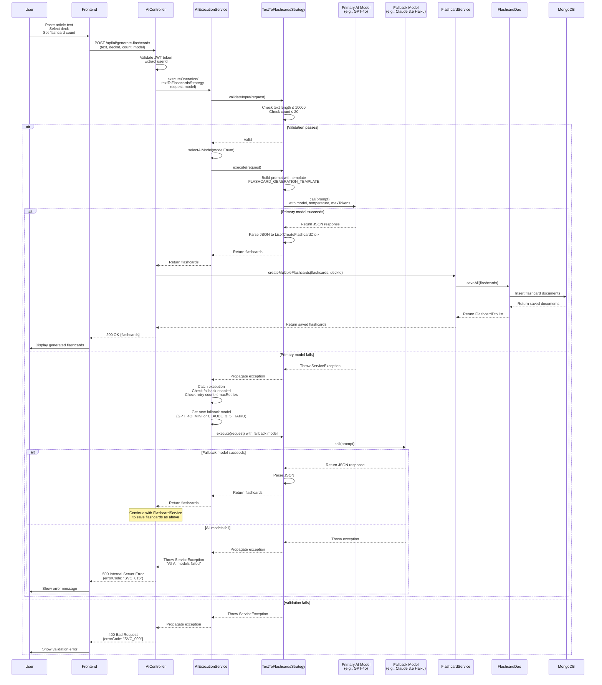
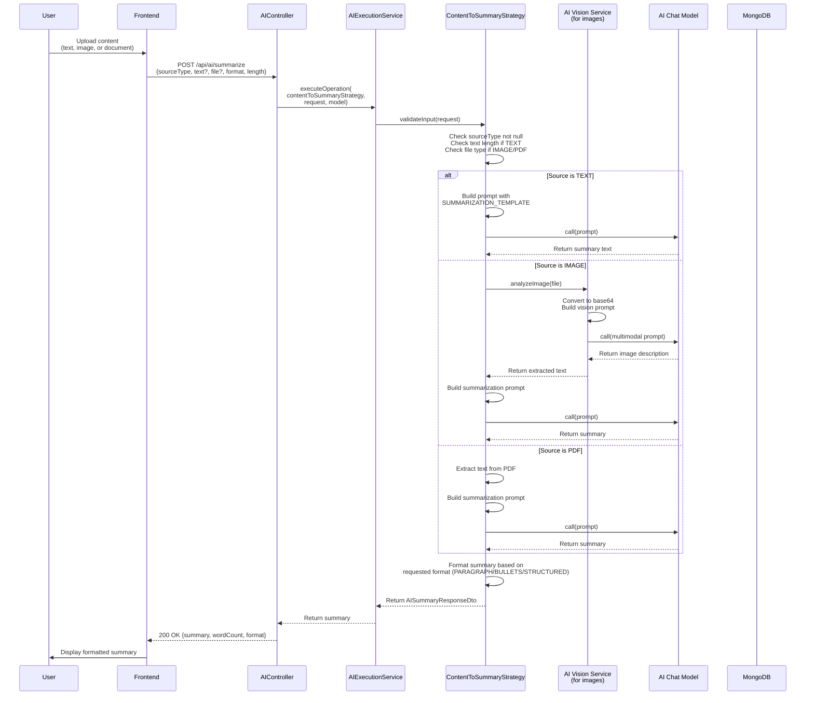
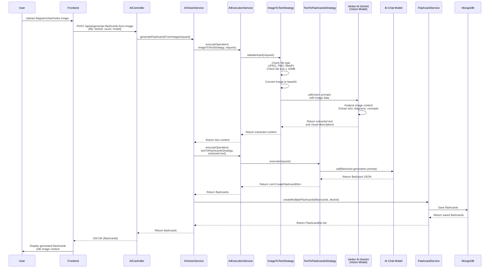
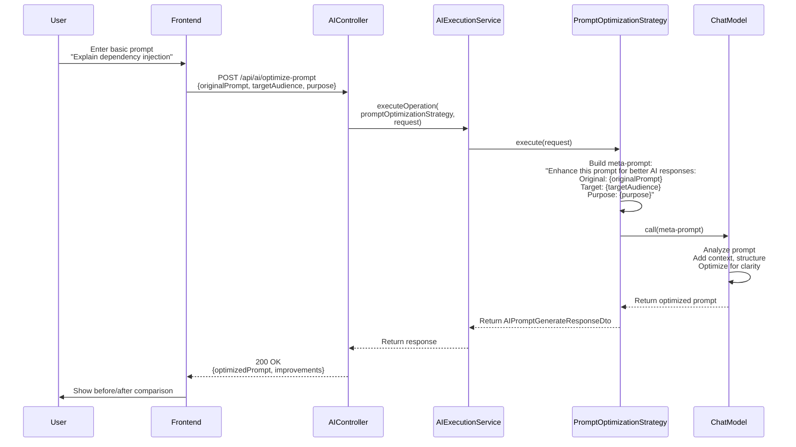
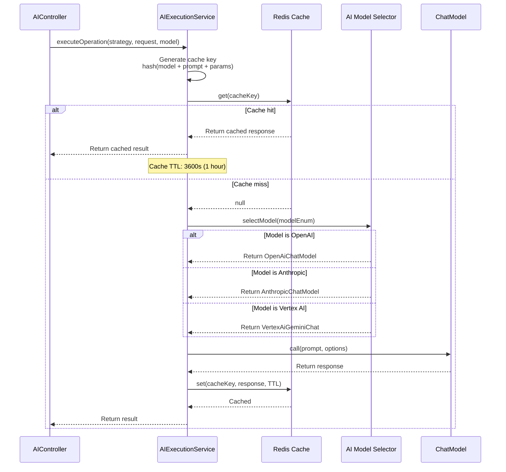

# AI Operations Sequence Diagrams

This document contains sequence diagrams for all AI-powered operations including flashcard generation, summarization, and prompt generation.

## 1. AI Flashcard Generation (Text-to-Flashcards with Fallback)



## 2. Content Summarization (Text/Image/Document)



## 3. Image-to-Flashcards (Vision AI)



## 4. AI Prompt Optimization



## 5. AI Model Selection and Caching



## Implementation Status

| Feature | Status | AI Models Used | Notes |
|---------|--------|----------------|-------|
| Text-to-Flashcards | ✅ Implemented | GPT-4o, GPT-4o-mini, Claude 3.5 Sonnet, Gemini 2.0 | Fallback working |
| Content Summarization | ✅ Implemented | GPT-4o-mini, Claude 3.5 Haiku | Supports TEXT source only |
| Image-to-Flashcards | ✅ Implemented | Vertex AI Gemini 2.0/2.5 Pro | Vision capabilities |
| Image Summarization | ⚠️ Partial | Vertex AI Gemini | Needs more testing |
| PDF Summarization | ❌ Not Implemented | - | Planned for MVP |
| Prompt Optimization | ✅ Implemented | GPT-4o-mini | Internal optimization |
| Response Caching | ⚠️ Configured | - | Redis configured but not enabled |

## AI Provider Configuration

### Current Configuration (application.yml)

1. **OpenAI**
   - Models: gpt-4o, gpt-4o-mini, gpt-3.5-turbo
   - Temperature: 0.7
   - Max Tokens: 2000
   - Timeout: 60s

2. **Anthropic (Claude)**
   - Models: claude-3-5-sonnet, claude-3-5-haiku
   - Temperature: 0.7
   - Max Tokens: 2000
   - Timeout: 60s

3. **Vertex AI (Google Gemini)**
   - Models: gemini-2.0-flash, gemini-2.5-pro, gemini-2.5-flash
   - Location: us-central1
   - Max Output Tokens: 2000
   - Temperature: 0.7

### Fallback Chain

Configured in application.yml:
```yaml
ai:
  fallback:
    enabled: true
    max-retries: 2
    fallback-models:
      - GPT_4O_MINI
      - CLAUDE_3_5_HAIKU
      - GEMINI_1_5_FLASH
```

## Code Quality Issues (From Review)

### Issues Identified in AIService and Strategies:

1. **Rate Limiting**
   - ⚠️ No rate limiting on AI endpoints
   - Can lead to cost overruns and API quota exhaustion
   - **Fix:** Implement Redis-based rate limiting (10 requests/minute per user)

2. **Prompt Templates**
   - ✅ Constants defined in AIConstants.java
   - ⚠️ Some hardcoded prompts in strategy classes
   - **Fix:** Extract all prompts to constants

3. **Error Handling**
   - ✅ Using ServiceException with ErrorCode enum
   - ⚠️ Generic error messages don't help debugging
   - **Fix:** Add more specific error codes for AI failures

4. **Validation**
   - ✅ Input validation in strategies
   - ⚠️ No output validation (e.g., checking if AI returned valid JSON)
   - **Fix:** Add response validation with retry on parse failure

5. **Monitoring**
   - ❌ No metrics or logging for AI usage
   - ❌ No cost tracking
   - **Fix:** Add request logging, token usage tracking, cost monitoring

6. **Testing**
   - ❌ No unit tests for strategies (<5% coverage)
   - ❌ No integration tests for AI endpoints
   - **Fix:** Achieve 80% coverage with mocked AI responses

## Security Considerations

1. **API Key Management**
   - ✅ Stored in environment variables
   - ✅ Not committed to git
   - ⚠️ Consider using secret management service (AWS Secrets Manager, Google Secret Manager)

2. **Input Sanitization**
   - ⚠️ Limited sanitization of user input
   - Risk: Prompt injection attacks
   - **Fix:** Add input sanitization, content filtering

3. **Output Filtering**
   - ❌ No content filtering on AI responses
   - Risk: Inappropriate content generation
   - **Fix:** Add content moderation layer

4. **Cost Controls**
   - ⚠️ No per-user spending limits
   - ⚠️ No monthly budget alerts
   - **Fix:** Implement usage quotas, budget monitoring

## Related Documentation

- [MVP Readiness Assessment](./MVP-Readiness-Assessment.md)
- [Audio Features Sequence Diagrams](./Sequence-Diagrams-Audio-Features.md)
- [Code Improvements for AI Endpoints](./AI-Endpoints-Code-Improvements.md) (to be created)
- [Rate Limiting with Redis](./Rate-Limiting-Redis-Design.md) (to be created)