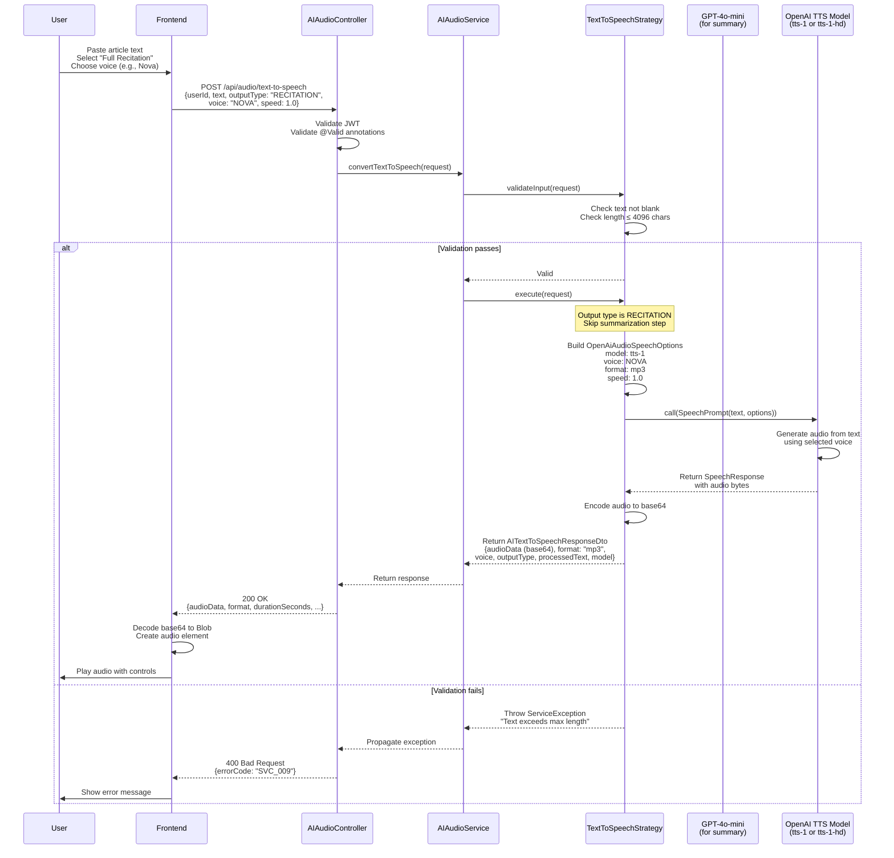
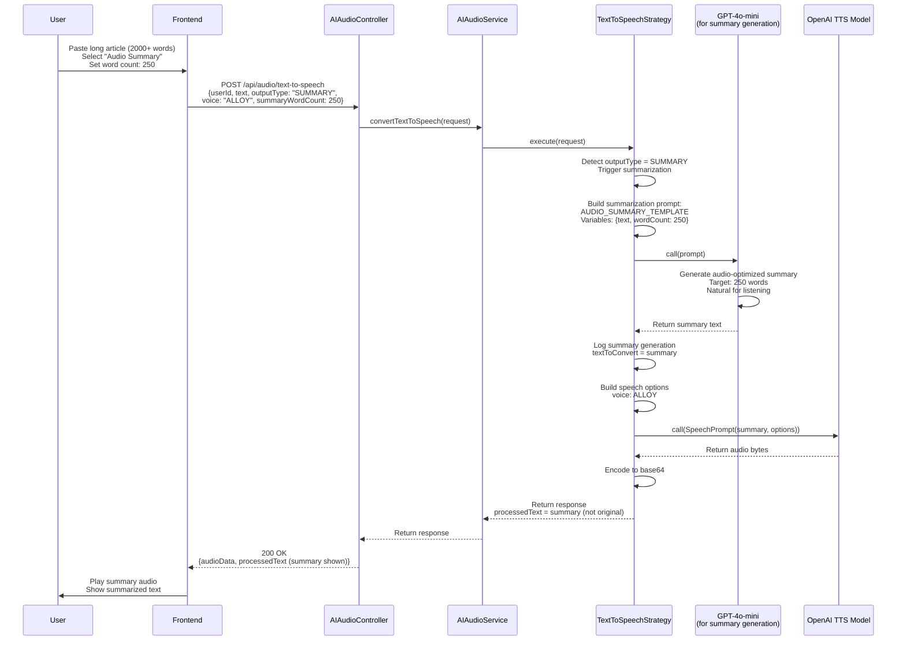
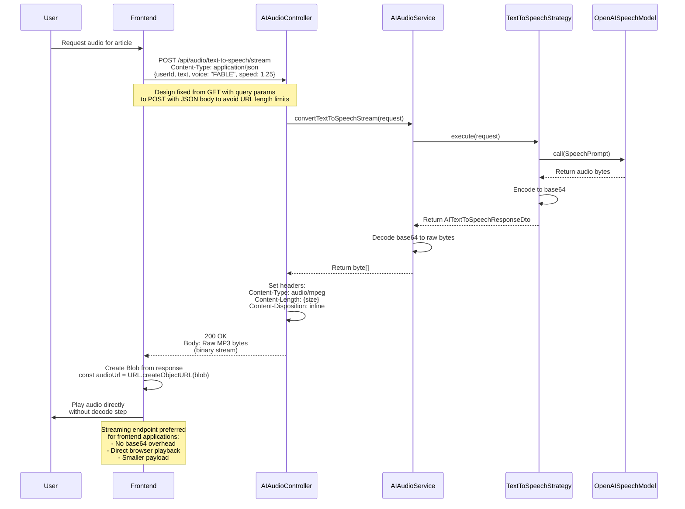
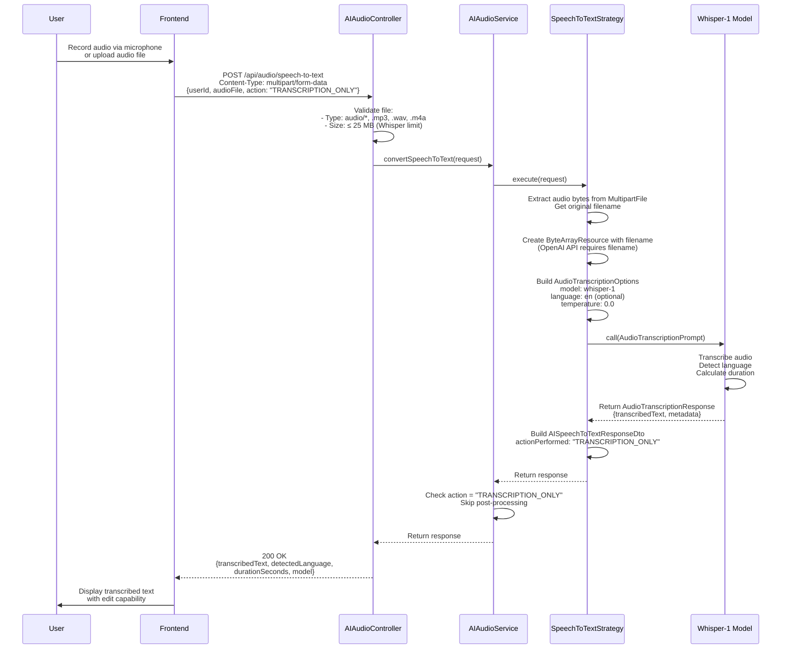
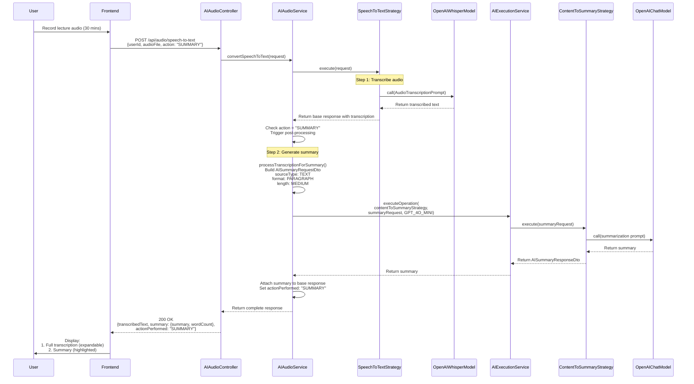
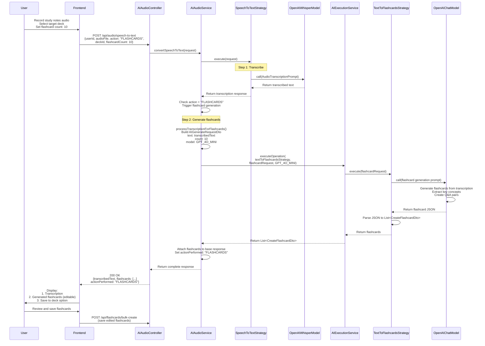

# Audio Features Sequence Diagrams

This document contains sequence diagrams for AI-powered audio features including Text-to-Speech (TTS) and Speech-to-Text (STT) with post-processing.

## 1. Text-to-Speech (Full Recitation)

## 2. Text-to-Speech (Audio Summary)

## 3. Text-to-Speech Streaming (Binary Audio)

## 4. Speech-to-Text (Transcription Only)

## 5. Speech-to-Text with Summary Generation

## 6. Speech-to-Text with Flashcard Generation

## Implementation Status

| Feature | Status | Models Used | Notes |
|---------|--------|-------------|-------|
| TTS - Full Recitation | ✅ Implemented | OpenAI TTS-1, TTS-1-HD | 6 voices available |
| TTS - Audio Summary | ✅ Implemented | GPT-4o-mini (summary) + TTS-1 (audio) | Two-step process |
| TTS - Binary Streaming | ✅ Implemented | OpenAI TTS-1 | Preferred for frontend |
| STT - Transcription | ✅ Implemented | Whisper-1 | ≤25MB file limit |
| STT - With Summary | ✅ Implemented | Whisper-1 + GPT-4o-mini | Post-processing |
| STT - With Flashcards | ✅ Implemented | Whisper-1 + GPT-4o-mini | Full pipeline |

## API Endpoints

| Endpoint | Method | Input | Output | Use Case |
|----------|--------|-------|--------|----------|
| `/api/audio/text-to-speech` | POST | JSON with text | JSON with base64 audio + metadata | Backend integration, metadata needed |
| `/api/audio/text-to-speech/stream` | POST | JSON with text | Binary MP3 stream | Frontend audio player, direct playback |
| `/api/audio/speech-to-text` | POST | Multipart with audio file | JSON with transcription ± processing | Voice notes, lecture transcription |

## Audio Configuration

### Supported Voices (OpenAI TTS)

| Voice | Description | Best For |
|-------|-------------|----------|
| ALLOY | Neutral and balanced | General purpose, professional content |
| ECHO | Clear and articulate | Educational content, tutorials |
| FABLE | Warm and expressive | Storytelling, narrative content |
| ONYX | Deep and authoritative | Serious topics, announcements |
| NOVA | Energetic and friendly | Engaging content, conversational |
| SHIMMER | Soft and calm | Meditation, relaxing content |

### Audio Formats and Limits

**Text-to-Speech:**
- Input: Text (max 4096 characters per request)
- Output: MP3 (default), OPUS, AAC, FLAC
- Models: tts-1 (faster), tts-1-hd (higher quality)
- Speed: 0.25x to 4.0x (default: 1.0x)

**Speech-to-Text:**
- Input: Audio files (mp3, wav, m4a, webm, etc.)
- Max file size: 25 MB (Whisper API limit)
- Max duration: ~3 hours (depends on quality)
- Output: Plain text transcription
- Language detection: Automatic

## Code Quality Issues

### Issues Identified:

1. **Bean Injection Conflict** (FIXED)
   - ✅ Multiple ChatModel beans caused autowiring failure
   - ✅ Fixed with @Qualifier("openAiChatModel") in TextToSpeechStrategy

2. **Missing Filename** (FIXED)
   - ✅ ByteArrayResource needed filename for OpenAI API
   - ✅ Fixed by overriding getFilename() method

3. **Missing SourceType** (FIXED)
   - ✅ NullPointerException in summary validation
   - ✅ Fixed by adding sourceType to AISummaryRequestDto builder

4. **Query Parameter Design** (FIXED)
   - ✅ Original design used GET with query params for streaming
   - ✅ Fixed to POST with JSON body to avoid URL length limits

5. **Error Handling**
   - ⚠️ Generic ServiceException for all audio errors
   - **Fix:** Add specific error codes (AUDIO_FILE_TOO_LARGE, UNSUPPORTED_AUDIO_FORMAT, etc.)

6. **Validation**
   - ⚠️ File type validation is basic (checks MIME type only)
   - ⚠️ No duration pre-check before sending to Whisper
   - **Fix:** Add audio file validation utility (check codec, duration, sample rate)

7. **Testing**
   - ❌ No unit tests for audio strategies
   - ❌ No integration tests with real audio files
   - **Fix:** Add tests with mock audio responses

8. **Rate Limiting**
   - ❌ No rate limiting on audio endpoints
   - Risk: Expensive audio API calls can be abused
   - **Fix:** Implement stricter limits (e.g., 5 TTS requests/minute, 3 STT requests/minute)

9. **Cost Tracking**
   - ❌ No tracking of audio generation costs
   - OpenAI TTS pricing: $15 per 1M characters
   - Whisper pricing: $0.006 per minute
   - **Fix:** Add usage metrics and cost calculation

## Security Considerations

1. **File Upload Security**
   - ⚠️ Basic validation of audio files
   - Risk: Malicious files could be uploaded
   - **Fix:**
     - Scan audio files for malware
     - Validate audio codecs and containers
     - Limit concurrent uploads per user

2. **Audio Content Moderation**
   - ❌ No content moderation on transcribed text
   - Risk: Inappropriate audio content transcribed
   - **Fix:** Add content filtering on STT output

3. **Generated Audio Storage**
   - ❌ Audio not stored, generated on-demand each time
   - Pro: No storage costs, privacy-friendly
   - Con: Repeated generation costs
   - **Consider:** Cache audio for repeated requests (with TTL)

4. **API Key Exposure**
   - ✅ OpenAI API key in environment variables
   - ✅ Not exposed to frontend
   - ✅ Server-side only

## Performance Considerations

1. **TTS Response Times**
   - Short text (<500 chars): ~2-3 seconds
   - Long text (2000+ chars): ~8-10 seconds
   - Summary generation adds ~3-5 seconds
   - **Optimization:** Consider caching common audio (e.g., deck intros)

2. **STT Response Times**
   - 1 minute audio: ~5-10 seconds
   - 10 minute audio: ~30-60 seconds
   - 30 minute audio: ~2-3 minutes
   - **Optimization:** Consider async processing for long audio

3. **Streaming vs Base64**
   - Base64 encoding increases payload size by ~33%
   - Streaming endpoint reduces data transfer and processing
   - **Recommendation:** Frontend should use streaming endpoint

## Related Documentation

- [MVP Readiness Assessment](./MVP-Readiness-Assessment.md)
- [AI Operations Sequence Diagrams](./Sequence-Diagrams-AI-Operations.md)
- [Authentication Flow](./Sequence-Diagrams-Authentication.md)
- [AI Endpoints Code Improvements](./AI-Endpoints-Code-Improvements.md) (to be created)
- [Rate Limiting with Redis](./Rate-Limiting-Redis-Design.md) (to be created)