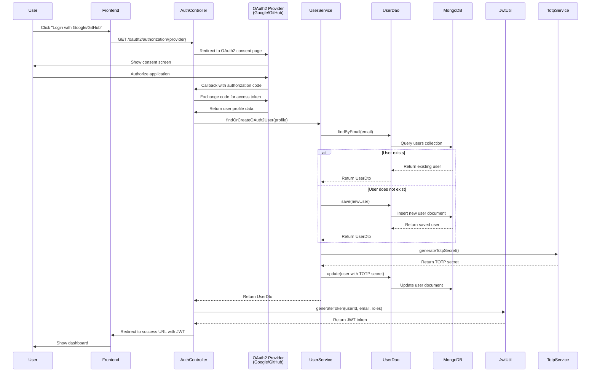
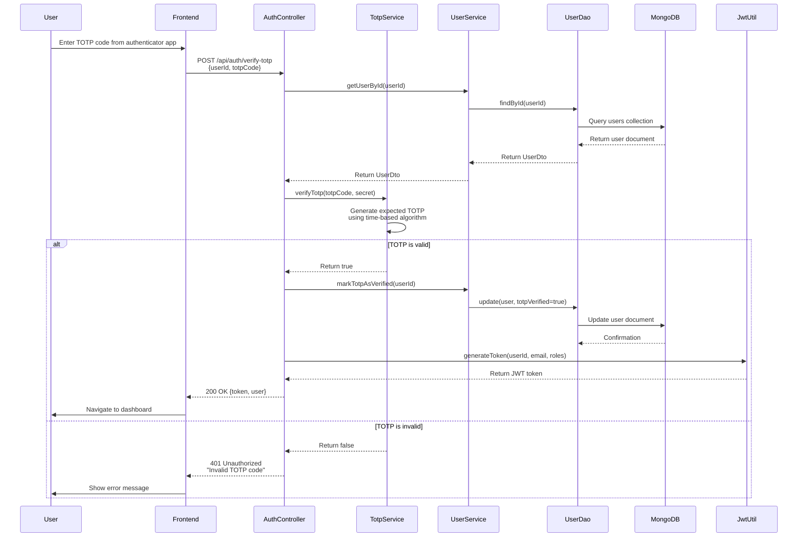
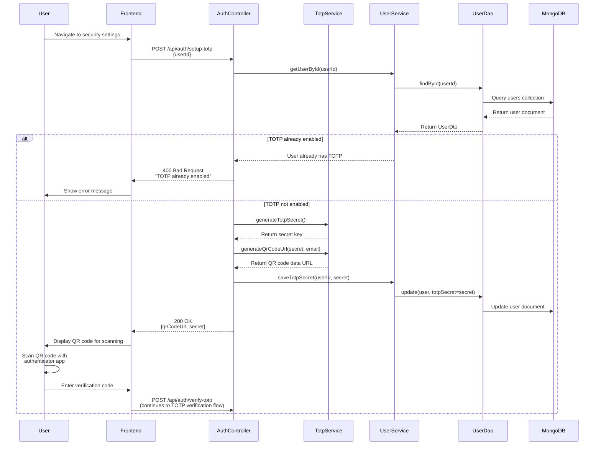
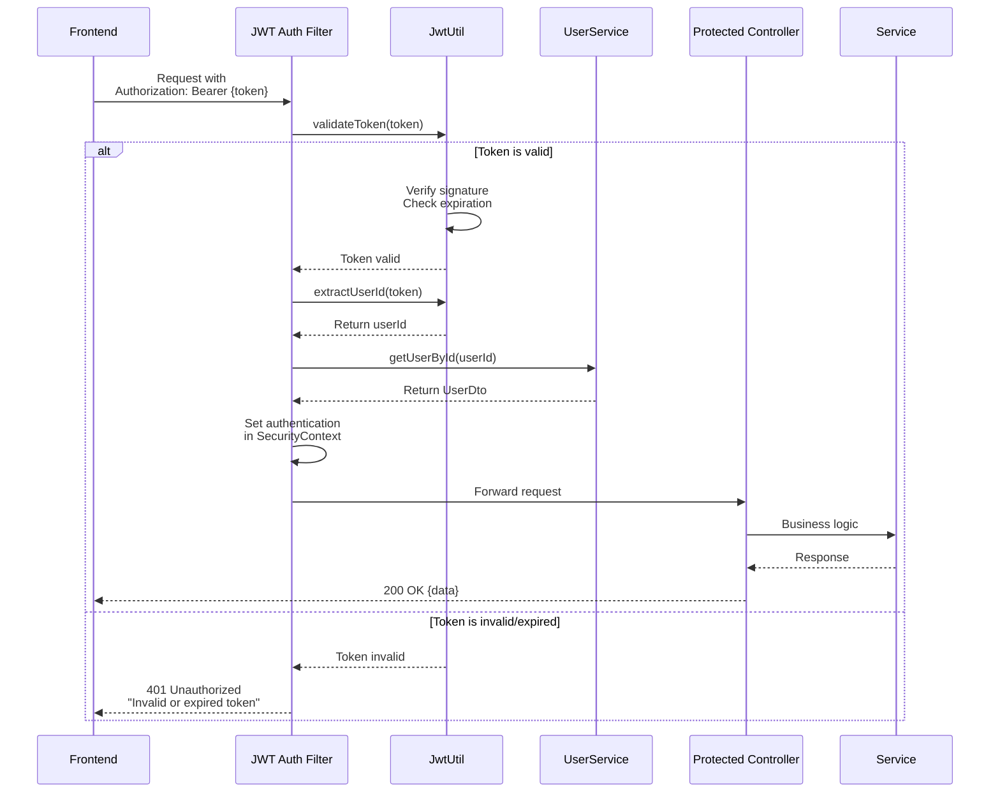
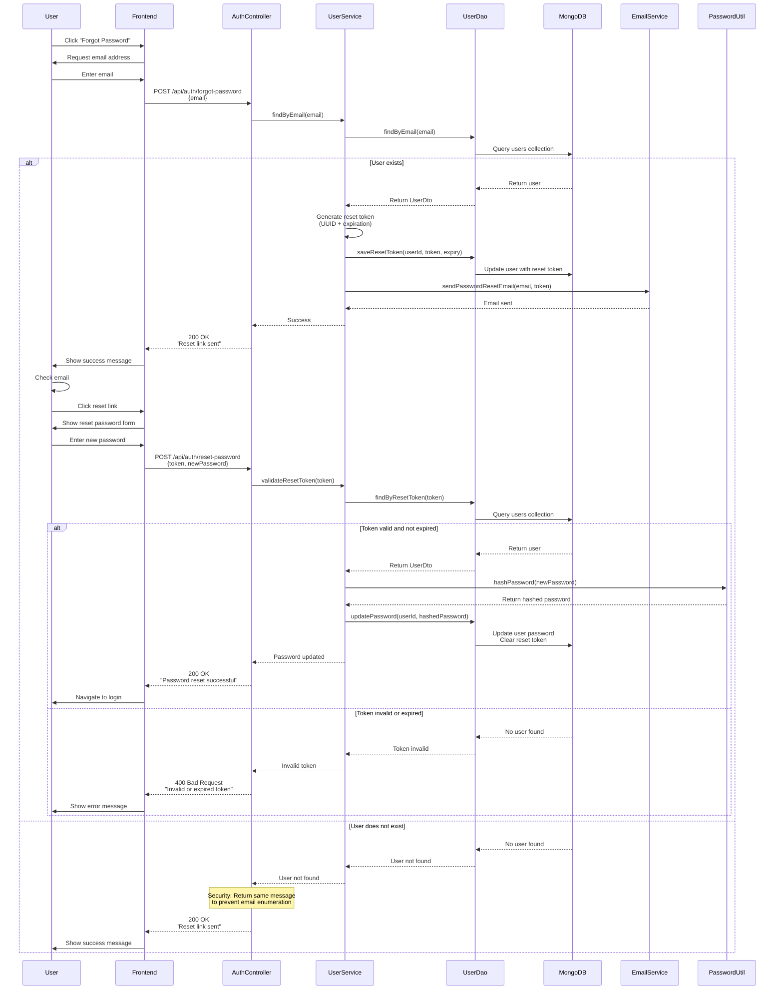

# Authentication Flow Sequence Diagrams

This document contains sequence diagrams for all authentication and authorization flows in the Flashcards application.

## 1. OAuth2 Login Flow (Google/GitHub)

## 2. TOTP Two-Factor Authentication Verification

## 3. TOTP Setup Flow (First Time)

## 4. JWT Token Validation (Protected Endpoints)

## 5. Password Reset Flow

## Implementation Status

| Flow | Status | Notes |
|------|--------|-------|
| OAuth2 Login | ✅ Implemented | Google and GitHub providers configured |
| TOTP Verification | ✅ Implemented | Using time-based OTP algorithm |
| TOTP Setup | ✅ Implemented | QR code generation working |
| JWT Validation | ✅ Implemented | Custom filter in security chain |
| Password Reset | ⚠️ Partial | Token generation works, email service needs configuration |

## Security Considerations

1. **JWT Tokens**
   - Currently stored in localStorage (consider HttpOnly cookies for XSS protection)
   - Token expiration: 24 hours (configurable via JWT_EXPIRATION)
   - Token refresh mechanism not implemented (needed for MVP)

2. **TOTP**
   - Secret keys stored encrypted in MongoDB
   - Time window: 30 seconds
   - Consider backup codes for account recovery

3. **OAuth2**
   - Redirect URIs validated
   - State parameter used to prevent CSRF
   - Token exchange happens server-side

4. **Rate Limiting**
   - ⚠️ NOT IMPLEMENTED - Critical security gap
   - Should limit login attempts, TOTP attempts, password reset requests
   - Redis-based rate limiting planned (see Redis Rate Limiting design doc)

## Related Documentation

- [MVP Readiness Assessment](./MVP-Readiness-Assessment.md)
- [Security Measures Review](./Security-Measures-Review.md) (to be created)
- [Rate Limiting with Redis](./Rate-Limiting-Redis-Design.md) (to be created)