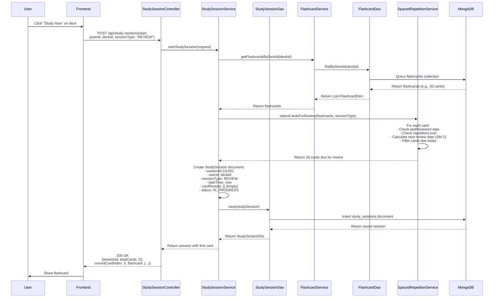
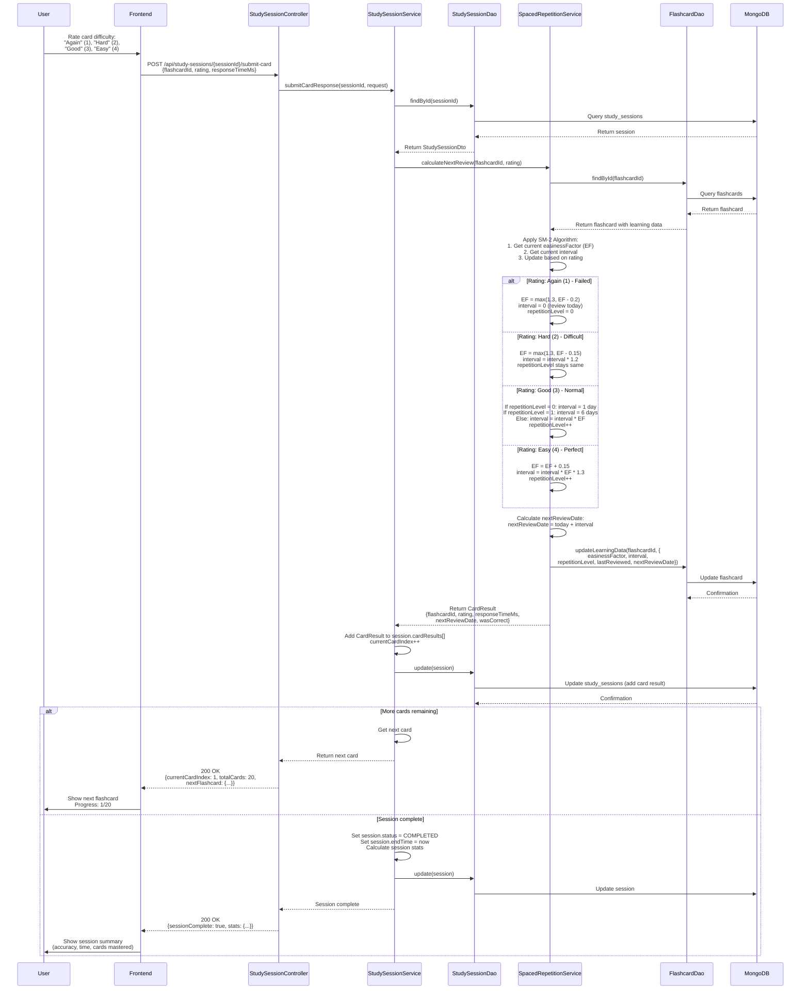
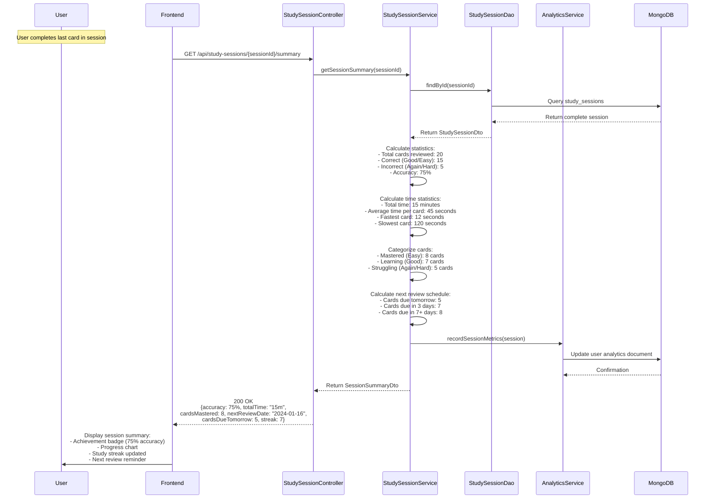
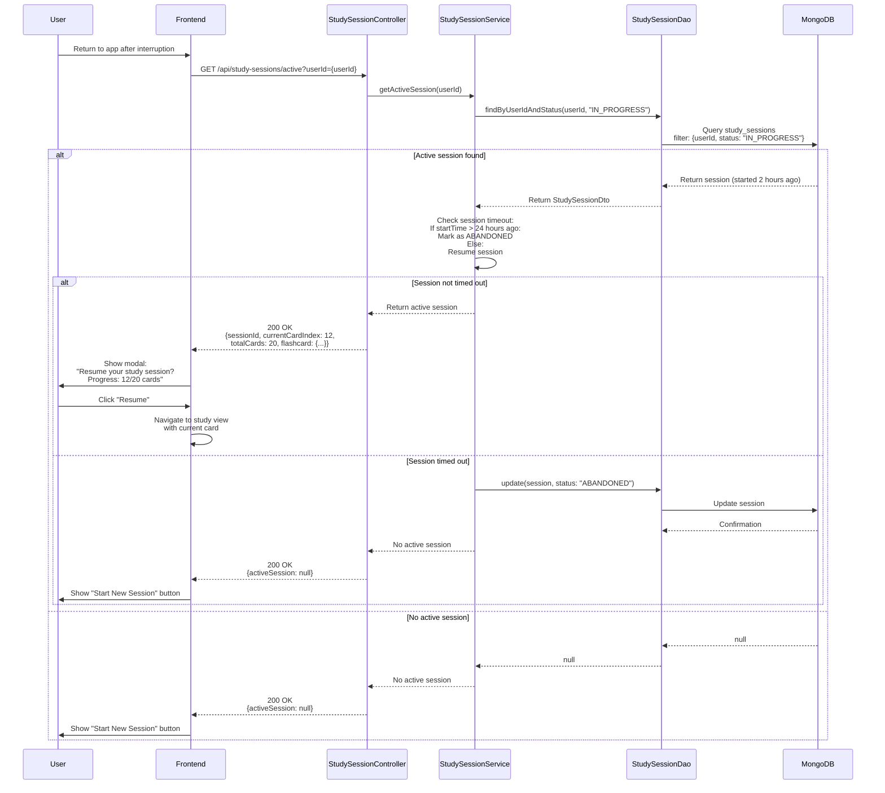
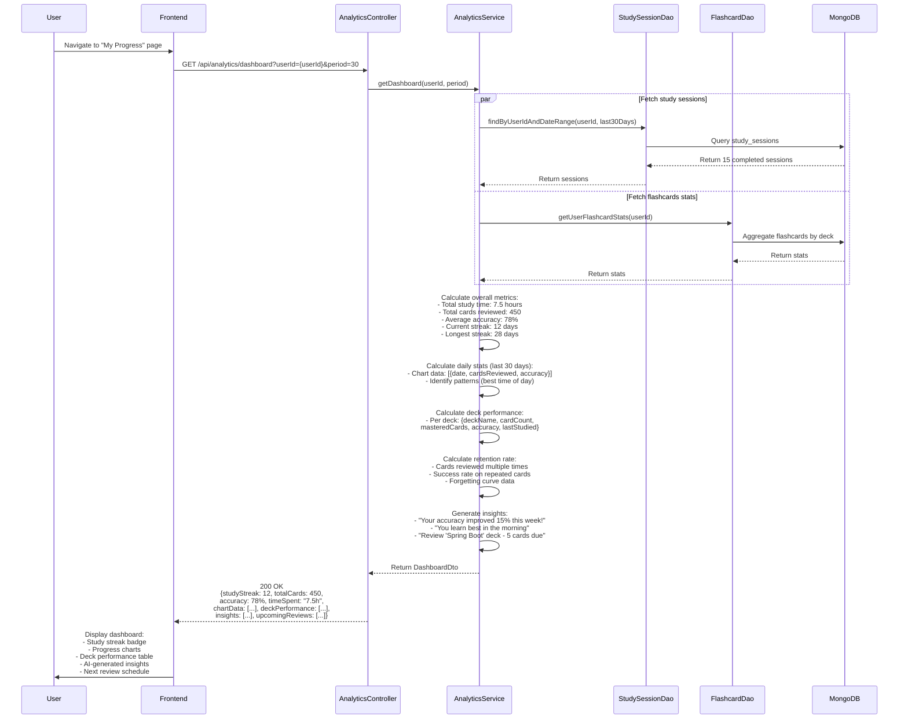
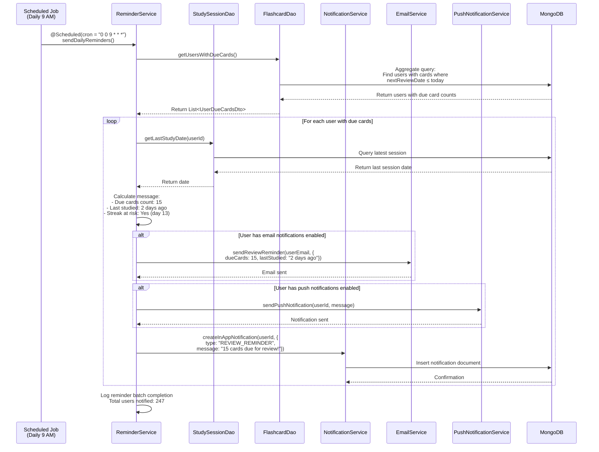

# Study Sessions Sequence Diagrams

This document contains sequence diagrams for the Study Session system including spaced repetition, progress tracking, and learning analytics.

**⚠️ IMPLEMENTATION STATUS:** Study Sessions are planned for MVP but NOT YET IMPLEMENTED (0% complete)

## 1. Starting a New Study Session



## 2. Submitting a Card Response (Spaced Repetition)



## 3. Completing a Study Session (Summary)



## 4. Resume Interrupted Study Session



## 5. Learning Analytics Dashboard



## 6. Daily Review Reminder System



## Implementation Status

| Feature | Status | Priority | Estimated Effort |
|---------|--------|----------|------------------|
| Start Study Session | ❌ Not Implemented | Critical | 2-3 days |
| Submit Card Response | ❌ Not Implemented | Critical | 2-3 days |
| SM-2 Algorithm | ❌ Not Implemented | Critical | 2-3 days |
| Session Summary | ❌ Not Implemented | High | 1-2 days |
| Resume Session | ❌ Not Implemented | High | 1 day |
| Learning Analytics | ❌ Not Implemented | Medium | 3-4 days |
| Daily Reminders | ❌ Not Implemented | Low | 1-2 days |
| **Total Effort** | - | - | **12-18 days** |

## Database Schema for Study Sessions

### StudySession Document

```json
{
  "_id": "session-uuid",
  "userId": "user-id",
  "deckId": "deck-id",
  "sessionType": "REVIEW", // REVIEW, NEW_CARDS, MIXED
  "status": "IN_PROGRESS", // IN_PROGRESS, COMPLETED, ABANDONED
  "startTime": "2024-01-15T10:00:00Z",
  "endTime": "2024-01-15T10:15:00Z",
  "cardResults": [
    {
      "flashcardId": "card-id-1",
      "rating": 3, // 1=Again, 2=Hard, 3=Good, 4=Easy
      "responseTimeMs": 4500,
      "wasCorrect": true,
      "timestamp": "2024-01-15T10:01:30Z",
      "nextReviewDate": "2024-01-22T00:00:00Z"
    }
  ],
  "totalCards": 20,
  "currentCardIndex": 15,
  "accuracyRate": 0.75,
  "totalTimeMs": 900000, // 15 minutes
  "createdAt": "2024-01-15T10:00:00Z",
  "updatedAt": "2024-01-15T10:15:00Z"
}
```

### Flashcard Learning Data (Embedded in Flashcard)

```json
{
  "_id": "flashcard-id",
  "deckId": "deck-id",
  "front": "What is dependency injection?",
  "back": "A design pattern...",
  "learningData": {
    "easinessFactor": 2.5, // SM-2 algorithm (1.3 to 2.5+)
    "interval": 7, // Days until next review
    "repetitionLevel": 3, // Number of successful reviews
    "lastReviewed": "2024-01-15T10:05:00Z",
    "nextReviewDate": "2024-01-22T00:00:00Z",
    "totalReviews": 5,
    "successfulReviews": 4,
    "averageResponseTimeMs": 5000,
    "masteryLevel": "LEARNING" // NEW, LEARNING, YOUNG, MATURE, MASTERED
  }
}
```

### UserAnalytics Document

```json
{
  "_id": "user-id",
  "userId": "user-id",
  "totalStudyTimeMs": 27000000, // 7.5 hours
  "totalCardsReviewed": 450,
  "totalSessionsCompleted": 15,
  "currentStreak": 12, // Days
  "longestStreak": 28,
  "lastStudyDate": "2024-01-15",
  "averageAccuracy": 0.78,
  "cardsMastered": 120,
  "cardsLearning": 80,
  "cardsNew": 50,
  "deckStats": [
    {
      "deckId": "deck-id",
      "deckName": "Spring Boot",
      "totalCards": 50,
      "masteredCards": 30,
      "accuracy": 0.82,
      "lastStudied": "2024-01-15",
      "totalStudyTimeMs": 5400000
    }
  ],
  "dailyActivity": [
    {
      "date": "2024-01-15",
      "cardsReviewed": 20,
      "accuracy": 0.75,
      "studyTimeMs": 900000,
      "sessionsCompleted": 1
    }
  ],
  "createdAt": "2023-12-01T00:00:00Z",
  "updatedAt": "2024-01-15T10:15:00Z"
}
```

## SM-2 (SuperMemo 2) Algorithm Details

The SM-2 algorithm optimizes review intervals based on recall difficulty:

### Algorithm Parameters

- **EF (Easiness Factor)**: 1.3 to 2.5+ (default: 2.5)
- **Interval**: Days until next review
- **Repetition Level**: Count of successful reviews

### Rating Scale

| Rating | Label | Meaning | Impact |
|--------|-------|---------|--------|
| 1 | Again | Complete failure | EF -= 0.2, interval = 0, reset level |
| 2 | Hard | Difficult but recalled | EF -= 0.15, interval *= 1.2 |
| 3 | Good | Recalled with effort | interval = level-based calculation |
| 4 | Easy | Perfect recall | EF += 0.15, interval *= EF * 1.3 |

### Interval Calculation

```java
if (rating < 3) {
    // Failed or struggled - review soon
    interval = (rating == 1) ? 0 : Math.ceil(interval * 1.2);
    if (rating == 1) repetitionLevel = 0;
} else {
    // Successful review
    if (repetitionLevel == 0) interval = 1; // 1 day
    else if (repetitionLevel == 1) interval = 6; // 6 days
    else interval = Math.ceil(previousInterval * easinessFactor);

    repetitionLevel++;
}

// Adjust EF
easinessFactor += (0.1 - (5 - rating) * (0.08 + (5 - rating) * 0.02));
easinessFactor = Math.max(1.3, easinessFactor);
```

## Testing Strategy

### Unit Tests Needed:

1. **SpacedRepetitionService**
   - SM-2 algorithm calculations
   - Card selection logic
   - Next review date calculation

2. **StudySessionService**
   - Session creation
   - Card response submission
   - Session completion
   - Timeout handling

3. **AnalyticsService**
   - Metric calculations
   - Chart data generation
   - Insight generation

### Integration Tests Needed:

1. Complete study session flow (start → submit cards → complete)
2. Session interruption and resume
3. Cross-deck analytics
4. Concurrent session handling

### Cucumber Scenarios:

```gherkin
Feature: Study Session with Spaced Repetition

  Scenario: User completes a study session with varying difficulty
    Given user "john@example.com" has a deck "Java Basics" with 20 flashcards
    And all flashcards are due for review today
    When user starts a study session for deck "Java Basics"
    And user rates card 1 as "Good"
    And user rates card 2 as "Easy"
    And user rates card 3 as "Again"
    And user completes all 20 cards
    Then session summary shows accuracy of 90%
    And card 1 should be scheduled for review in 1 day
    And card 2 should be scheduled for review in 6 days
    And card 3 should be scheduled for review today
    And user's study streak should increase by 1
```

## Related Documentation

- [MVP Readiness Assessment](./MVP-Readiness-Assessment.md) - Study Sessions marked as 0% complete
- [Database ERD](./Database-ERD.md) (to be created) - Full schema documentation
- [Testing Strategy](./Testing-Strategy.md) (to be created)
- [AI Operations](./Sequence-Diagrams-AI-Operations.md)