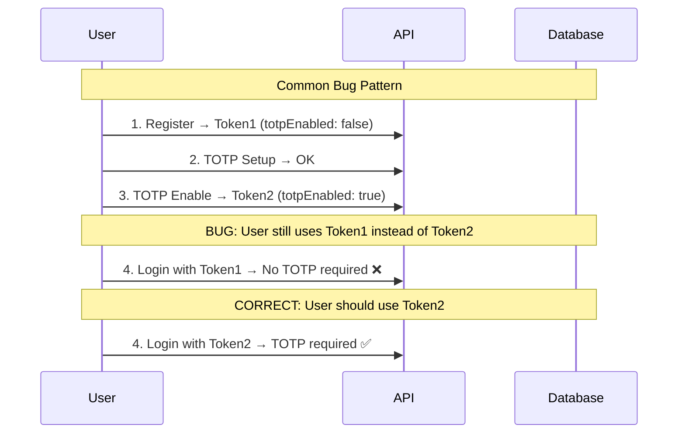

# TOTP Debugging Guide

## Your Current Issue Analysis

Based on your JWT token showing `"totpEnabled": false` after enabling TOTP, here's the systematic debugging approach:

### Step 1: Verify TOTP Enable Response

When you call `POST /api/auth/totp/enable`, you should get a response like:

```json
{
  "accessToken": "eyJ...NEW_TOKEN_HERE",
  "tokenType": "Bearer",
  "expiresIn": 3600,
  "user": {
    "id": "...",
    "username": "yasmim",
    // ... other fields
  },
  "requiresTotpSetup": false
}
```

**Check the NEW token's payload** - it should show `"totpEnabled": true`.

### Step 2: Token Usage Verification



### Step 3: Database State Verification

Check the database directly:

```sql
-- Replace with your user ID
SELECT totpEnabled, totpSecret FROM users WHERE id = 'your-user-id';
```

Should show:
- `totpEnabled: true`
- `totpSecret: <some-base32-string>`

### Step 4: Debug Your Current Flow

**What you did:**
1. Register user → Got Token A
2. TOTP enable → Got Token B (but maybe didn't use it?)
3. Login → Used Token A or B?

**The bug is likely:** You're using the old token from registration instead of the new token from TOTP enable.

## Debugging Commands

### 1. Decode Your JWT Token

Use this online tool or command to decode your JWT:
- https://jwt.io
- Or use: `echo "your-jwt-token" | base64 -d`

Check the payload for:
```json
{
  "totpEnabled": true,  // Should be true after enabling
  "username": "yasmim",
  "iat": 1758256928,    // Issue time - should be recent
  "exp": 1758260528     // Expiry time
}
```

### 2. Test Complete Flow

```bash
# 1. Register new user
curl -X POST http://localhost:8080/api/auth/register \
  -H "Content-Type: application/json" \
  -d '{"username":"testuser2", "email":"test2@example.com", "password":"Test123!", "firstName":"Test", "lastName":"User"}'

# Save the token from response as TOKEN1

# 2. Setup TOTP
curl -X POST http://localhost:8080/api/auth/totp/setup \
  -H "Authorization: Bearer TOKEN1"

# 3. Enable TOTP (use code from authenticator)
curl -X POST http://localhost:8080/api/auth/totp/enable \
  -H "Authorization: Bearer TOKEN1" \
  -H "Content-Type: application/json" \
  -d '{"totpCode":"123456"}'

# Save the NEW token from response as TOKEN2

# 4. Try login without TOTP code (should fail)
curl -X POST http://localhost:8080/api/auth/login \
  -H "Content-Type: application/json" \
  -d '{"usernameOrEmail":"testuser2", "password":"Test123!"}'

# Should return: "TOTP code is required"

# 5. Try login with TOTP code (should succeed)
curl -X POST http://localhost:8080/api/auth/login \
  -H "Content-Type: application/json" \
  -d '{"usernameOrEmail":"testuser2", "password":"Test123!", "totpCode":"789456"}'
```

## Expected Results

| Step | Expected Result | Your Result |
|------|----------------|-------------|
| TOTP Enable | Returns new token with `totpEnabled: true` | ? |
| Login without TOTP | Fails with "TOTP code required" | Succeeded ❌ |
| Login with TOTP | Succeeds with token | ? |

## Quick Fix Test

**Immediately test this:**

1. Go to your TOTP enable endpoint response
2. Copy the `accessToken` from that response
3. Decode it at jwt.io
4. Check if it shows `"totpEnabled": true`
5. If it shows `false`, then the bug is in the enable logic
6. If it shows `true`, then you're using the wrong token for login

## Most Likely Root Cause

Based on enterprise patterns, you're probably using the old registration token instead of the new TOTP-enabled token. The frontend should:

1. Store the token from registration
2. **Replace it** with the new token from TOTP enable
3. Use the updated token for all subsequent requests

This is a common integration bug in enterprise applications.