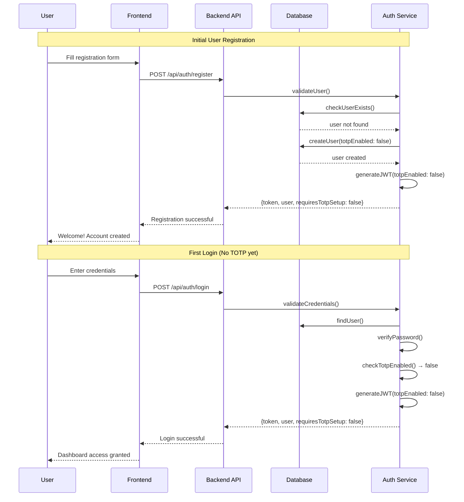
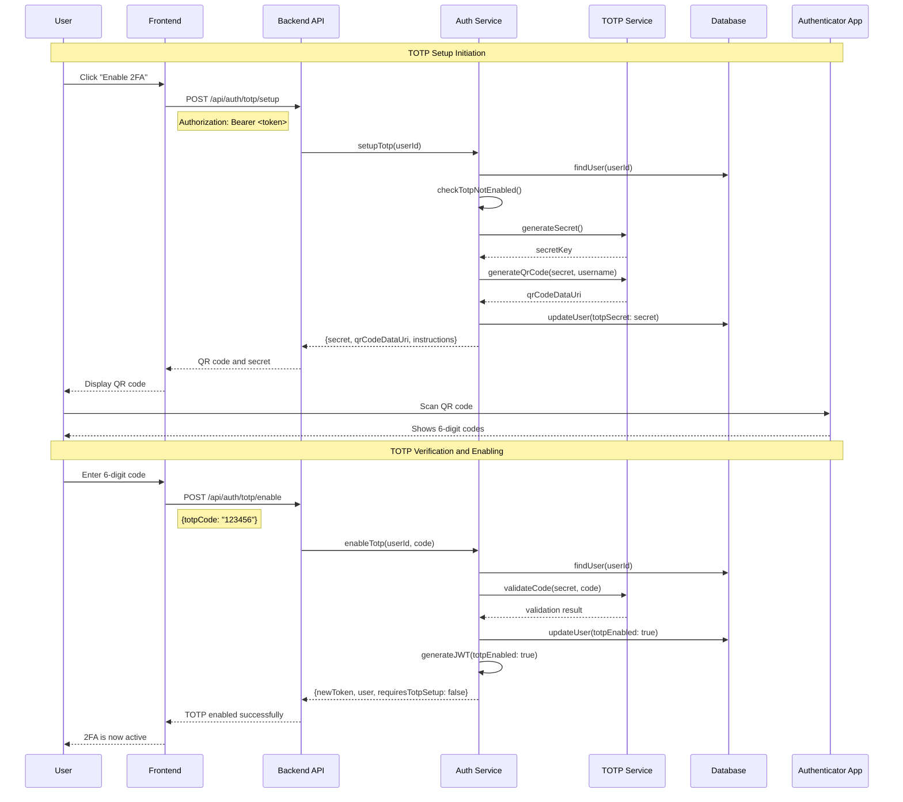
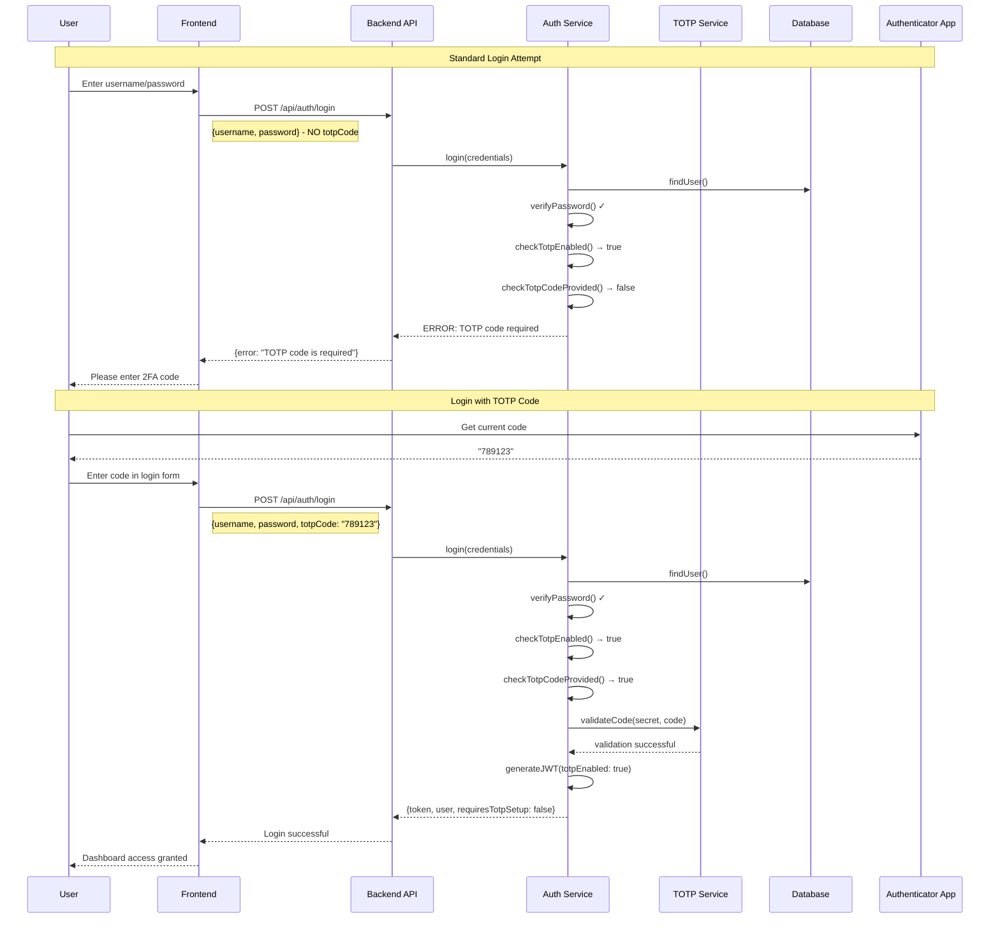
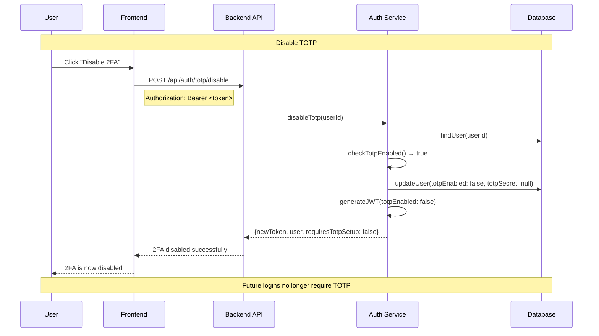
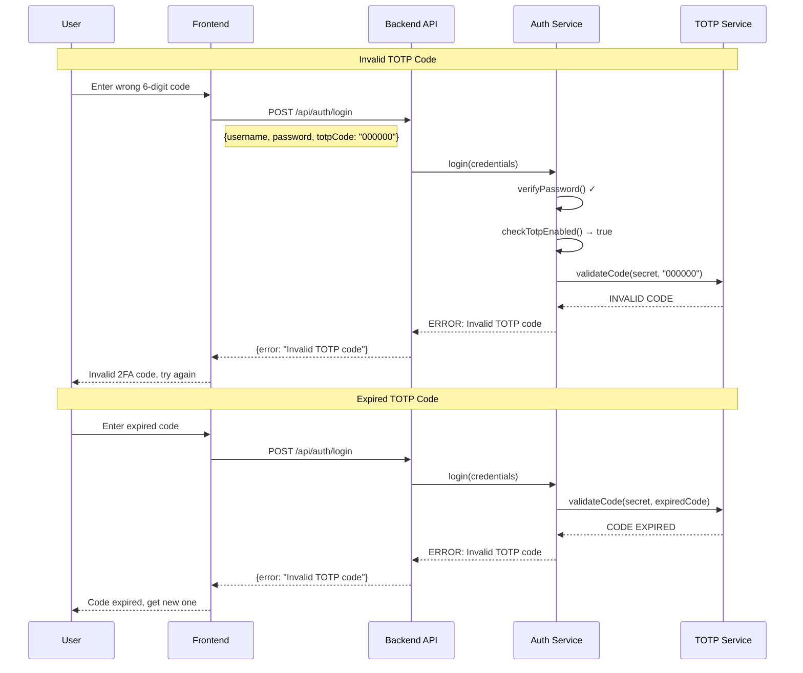

# Enterprise TOTP Authentication Flow

This document outlines the complete TOTP (Time-based One-Time Password) authentication flow as implemented in professional enterprise applications.

## 1. User Registration and Initial Login

## 2. TOTP Setup Process

## 3. Login with TOTP Enabled

## 4. TOTP Disable Process

## 5. Error Scenarios

## Key Enterprise Security Principles

### 1. **Token Lifecycle Management**
- New JWT tokens are issued after TOTP state changes
- Old tokens become invalid when TOTP is enabled/disabled
- Tokens contain current TOTP status for validation

### 2. **State Consistency**
- Database `totpEnabled` field is source of truth
- JWT token `totpEnabled` claim reflects database state
- No partial states - either fully enabled or disabled

### 3. **Security Boundaries**
- TOTP setup requires valid authentication
- TOTP enable requires valid TOTP code verification
- Login with TOTP enabled MUST provide valid code

### 4. **Error Handling**
- Specific error messages for different failure modes
- No information leakage about account state
- Consistent error responses

### 5. **User Experience**
- Clear feedback at each step
- Progressive enhancement (optional → required)
- Graceful degradation for edge cases

## Common Issues and Debugging

### Issue: Login succeeds without TOTP when it should be required

**Root Causes:**
1. Using old JWT token (before TOTP was enabled)
2. Database `totpEnabled` not properly updated
3. Login validation logic not checking TOTP state
4. JWT generation not reflecting current database state

**Debug Steps:**
1. Check JWT token payload for `totpEnabled` field
2. Verify database user record has `totpEnabled: true`
3. Ensure using latest token from TOTP enable response
4. Validate login logic checks `user.isTotpEnabled()`