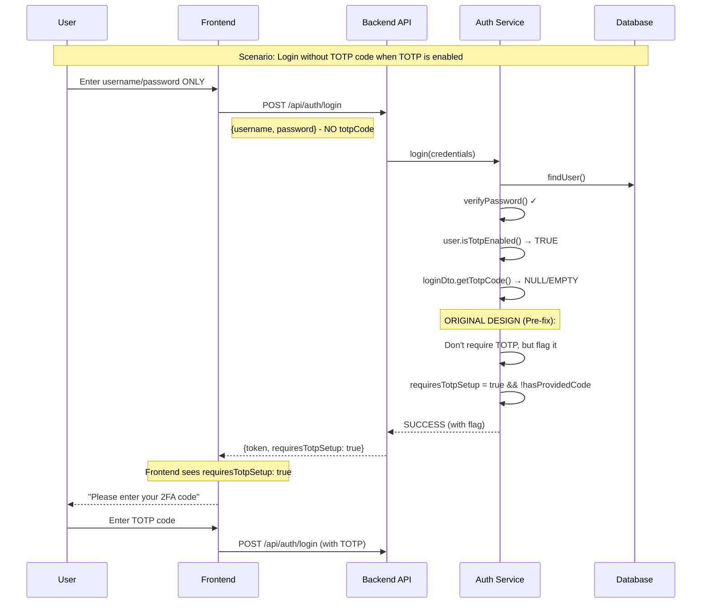

# Understanding `requiresTotpSetup` Field

## Purpose

The `requiresTotpSetup` field is a **UX hint** that tells the frontend when the user needs to provide a TOTP code but hasn't yet. It's designed for a specific scenario in enterprise applications.

## When `requiresTotpSetup` is TRUE

This field is `true` in exactly ONE scenario:



## The Problem with Original Implementation

Looking at the original code (before our fix):

```java
// Line 62-64 (BEFORE FIX)
if (BooleanUtils.isTrue(user.isTotpEnabled()) && isNotBlank(loginDto.getTotpCode())) {
    validateTotpCode(user, loginDto.getTotpCode());
}

// Line 70-71
boolean requiresTotpSetup = BooleanUtils.isTrue(user.isTotpEnabled()) &&
                           BooleanUtils.isFalse(isNotBlank(loginDto.getTotpCode()));
```

This created a **"soft" TOTP enforcement**:
- Login succeeds even without TOTP code
- But flags `requiresTotpSetup: true` to hint the frontend
- Frontend then prompts for TOTP in a second step

## After Our Security Fix

```java
// Line 64-68 (AFTER FIX)
if (BooleanUtils.isTrue(user.isTotpEnabled())) {
    if (BooleanUtils.isTrue(isBlank(loginDto.getTotpCode()))) {
        throw new ServiceException(AUTH_TOTP_CODE_REQUIRED, ErrorCode.AUTH_TOTP_REQUIRED);
    }
    validateTotpCode(user, loginDto.getTotpCode());
}
```

Now `requiresTotpSetup` will **NEVER be true** because:
- If TOTP is enabled and no code provided → Login FAILS (throws exception)
- If TOTP is enabled and code provided → Login succeeds with `requiresTotpSetup: false`
- If TOTP is disabled → Always `requiresTotpSetup: false`

## Two Different UX Patterns

### Pattern 1: Soft TOTP (Original - Less Secure)
```
Login → Success with flag → Frontend prompts for TOTP → Second API call
```
- Pros: Better UX, progressive disclosure
- Cons: **Security risk** - partial authentication state

### Pattern 2: Hard TOTP (Current - More Secure)
```
Login → Fail if no TOTP → Frontend shows error → Retry with TOTP
```
- Pros: **More secure**, no partial states
- Cons: Extra round trip if user forgets TOTP

## Enterprise Best Practice

Most enterprise applications use **Pattern 2** (Hard TOTP) because:
1. No partial authentication states
2. Clear security boundary
3. Prevents token misuse
4. Simpler state management

## Should We Remove `requiresTotpSetup`?

Since it will always be `false` now, we could:

### Option A: Remove it entirely
```java
// Remove from AuthResponseDto
// Remove from buildAuthResponse method
```

### Option B: Repurpose for different UX
```java
// Use it to indicate "TOTP is enabled on this account"
// So frontend knows to show TOTP field on login form
```

### Option C: Keep for backwards compatibility
```java
// Leave as-is, always false
// Document as deprecated field
```

## Recommended Approach

For enterprise applications, I recommend:

1. **Keep the hard enforcement** (current fix)
2. **Remove or deprecate** `requiresTotpSetup` field
3. **Add a separate endpoint** to check if user has TOTP enabled:

```java
// New endpoint for checking TOTP status
GET /api/auth/check-totp/{username}
Response: {
    "totpEnabled": true/false
}
```

This allows the frontend to:
- Show/hide TOTP field on login form
- Provide better UX without compromising security
- Know ahead of time if TOTP will be required

## Summary

- `requiresTotpSetup` was designed for soft TOTP enforcement
- After our security fix, it will always be `false`
- This is the correct behavior for enterprise security
- Consider removing or repurposing the field
- The field currently has no practical use