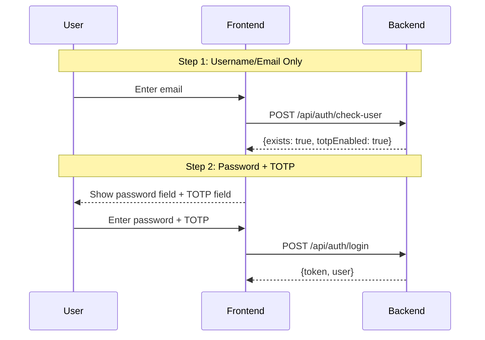
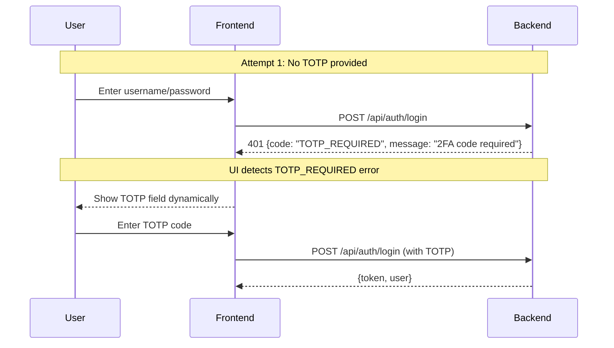
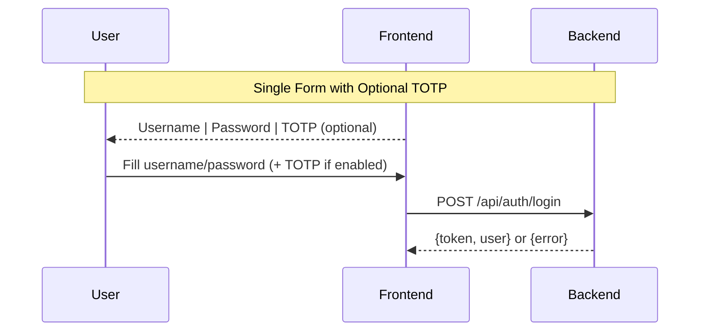

# TOTP UI Flow Patterns in Enterprise Applications

## The Problem: How Does UI Know When to Show TOTP Field?

When a user tries to login, the UI needs to know:
1. Should I show a TOTP field?
2. If login fails, is it because of bad credentials or missing TOTP?

## Common Enterprise Patterns

### Pattern 1: Two-Step Login (Google, Microsoft, GitHub)



**Pros:**
- Clean UX - only show TOTP when needed
- Clear user guidance
- Prevents username enumeration (always show password field)

**Cons:**
- Extra API call
- More complex frontend logic

### Pattern 2: Smart Error Messages (AWS, Stripe)



**Pros:**
- Single endpoint
- Progressive disclosure
- Simple backend

**Cons:**
- Extra round trip on first login
- Relies on error parsing

### Pattern 3: Always Show Optional TOTP Field (1Password, Bitwarden)



**Pros:**
- Simplest implementation
- Single request
- Works for all users

**Cons:**
- Shows unnecessary field for users without TOTP
- Less polished UX

## Recommended Approach for Your App

### Add `totpEnabled` Field to Response

```java
// AuthResponseDto.java
@Schema(description = "Authentication response")
public class AuthResponseDto {
    private String accessToken;
    private String tokenType;
    private long expiresIn;
    private UserDto user;
    private boolean totpEnabled;  // Add this instead of requiresTotpSetup
}
```

### Use Specific Error Codes

```java
// ErrorCode.java
public enum ErrorCode {
    AUTH_INVALID_CREDENTIALS("AUTH_001", "Invalid username or password"),
    AUTH_TOTP_REQUIRED("AUTH_007", "TOTP code required"),
    AUTH_TOTP_INVALID("AUTH_006", "Invalid TOTP code"),
    // ...
}
```

### Login Flow Logic

```java
// AuthService.java
public AuthResponseDto login(LoginDto loginDto) {
    // 1. Validate credentials
    User user = findUserByUsernameOrEmail(loginDto.getUsernameOrEmail());
    validateUserCredentials(user, loginDto);

    // 2. Check TOTP requirement
    if (BooleanUtils.isTrue(user.isTotpEnabled())) {
        if (isBlank(loginDto.getTotpCode())) {
            // Return specific error for missing TOTP
            throw new ServiceException(
                AUTH_TOTP_CODE_REQUIRED,
                ErrorCode.AUTH_TOTP_REQUIRED
            );
        }
        // Validate TOTP code
        validateTotpCode(user, loginDto.getTotpCode());
    }

    // 3. Generate response with totpEnabled flag
    return AuthResponseDto.builder()
        .accessToken(token)
        .tokenType("Bearer")
        .expiresIn(3600)
        .user(userDto)
        .totpEnabled(user.isTotpEnabled())  // Tell UI if TOTP is enabled
        .build();
}
```

## Frontend Implementation

```javascript
// Login Component
async function handleLogin(credentials) {
    try {
        const response = await api.post('/auth/login', credentials);
        // Success - store token
        localStorage.setItem('token', response.accessToken);
        localStorage.setItem('totpEnabled', response.totpEnabled);
        navigateToDashboard();
    } catch (error) {
        if (error.code === 'AUTH_TOTP_REQUIRED') {
            // Show TOTP field
            setShowTotpField(true);
            setError('Please enter your 2FA code');
        } else if (error.code === 'AUTH_TOTP_INVALID') {
            // TOTP code was wrong
            setError('Invalid 2FA code, please try again');
        } else if (error.code === 'AUTH_INVALID_CREDENTIALS') {
            // Bad username/password
            setError('Invalid username or password');
        }
    }
}
```

## Error Response Examples

### Missing TOTP Code
```json
{
  "timestamp": "2025-01-19T00:00:00",
  "status": 401,
  "error": "Unauthorized",
  "code": "AUTH_TOTP_REQUIRED",
  "message": "TOTP code is required for this account",
  "path": "/api/auth/login"
}
```

### Invalid TOTP Code
```json
{
  "timestamp": "2025-01-19T00:00:00",
  "status": 401,
  "error": "Unauthorized",
  "code": "AUTH_TOTP_INVALID",
  "message": "Invalid TOTP code",
  "path": "/api/auth/login"
}
```

### Bad Credentials
```json
{
  "timestamp": "2025-01-19T00:00:00",
  "status": 401,
  "error": "Unauthorized",
  "code": "AUTH_INVALID_CREDENTIALS",
  "message": "Invalid username or password",
  "path": "/api/auth/login"
}
```

## Additional Endpoints to Consider

### 1. Check User Status (Optional)
```
GET /api/auth/check/{username}
Response: {
    "exists": true,
    "totpEnabled": true
}
```

### 2. Current User Info
```
GET /api/auth/me
Headers: Authorization: Bearer <token>
Response: {
    "user": {...},
    "totpEnabled": true
}
```

## Summary

For your application, I recommend:

1. **Replace** `requiresTotpSetup` with `totpEnabled` in AuthResponseDto
2. **Use specific error codes** (AUTH_TOTP_REQUIRED vs AUTH_INVALID_CREDENTIALS)
3. **Let the frontend decide** how to handle the UX based on error codes
4. **Keep TOTP optional** - users choose whether to enable it

This gives you:
- Clear error messages for users
- Frontend knows exactly why login failed
- Clean separation of concerns
- Flexibility for UI improvements